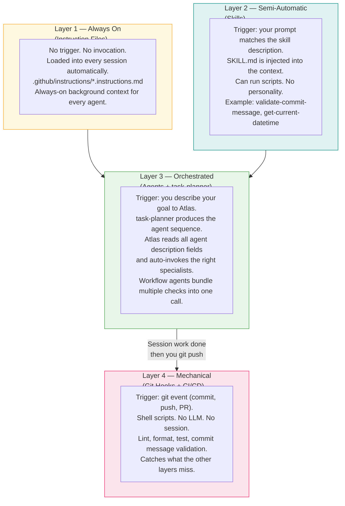
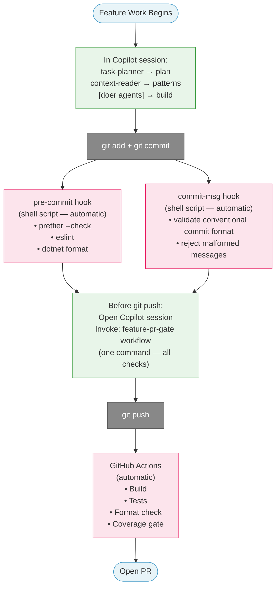
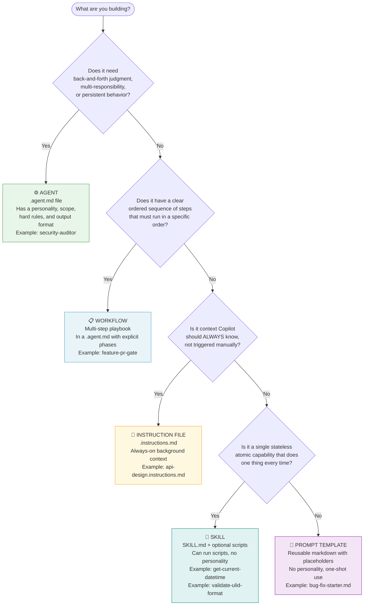
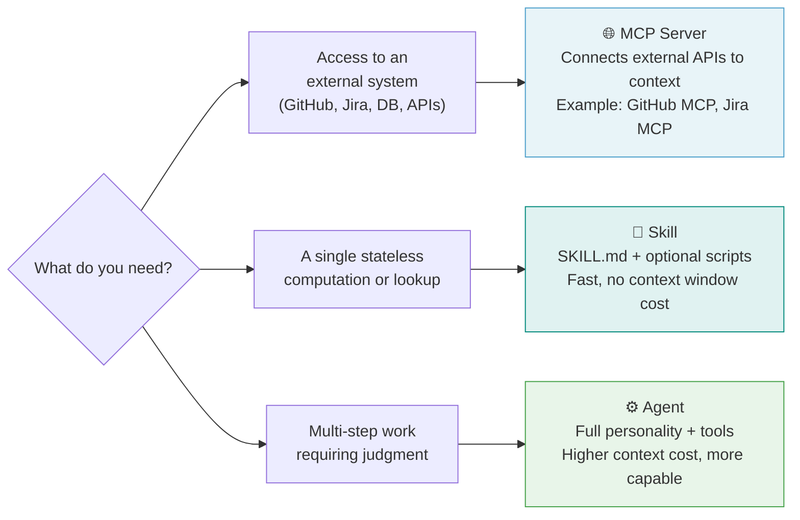
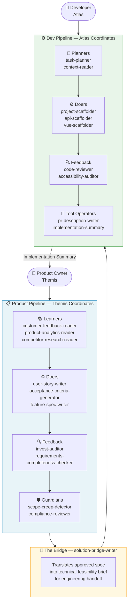
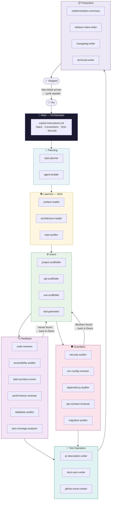
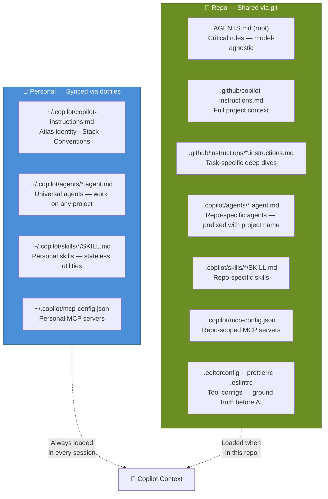

# AI Dev Learning Platform — Planning Document

> **Purpose:** Strategic plan for improving, extending, and correcting the dotfiles-presentation learning platform.  
> **Scope:** Content gaps, structural issues, best-practice corrections, new lessons, and improved diagrams.

---

## 0. The Central Teaching Gap — "Why Don't My Agents Run Automatically?"

This is the most common question from learners who build an agent ecosystem and then wonder why they still have to invoke every agent by hand. **This misunderstanding must be addressed before anything else in the curriculum.** It's the gap that makes learners feel like their ecosystem isn't working, even when it's built correctly.

### The Misunderstanding

Learners build a full agent ecosystem — planning agents, doers, feedback agents, guardians — and then expect them to fire at the right GitFlow stages automatically, like CI/CD jobs or IDE plugins. When that doesn't happen, they either:

- Give up and go back to manually picking agents one at a time
- Try to wire agents into git hooks (which doesn't work — hooks run shell scripts, not LLM sessions)
- Assume something is misconfigured

None of those are right. The issue is a mental model problem.

### The Correct Mental Model

**Agents are interactive specialists, not background daemons.** They live inside a Copilot session. They require a session to run. They cannot fire themselves at a git event. They are not plugins in the traditional sense.

What learners are actually looking for is the **four-layer automation model** — each layer has a different trigger, a different tool, and a different job:

```
WHAT TRIGGERS IT          LAYER                  WHAT IT DOES
──────────────────────────────────────────────────────────────────────────
Every session,            Instruction files      Always-on background context.
automatically             (passive)              Not invoked. Always loaded.
                                                 Example: .github/instructions/
                                                 api-design.instructions.md

Your prompt description   Skills                 SKILL.md injected into context
matches a skill           (semi-automatic)       when your prompt matches the
                                                 skill's description field.
                                                 Can run scripts. Stateless.

You describe your goal    task-planner +         task-planner produces the
to Atlas                  Atlas auto-routing     exact agent sequence. Atlas
                          (orchestrated)         reads all agent description
                                                 fields and invokes matches.
                                                 This is the "automatic" layer.

git commit / push /       Git hooks + CI/CD      Shell scripts. Mechanical
PR event                  (mechanical)           checks: lint, format, tests,
                                                 conventional commits.
                                                 NOT agents. Complement them.
```

### The Answer to "I Want Agents to Run at GitFlow Stages"

The answer is **two things working together**:

1. **Workflow agents** bundle multiple specialist agents into one invocation. Instead of calling `code-reviewer`, then `security-auditor`, then `pr-description-writer` one at a time, you invoke `feature-pr-gate` once and it chains them all.

2. **Git hooks handle the mechanical layer** — format, lint, commit message validation. These run at git events. They're fast, deterministic, and don't require a session.

The agents live in a Copilot session **you open before you push.** The git hooks are the automated safety net for when you forget.

### The GitFlow Integration — Correctly Mapped

```
GITFLOW EVENT             CORRECT TOOL              WHAT HAPPENS
──────────────────────────────────────────────────────────────────────────
git commit                pre-commit hook           prettier, eslint, format
                          (shell script)            Fast. Automatic. No session.

git commit -m "..."       commit-msg hook           Validate conventional commit
                          (shell script)            format. Reject bad messages.

During feature work       Copilot session           task-planner → produces plan.
                          (when you need it)        context-reader → patterns.
                                                    [doer agents] → build.

Before git push           Copilot session           feature-pr-gate workflow agent
                          (you invoke once)         → code-reviewer
                                                    → security-auditor
                                                    → env-config-reviewer
                                                    → pr-description-writer

git push / PR open        GitHub Actions            Build, tests, format check.
                          (CI/CD pipeline)          Mechanical enforcement.
                                                    Catches what hooks missed.

PR merge → develop        CI/CD pipeline            Integration tests.
                                                    Coverage gate. Deploy.
```

**This mapping is missing from the current curriculum entirely. It must be added.**

---

## 1. Current State Assessment

### What Exists

| Asset | Status | Notes |
|---|---|---|
| `exercises/01` — Setup | ✅ Solid | Small inconsistency (agent path) |
| `exercises/02` — Environment Walkthrough | ✅ Solid | Most thorough exercise in the repo |
| `exercises/03` — Agent Ecosystem Guide | ✅ Strong | Mermaid diagram is good, needs loops |
| `exercises/04` — Project Setup | ✅ Good | PFS-specific references leak through |
| `exercises/05` — Building Agents | ⚠️ PFS-dependent | Heavy dependency on `pfs-agent-builder` and `PFS.Utility.Common.Agents` |
| `exercises/06` — Business Ecosystem | ✅ Strong | No corresponding video lesson yet |
| `docs/lesson-1` | ✅ Complete | Rendered, 14 scenes, ~8 min |
| `docs/lesson-2` | ✅ Complete | Rendered, 9 scenes, ~13.5 min |
| `remotion/` | ✅ Working | Scripts, voiceover generation, Remotion video pipeline |

### What's Missing

- No dedicated exercise on **Skills** (vs. agents, vs. instructions)
- No dedicated exercise on **MCP Servers / Plugins** (deep dive on when to use vs. skill vs. agent)
- No dedicated exercise on **Workflows** as a content type
- No dedicated exercise on **Hooks, scripts, and automation patterns**
- No **Lesson 3** planned (or beyond)
- No **visual content-type decision tree** (it exists in prose in exercise 05 but not as a diagram)
- The **Atlas ↔ Themis bridge** is mentioned but never taught explicitly
- No **feedback loop** shown in the ecosystem diagrams

---

## 2. Issues Found

### 2.1 Critical: Agent Placement Inconsistency

The exercises give **contradictory instructions** on where repo-specific agents live:

| File | What It Says |
|---|---|
| `exercises/03-agent-ecosystem-guide.md` | Repo agents → `.copilot/agents/` |
| `exercises/04-project-setup-exercise.md` | Repo agents → `.github/agents/` |
| `exercises/01-setup-exercise.md` | Repo agents → `.github/agents/` |
| `README.md` | Correct: `.copilot/agents/` |

**Correct answer:** `.copilot/agents/` for repo-specific agents (not `.github/agents/`). The `.github/` folder is for GitHub-native features (Actions, PR templates, Dependabot). Copilot CLI reads `.copilot/` for repo-scoped config. Exercises 01 and 04 need to be corrected.

### 2.2 PFS-Specific Leakage in a Public Platform

Exercise 05 is written for an internal PFS audience:

- References `pfs-agent-builder` (a PFS-only agent)
- References `PFS.Utility.Common.Agents` (a PFS-internal repository)
- References `C:\workspace\PFS.Utility.Common.Agents\agents\`

These references make exercise 05 non-functional for any learner outside PFS. The exercise needs to be rewritten to use the generic `agent-builder` agent and a learner's own dotfiles repo.

### 2.3 Skills Are Under-Taught

Skills are mentioned in:
- `exercises/02` — skills vs instructions comparison table ✅
- `exercises/05` — content-type decision tree (1 row in a table) ⚠️
- `exercises/01` — quick reference table listing where skills live ✅

But there is **no exercise that teaches a learner to actually build a skill**, even though they're a distinct content type with different structure (`SKILL.md` + scripts), different security implications (they can run scripts), and different invocation patterns.

### 2.4 MCP / Plugins Treated as an Afterthought

Exercise 01 Step 8 covers MCP in ~10 lines. The full walkthrough (exercise 02) covers it minimally. There is no exercise that teaches:

- When to choose MCP over a skill over an agent
- The security model of MCP (who can see tokens, how to scope)
- Building a custom MCP server
- MCP vs. GitHub built-in (what the built-in already covers so you don't duplicate)

### 2.5 No Workflow Agent Pattern Taught

The platform teaches individual agents but never teaches learners how to **chain them into a single invocation**. This is the direct cause of the "I have to call every agent manually" problem.

A workflow agent is an `.agent.md` file whose instructions tell it to run a sequence of sub-agents in order. One invocation. Multiple specialists. This is the GitFlow integration pattern learners are looking for.

**Example: `feature-pr-gate.agent.md`**

```markdown
---
name: feature-pr-gate
description: "Use this before submitting any PR. Runs the full pre-merge quality
  and safety pipeline in sequence. Trigger phrases: 'run the PR gate', 'pre-PR checks',
  'I'm ready to open a PR', 'prep this for PR'."
tools: [read_file, search_files, run_terminal_command, write_file]
---

# feature-pr-gate

You are the pre-PR gate for this project. When invoked, run the following checks
in sequence. Do not skip any step. Report results from each before moving to the next.

## Phase 1 — Code Quality
Invoke code-reviewer on all files changed since the last commit.

## Phase 2 — Safety
Invoke security-auditor on the same changed files.
Invoke env-config-reviewer to check for any hardcoded config.

## Phase 3 — Dependencies (if package files changed)
Invoke dependency-auditor only if package.json or *.csproj was modified.

## Phase 4 — PR Artifacts
Invoke pr-description-writer to generate the PR description.
Invoke implementation-summary to produce the AI work receipt.

## Output
After all phases complete, print a summary:
- Phase results (pass / issues found)
- List of files changed
- Link to the generated PR description
```

This is the answer to "I want agents to run at GitFlow stages without calling each one." You call **the workflow**. The workflow calls the specialists.

### 2.6 No Content on Hooks/Scripts/Automation

The repo itself uses automation patterns (voiceover generation scripts in `remotion/scripts/`) but this automation model is never taught. The AI dev workflow includes:

- Git hooks (pre-commit, commit-msg) for linting and conventional commit enforcement
- Shell scripts for repetitive local tasks
- CI/CD integration patterns

These deserve at minimum an exercise section.

### 2.7 No Lesson 3+ Planning

Lessons 1 and 2 establish foundation (setup) and retrospective (lessons learned). The natural lesson 3 should be **live demo / case study** — showing the full pipeline in action, not describing it. No planning exists for this.

---

## 3. Automation Architecture — The Missing Lesson

This is the conceptual foundation that ties everything together. It does not exist anywhere in the current curriculum. Every learner hits this wall.

### The Four Layers



### The Most Important Insight

> **Agents are interactive specialists. They are not background daemons.**
>
> They live inside a Copilot session. A session requires a human. You cannot wire an agent to a `git commit` event the same way you wire a linter to one. They are fundamentally different kinds of tools.
>
> The "automatic" quality of a well-built ecosystem comes from **Atlas knowing which agents to call** (via description matching and task-planner), not from agents watching for events.

### The Workflow Agent Pattern — One Call, Full Pipeline

Instead of calling each agent manually before a PR, you build one **workflow agent** that chains them:

```
You say: "I'm ready to open a PR"
Atlas invokes: feature-pr-gate
  → Phase 1: code-reviewer     (quality)
  → Phase 2: security-auditor  (safety)
  → Phase 2: env-config-reviewer (safety)
  → Phase 3: dependency-auditor (if packages changed)
  → Phase 4: pr-description-writer
  → Phase 4: implementation-summary
Done. One command. Full pipeline.
```

**This is the pattern that replaces "I have to call every agent manually."**

### The GitFlow Integration — Correctly Mapped



**Green = Copilot session (interactive, you're present)**
**Red = Automatic (fires at git event, no session needed)**

### What This Means for the Curriculum

This concept — the four layers and where each tool belongs — **should be taught before agents, before skills, before anything else.** It is the mental model everything else builds on. Currently it doesn't exist anywhere in the curriculum.

**It should be Exercise 02 (or a new section at the start of Exercise 02).** Learners need to understand that instructions are passive, skills are semi-automatic, agents are orchestrated, and git hooks are mechanical — before they start building any of them.

---

## 4. Content Type Taxonomy — Corrected

The platform teaches five distinct content types. This needs to be made explicit with a visual decision tree.



### Quick Decision Reference

| Content Type | Lives In | When Copilot Uses It | Can Run Scripts | Has Personality |
|---|---|---|---|---|
| **Agent** | `~/.copilot/agents/` or `.copilot/agents/` | When invoked by name or auto-matched | Via tools | ✅ Yes |
| **Workflow** | Same as agent | When invoked, runs phases in sequence | Via tools | ✅ Yes |
| **Instruction** | `.github/instructions/*.instructions.md` | Always, every session in this repo | ❌ No | ❌ No |
| **Skill** | `~/.copilot/skills/*/SKILL.md` or `.github/skills/*/SKILL.md` | When prompt matches skill description | ✅ Yes (scripts) | ❌ No |
| **Prompt Template** | Anywhere, `.md` files | Copy-paste starting point | ❌ No | ❌ No |

---

## 4b. Draft Exercise Content (Reference — superseded by Sections 8–9)

### Exercise 07 — Skills, Workflows, and Prompts (Missing Content Type Deep Dive)

**Goal:** Teach learners to correctly identify when an agent is overkill and a lighter-weight content type is more appropriate.

**Outline:**
1. The content-type decision tree (interactive walkthrough)
2. Building a skill — structure, SKILL.md format, when scripts are needed
3. Building a workflow — when sequence matters more than judgment
4. Prompt templates — when you just need a starting point
5. Security review for skills (they can run scripts — audit before enabling)
6. When to refactor an agent into a skill

**Key examples to include:**
- Skill: `get-current-datetime` (purely stateless, single output)
- Skill: `validate-commit-message` (check conventional commit format, no judgment)
- Workflow: `feature-pr-gate` (code-review → security-audit → pr-description, in order)
- Prompt: Bug fix starter template

---

### Exercise 08 — MCP Servers, Plugins, and External Integrations

**Goal:** Teach learners the MCP model, when to use it vs. skills vs. agents, and how to evaluate new MCP servers safely.

**Outline:**
1. What MCP is and what the GitHub built-in covers (so you don't duplicate it)
2. MCP vs. skill vs. agent — the decision matrix
3. Adding a trusted MCP server (`/mcp add`)
4. Per-user vs. per-project MCP config
5. Security: what an MCP server can access, how to evaluate one before adding
6. Building a simple custom MCP server (optional advanced section)
7. Common MCP servers the ecosystem uses

**MCP vs. Skill vs. Agent Decision Matrix:**



---

### Exercise 09 — Automation, Hooks, and CI/CD Integration

**Goal:** Teach learners to encode AI best practices into the mechanical layer — not just Copilot instructions.

**Outline:**
1. Git hooks — pre-commit (format, lint), commit-msg (conventional commits)
2. The `lint-staged` pattern — run checks only on changed files
3. CI/CD integration — running agent-equivalent checks in pipeline
4. Automation scripts — when shell scripts vs. agents (the voiceover generation pattern)
5. Connecting the mechanical layer to the AI layer

---

## 5. Atlas ↔ Themis Bridge — Missing Diagram

The platform teaches Atlas (dev orchestrator) and Themis (product orchestrator) as separate ecosystems. What's missing is the bridge: how they hand off to each other.



**This diagram should become Exercise 06's centerpiece.** The `solution-bridge-writer` is the most important agent most teams haven't built, and it's currently only mentioned in passing in exercise 06.

---

## 6. Full Pipeline Diagram — With Feedback Loops

The current mermaid diagram in exercise 03 is a top-down waterfall. Real pipelines have feedback loops. Here's the corrected version:



---

## 7. Where Things Live — Corrected Reference

This table should replace or consolidate the quick references scattered across exercises 01, 03, and 04. The current tables in those files have inconsistencies.



**The single most important rule:** `.copilot/` is for Copilot CLI config. `.github/` is for GitHub product features (Actions, Dependabot, PR templates). Don't mix them.

---

## 8. Curriculum Architecture — Restructured

### Design Principles

1. **Every lesson has a paired exercise.** The video teaches the concept; the exercise makes the learner do it.
2. **Mental models before tools.** Teach *why* and *how things work* before asking someone to configure them.
3. **Simple to complex.** Instructions (passive) → Skills (semi-automatic) → Agents (orchestrated) → Workflows (chained) → Projects (full pipeline).
4. **Existing "Lessons Learned" content is woven in.** The valuable retrospective insights from the old Lesson 2 (model selection, conductor thinking, planning, testing, componentization) are distributed into the lessons where they're contextually relevant — not held back as a standalone retrospective.
5. **The old Lesson 2 becomes a Companion Video** — a standalone "after you've done all of this, here's what it looks like at scale" piece. It retains its identity (John Wayne voice, retrospective tone) but is not part of the main curriculum arc.

### The Learning Arc

```mermaid
flowchart TD
    L1["Lesson 1\nFoundation Setup\nInstall · Atlas · Dotfiles · Tool Configs"] --> L2
    L2["Lesson 2\nThe Context Hierarchy\nHow layers work · What loads when"] --> L3
    L3["Lesson 3\nFour Automation Layers\nThe mental model — why agents\ndon't auto-fire at git events"] --> L4
    L4["Lesson 4\nThe Agent Ecosystem\n8 categories · Pipeline · Where things live"] --> L5
    L5["Lesson 5\nContent Types\nAgent vs Workflow vs Skill\nvs Instruction vs Prompt"] --> L6
    L6["Lesson 6\nBuilding Real Agents\nDescription · Hard rules · Output format"] --> L7
    L7["Lesson 7\nWorkflow Agents & GitFlow\nOne command · Full pipeline\nGit hooks · CI integration"] --> L8
    L8["Lesson 8\nSkills & MCP\nStateless utilities · External integrations\nSecurity model"] --> L9
    L9["Lesson 9\nAI-First Project Setup\nDocs · Specs · Fleet plan\nPlan mode in practice"] --> L10
    L10["Lesson 10\nThe Business Ecosystem\nThemis · Product pipeline\nAtlas ↔ Themis bridge"]

    CV(["🎬 Companion Video\nLessons Learned at Scale\nRetained from old Lesson 2"])

    L10 -.->|"After completing\nthe full curriculum"| CV

    style L1 fill:#e8f4f8,stroke:#4a9eca
    style L2 fill:#e8f4f8,stroke:#4a9eca
    style L3 fill:#fce4ec,stroke:#e91e63
    style L4 fill:#e8f5e9,stroke:#43a047
    style L5 fill:#e8f5e9,stroke:#43a047
    style L6 fill:#e8f5e9,stroke:#43a047
    style L7 fill:#fff8e1,stroke:#f9a825
    style L8 fill:#fff8e1,stroke:#f9a825
    style L9 fill:#ede7f6,stroke:#5e35b1
    style L10 fill:#ede7f6,stroke:#5e35b1
    style CV fill:#f5f5f5,stroke:#999
```



---

### Lesson 1 — Foundation Setup

**Concept:** What this is, why Copilot needs customization, and how to get your personal environment working from scratch.

**Key insight from old Lesson 2 to weave in:** Model selection (Haiku for cheap/fast, Sonnet for daily work, Opus for precision) — the earlier learners understand this, the less money they waste.

**Scenes:**

| # | Scene | Content |
|---|---|---|
| 01 | Why It Matters | Generic vs. customized Copilot — the gap that customization closes |
| 02 | Install | `winget install GitHub.Copilot`, `/login`, one-time auth |
| 03 | Global Instructions | `~/.copilot/copilot-instructions.md` — Atlas identity, stack, conventions, security rules |
| 04 | Dotfiles | Why dotfiles exist, repo setup, symlinks for cross-machine sync |
| 05 | Tool Configs | `.editorconfig`, `.prettierrc`, `.eslintrc` — ground truth before AI |
| 06 | Models | Haiku / Sonnet / Opus — cost tiers, when to use each, `/model` |
| 07 | Modes | Plan → Autopilot → Fleet — the three execution modes |
| 08 | Verify | `/instructions`, `/env`, `/skills list`, `/agent`, `/model`, `/mcp show` |

**Paired exercise:** `01-setup-exercise.md` (updated — fix agent path reference)

---

### Lesson 2 — The Context Hierarchy

**Concept:** How Copilot builds its context window. What loads automatically, what you trigger, and how the layers combine.

**Scenes:**

| # | Scene | Content |
|---|---|---|
| 01 | The Stack | Visual of all layers: global → repo → task-specific → skills → tool configs |
| 02 | Global Config | `~/.copilot/copilot-instructions.md` — always loaded, personal |
| 03 | AGENTS.md | Model-agnostic critical rules at the repo root |
| 04 | Repo Instructions | `.github/copilot-instructions.md` — project context |
| 05 | Task Instructions | `.github/instructions/*.instructions.md` — loaded when relevant |
| 06 | Tool Configs | `.editorconfig`, `.prettierrc` — Copilot reads these too |
| 07 | The Safety Net | Copilot → editor → pre-commit → CI — AI is one layer, not the only layer |
| 08 | Instructions Like Code | Version them, document changes, treat drift like a bug |

**Paired exercise:** `02-environment-walkthrough.md` (updated — add safety net model, add "instructions like code" principle from old Lesson 2)

---

### Lesson 3 — The Four Automation Layers

**Concept:** The mental model that prevents the single most common mistake: trying to wire agents to git events. Every learner needs this before they touch agents or skills.

**This is the most important new lesson. It does not exist today.**

**Scenes:**

| # | Scene | Content |
|---|---|---|
| 01 | The Question | "Why don't my agents fire automatically?" — the wall everyone hits |
| 02 | Layer 1: Instructions | Passive. Always loaded. No trigger. No invocation. |
| 03 | Layer 2: Skills | Semi-automatic. Fire when your prompt matches the description field. |
| 04 | Layer 3: Agents | Orchestrated. You describe intent → Atlas routes → agents run. |
| 05 | Layer 4: Hooks & CI | Mechanical. Shell scripts. Fire at git events. NOT agents. |
| 06 | The Key Insight | Agents are interactive specialists, not daemons. This is a feature, not a bug. |
| 07 | Where Each Fits | Map each layer to GitFlow stages — what runs where, triggered by what |
| 08 | Setting Up Layer 4 | Git hooks: pre-commit (lint, format), commit-msg (conventional commits) |
| 09 | CI Integration | GitHub Actions as enforcement after push |
| 10 | Closing | "Four layers. Four jobs. No single layer does everything." |

**Paired exercise:** `03-four-automation-layers.md` (new)

**Exercise outline:**
1. Diagram: draw your own four-layer map for your project
2. Add a `.husky/pre-commit` hook that runs prettier + eslint
3. Add a `.husky/commit-msg` hook that validates conventional commit format
4. Walk through `/skills list` and understand when skills fire vs. when agents fire
5. Write the description field for a hypothetical skill and a hypothetical agent — understand the difference in how each is triggered

---

### Lesson 4 — The Agent Ecosystem

**Concept:** Why the agent ecosystem is structured around specialization, the 8 categories, and how a full pipeline works — including feedback loops.

**Key insight from old Lesson 2 to weave in:** Conductor thinking — your job shifts from "expert in one layer" to "coordinator of specialists." This changes how you design your agents.

**Scenes:**

| # | Scene | Content |
|---|---|---|
| 01 | Why Specialists | The generalist problem — good at everything, great at nothing |
| 02 | Orchestrator | Atlas — configured in `copilot-instructions.md`, not an agent file |
| 03 | Planners | task-planner, agent-builder — describe your goal, get a sequenced plan |
| 04 | Learners (RAG) | context-reader, architecture-reader — read before you build |
| 05 | Doers | Scaffolders, generators — always run after Learners |
| 06 | Feedback | code-reviewer, accessibility-auditor, test-coverage-analyzer |
| 07 | Guardians | security-auditor, env-config-reviewer, api-contract-reviewer |
| 08 | Tool Operators | pr-description-writer, docs-sync-writer, github-issue-creator |
| 09 | Presenters | implementation-summary, release-notes-writer |
| 10 | The Pipeline | Full flow with feedback loops — review → back to doers, guardian → back to doers |
| 11 | Where Agents Live | `~/.copilot/agents/` vs `.copilot/agents/` — personal vs repo-specific |
| 12 | Conductor Thinking | You don't write the code. You direct the specialists who do. |

**Paired exercise:** `04-agent-ecosystem.md` (renamed + updated from current exercise 03 — fix mermaid feedback loops)

---

### Lesson 5 — Content Types: What to Build and When

**Concept:** Five distinct content types. A decision tree. The workflow agent as the answer to "one command, full pipeline." The GitFlow map completed.

**This lesson closes the loop opened in Lesson 3.**

**Scenes:**

| # | Scene | Content |
|---|---|---|
| 01 | The Five Types | Agent · Workflow · Instruction · Skill · Prompt — overview |
| 02 | The Decision Tree | Visual walkthrough — 4 questions to the right answer |
| 03 | Agent | Judgment, multi-step, personality, hard rules — when this is the answer |
| 04 | Workflow | Ordered sequence, phases, chains specialists — the GitFlow answer |
| 05 | Instruction | Always-on context, no trigger, `.instructions.md` |
| 06 | Skill | Stateless, single-purpose, optional scripts, auto-invoked by description |
| 07 | Prompt Template | Copy-paste starter, `{{placeholders}}`, no personality |
| 08 | The Workflow Agent Live | `feature-pr-gate` — one invocation, full pre-PR pipeline |
| 09 | Closing | "The right tool for the right job. Don't build an agent when a skill will do." |

**Paired exercise:** `05-content-types.md` (new)

**Exercise outline:**
1. Walk through the decision tree with 5 real scenarios
2. Identify which content type each of your current needs maps to
3. Build `feature-pr-gate` workflow agent step by step
4. Test it: invoke it on real staged changes, verify all phases run
5. Reference example skill file: `validate-commit-message.skill.md`

---

### Lesson 6 — Building Real Agents

**Concept:** What separates a reliable agent from an unpredictable one. The description field, hard rules, output format, and how to test an agent before shipping it.

**Key insight from old Lesson 2 to weave in:** Create testing agents before you create implementation agents. Build the validators first, then the doers.

**Scenes:**

| # | Scene | Content |
|---|---|---|
| 01 | The Agent File | `.agent.md` frontmatter — name, description, tools |
| 02 | The Description Field | This controls auto-invocation — trigger phrases, examples, NOT scope |
| 03 | Category & Naming | Pick the right category first; naming convention enforces scope |
| 04 | Hard Rules | What the agent must NEVER do — this is what makes it reliable |
| 05 | Output Format | Define it with an example — no format = inconsistent results |
| 06 | Build: Feedback Agent | Walk through building a complete `code-reviewer` from scratch |
| 07 | Build: Guardian Agent | Walk through building a complete `env-config-reviewer` from scratch |
| 08 | Testing Your Agent | Run it on real code — does it trigger? Does it stay in scope? |
| 09 | Validators Before Doers | Build feedback and guardian agents before you build scaffolders |
| 10 | Contributing | Where to put it, how to PR it, how to maintain it |

**Paired exercise:** `06-building-agents.md` (rewritten from current exercise 05 — remove all PFS references, use generic `agent-builder`)

---

### Lesson 7 — Workflow Agents & GitFlow Integration

**Concept:** Completing the GitFlow integration. Git hooks for the mechanical layer. CI/CD for enforcement. Workflow agents as the session-based pipeline trigger.

**Scenes:**

| # | Scene | Content |
|---|---|---|
| 01 | The Complete GitFlow Map | Every stage, every tool, every trigger — the full picture |
| 02 | Pre-Commit Hook | Format + lint automatically on every commit |
| 03 | Commit-Msg Hook | Conventional commit validation — no more "fix" commits |
| 04 | lint-staged | Run checks only on staged files — keep hooks fast |
| 05 | CI/CD Enforcement | GitHub Actions as the post-push safety net |
| 06 | The Workflow Agent | `feature-pr-gate` — one invocation, all pre-PR checks |
| 07 | Plan Mode for Features | Shift+Tab → plan → approve → autopilot — the feature workflow |
| 08 | Fleet for Parallel Work | When to use fleet, scope isolation, combining with plan mode |
| 09 | Closing | "Hooks enforce. Agents judge. You decide." |

**Paired exercise:** `07-workflow-agents-and-gitflow.md` (new)

---

### Lesson 8 — Skills & MCP

**Concept:** The two tools between instructions and agents. Skills for stateless automation. MCP for external system access. The security model for both.

**Scenes:**

| # | Scene | Content |
|---|---|---|
| 01 | Recap | Where skills and MCP fit in the four-layer model |
| 02 | Skills: Structure | `SKILL.md` + optional scripts — the anatomy |
| 03 | Skills: Description | How the description field triggers auto-invocation |
| 04 | Skills: Scripts | When and why a skill runs a script — and the security implication |
| 05 | Skill Security | Review SKILL.md before enabling. Never pre-approve `shell` for unaudited skills. |
| 06 | Build a Skill | `validate-commit-message` — live build, `/skills reload`, test |
| 07 | MCP: What It Is | Protocol for connecting external APIs to Copilot's context |
| 08 | GitHub MCP Built-In | What's already available — issues, PRs, code search, etc. |
| 09 | Adding MCP Servers | `/mcp add`, per-user vs per-project config, `/mcp show` |
| 10 | MCP Security | What a server can access, how to evaluate one before adding |
| 11 | Decision Matrix | MCP vs skill vs agent — the right tool for the right job |

**Paired exercise:** `08-skills-and-mcp.md` (new)

---

### Lesson 9 — AI-First Project Setup

**Concept:** How to kick off a project using AI as a design partner before writing a single line of application code. Docs, specs, feature plans, and fleet.

**Key insights from old Lesson 2 to weave in:** Design systems first (componentization before doers), plan upfront beats reactive (the 50% rework stat), upfront investment pays back every iteration.

**Scenes:**

| # | Scene | Content |
|---|---|---|
| 01 | Before Any Code | Why setup investment beats reactive prompting — the cost of rework |
| 02 | Naming & Framing | Project concept, naming, the one-paragraph elevator pitch |
| 03 | Generating Docs | `README.md`, `ARCHITECTURE.md`, `DATA_MODEL.md` in one prompt |
| 04 | Project Instructions | `.github/copilot-instructions.md` loaded from the docs you just made |
| 05 | Design System First | Components, tokens, and patterns before any agent builds anything |
| 06 | Feature Specs | `*.instructions.md` per feature area — auto-loaded into every agent |
| 07 | Fleet Build Plan | `FLEET.md` — parallel waves, dependencies, agent assignments |
| 08 | Plan Mode for Prerequisites | Sequential scaffold before parallel fleet |
| 09 | Running Fleet | One wave at a time, review between waves |
| 10 | Closing | "22 files before one line of app code. That's the investment." |

**Paired exercise:** `09-project-setup.md` (updated from current exercise 04 — genericize examples)

---

### Lesson 10 — The Business Ecosystem (Themis)

**Concept:** The same 8-category structure applied to the product side. Themis as the product orchestrator. The solution-bridge-writer as the handoff between Themis and Atlas.

**Scenes:**

| # | Scene | Content |
|---|---|---|
| 01 | Same Structure, Different Domain | Dev pipeline vs business pipeline — the parallel |
| 02 | Themis | Product orchestrator — parallel to Atlas, same `copilot-instructions.md` pattern |
| 03 | Learner Layer | Customer feedback, analytics, competitor research — read before you spec |
| 04 | Doer Layer | User stories, AC, feature specs, business cases |
| 05 | Feedback | INVEST auditor, requirements completeness, AC auditor |
| 06 | Guardians | Scope-creep-detector, compliance-reviewer, feasibility-checker |
| 07 | Tool Operators | Jira creator, roadmap updater, stakeholder notifier |
| 08 | The Bridge | `solution-bridge-writer` — the agent most teams don't have |
| 09 | Atlas ↔ Themis | The full end-to-end: business idea → shipped feature |
| 10 | Closing | "Two orchestrators. One pipeline. Everything traceable." |

**Paired exercise:** `10-business-ecosystem.md` (updated from current exercise 06 — add bridge diagram as centerpiece)

---

### 🎬 Companion Video — Lessons Learned at Scale

**Not part of the main curriculum arc.** Positioned after Lesson 10 as "what does this look like when you do it for real on a large project?"

This is the existing Lesson 2 video (John Wayne voice, retrospective tone). It stays as-is. No re-render needed unless content changes.

Link placement: end of `README.md` after the lesson table, clearly labeled as "after you've completed the curriculum."

The key insights are now woven into the appropriate lessons (model selection → L1, conductor thinking → L4, testing strategy → L6, planning → L9, componentization → L9), so this video is additive context, not prerequisite knowledge.

---

## 9. Lesson → Exercise Mapping — Complete

| Lesson | Concept | Exercise | Status | Action |
|---|---|---|---|---|
| 1 | Foundation Setup | `01-setup-exercise.md` | ✅ Update | Fix `.github/agents/` → `.copilot/agents/`; trim to core setup only |
| 2 | Context Hierarchy | `02-environment-walkthrough.md` | ✅ Update | Add safety net model; add "instructions like code" |
| 3 | Four Automation Layers | `03-four-automation-layers.md` | 🔲 Create | New — the missing mental model |
| 4 | Agent Ecosystem | `04-agent-ecosystem.md` | ✅ Update | Renamed from current 03; fix mermaid feedback loops |
| 5 | Content Types | `05-content-types.md` | 🔲 Create | New — decision tree + feature-pr-gate build |
| 6 | Building Agents | `06-building-agents.md` | ⚠️ Rewrite | Rewritten from current 05; remove all PFS refs |
| 7 | Workflow Agents & GitFlow | `07-workflow-gitflow.md` | 🔲 Create | New — complete GitFlow integration |
| 8 | Skills & MCP | `08-skills-and-mcp.md` | 🔲 Create | New — skill build + MCP setup |
| 9 | AI-First Project Setup | `09-project-setup.md` | ✅ Update | Updated from current 04; genericize examples |
| 10 | Business Ecosystem | `10-business-ecosystem.md` | ✅ Update | Updated from current 06; add bridge as centerpiece |

### Files to Rename (Current → New)

| Current | New | Why |
|---|---|---|
| `exercises/03-agent-ecosystem-guide.md` | `exercises/04-agent-ecosystem.md` | Number shifts with new lesson 3 inserted |
| `exercises/04-project-setup-exercise.md` | `exercises/09-project-setup.md` | Moved to logical position after agents are understood |
| `exercises/05-building-agents-exercise.md` | `exercises/06-building-agents.md` | Shifted one position |
| `exercises/06-business-agent-ecosystem.md` | `exercises/10-business-ecosystem.md` | Moved to end of arc |

### What Stays

| Current | New | Change |
|---|---|---|
| `exercises/01-setup-exercise.md` | `exercises/01-setup-exercise.md` | Minor path fix |
| `exercises/02-copilot-environment-walkthrough.md` | `exercises/02-environment-walkthrough.md` | Slight rename + additions |

---

## 9b. Returning Learner Upgrade Guide

### Who this is for

Learners who completed the **original Lesson 1** (AI Dev Setup, 14 scenes) and/or the **original Lesson 2** (Lessons Learned, John Wayne, 9 scenes) before the curriculum was restructured.

### What you already know

| Old Lesson | Topics Covered | Maps to New Curriculum |
|---|---|---|
| **Lesson 1** | Install, Auth, Atlas, Dotfiles, Tool Configs, Repo Instructions, Agents (intro), MCP (intro), Models, Plan Mode, Autopilot, Fleet, Verify | ✅ Lessons 1 & 2 fully covered |
| **Lesson 2** | Model selection, Testing strategy, Planned vs reactive, Componentization, Conductor thinking, Project setup, Best practices | ✅ These insights are now woven into Lessons 4, 6, 9 |

### Your fast-track path

```mermaid
flowchart LR
    done1["✅ Old Lesson 1\nFoundation setup"] --> done2
    done2["✅ Old Lesson 2\nLessons learned"] --> skip

    skip["⏭️ Skip\nLesson 1 & 2\nYou have this"] --> L3

    L3["🔴 START HERE\nLesson 3\nFour Automation Layers\nThe mental model\nyou were missing"] --> L4
    L4["Lesson 4\nAgent Ecosystem\n(deeper than what\nyou saw in L1)"] --> L5
    L5["Lesson 5\nContent Types\nDecision tree"] --> L6
    L6["Lesson 6\nBuilding Agents\n(proper method)"] --> L7
    L7["Lesson 7\nWorkflow Agents\n& GitFlow"] --> L8
    L8["Lesson 8\nSkills & MCP\n(MCP was just\nan intro in L1)"] --> L9
    L9["Lesson 9\nAI-First\nProject Setup"] --> L10
    L10["Lesson 10\nBusiness Ecosystem"]

    style L3 fill:#fce4ec,stroke:#e91e63,color:#000
    style done1 fill:#e8f5e9,stroke:#43a047
    style done2 fill:#e8f5e9,stroke:#43a047
    style skip fill:#f5f5f5,stroke:#999
```



### What to focus on vs. what to skim

| New Lesson | Returning Learner Guidance |
|---|---|
| **Lesson 1** | ⏭️ Skip — you've done the setup |
| **Lesson 2** | ⏭️ Skip — you understand the context hierarchy |
| **Lesson 3** | 🔴 **Read carefully — this is the concept you were missing.** This explains why your agents don't auto-fire and gives you the four-layer mental model. |
| **Lesson 4** | 📖 Review — you've seen agents briefly; this gives you the full 8-category taxonomy and correct pipeline with feedback loops |
| **Lesson 5** | 🔴 **New — build `feature-pr-gate` here.** This answers "one command, full pipeline." |
| **Lesson 6** | 📖 Review — now you'll build agents the right way (description field, hard rules, output format) |
| **Lesson 7** | 🔴 **New — completes the GitFlow integration you asked about.** Git hooks + CI + workflow agents. |
| **Lesson 8** | 📖 Mostly new — MCP was a quick intro in Lesson 1; this is the full treatment plus skills |
| **Lesson 9** | 📖 Review + depth — you got the principles in old Lesson 2; this adds the full project kickoff workflow |
| **Lesson 10** | 🔴 **New — Themis, the business pipeline, the Atlas↔Themis bridge** |

**Legend:** 🔴 Don't skip · 📖 Worth a read · ⏭️ Skip

---

### Upgrade Guide — Remotion Video

A short companion video for returning learners. Different from the main curriculum — it's a 4-scene "here's what changed and where to start" piece.

**Format:** Short (3–4 minutes), same production quality as Lesson 1 scenes, no voiceover audio required (or optional). Could be a standalone web embed alongside the README.

**Composition ID:** `UpgradeGuide`
**Lesson folder:** `lesson-0-upgrade-guide` (prefix with 0 so it sits before lesson 1 in file order)

#### Scene outline

| # | Scene | Content | Est. Duration |
|---|---|---|---|
| 01 | What Changed | "The curriculum has been restructured. Here's what that means for you." Side-by-side: old 2 lessons → new 10-lesson arc | 30s |
| 02 | What You Already Know | Two-column checklist: Old Lesson 1 topics ✅ / Old Lesson 2 topics ✅, mapped to new lesson numbers | 40s |
| 03 | Your Fast-Track Path | Visual flow: Skip L1+L2 → 🔴 Start at Lesson 3 → L4 → L5... The "don't skip these" lessons called out in red | 45s |
| 04 | Start Here | Single CTA: "Go to Lesson 3 — Four Automation Layers. This is the concept that unlocks everything else." | 20s |

**Total:** ~2.5 minutes · 4 scenes · no new voiceover required if text-only

#### Notes for the Remotion agent

- Use `SceneFrame` with `accentColor={COLORS.orange}` to visually distinguish this from the main curriculum lessons (which use blue)
- Scene 02: `TwoColumn` component — left: old lesson 1 items as `BulletList`, right: old lesson 2 items as `BulletList`
- Scene 03: Custom animated flow diagram — items reveal sequentially with `fadeSlide` stagger; the "Start Here" step should pulse or use a highlight color
- Scene 04: Large centered text with a `CodeBlock` showing the lesson URL or filename
- This is a short video — no ElevenLabs audio needed unless the author wants it; can render with `AUDIO_ENABLED = false` using estimated frames

---

## 10. Agentic Ecosystem Evaluation — Are These Things Built Right?

### Atlas (Developer Orchestrator) — Implemented Correctly ✅
- Lives in `copilot-instructions.md` (not an `.agent.md` file) — correct. It's always-on background context, not an invocable specialist.
- Personal, synced via dotfiles — correct.

### Themis (Product Orchestrator) — Implemented Correctly ✅
- Same pattern as Atlas — `copilot-instructions.md`, personal, dotfiles-synced.
- Conceptually correct. The platform should make this explicit.

### Specialist Agents — Implemented Correctly ✅
- Individual `.agent.md` files in `~/.copilot/agents/` for universal agents.
- Naming: verb-noun kebab-case (e.g., `security-auditor`, `pr-description-writer`) — correct.

### Skills — **Under-Implemented in the Platform** ⚠️
- The platform *describes* skills but doesn't teach how to *build* them.
- No example skill files are provided as reference.
- The security implications of skills (they run scripts) are mentioned in the global instructions but not taught as a lesson.
- **Recommendation:** Exercise 07 + Lesson 4, plus add 2–3 example skill files as references.

### Workflows — **Not Distinguished Clearly** ⚠️
- The glossary entry for "workflow" in README.md is good.
- Exercise 05's content-type decision tree includes it.
- But there are no example workflow files and no exercise teaching how to build one.
- **Recommendation:** Include in Exercise 07 with a concrete example.

### Plugins / MCP — **Under-Taught** ⚠️
- Step 8 of exercise 01 is the only coverage, and it's 10 lines.
- The security model is not taught.
- **Recommendation:** Exercise 08 (full deep dive).

### Git Hooks / Scripts — **Not Taught at All** ❌
- The `remotion/scripts/` automation pattern exists but is never referenced as a teaching moment.
- Pre-commit hooks, lint-staged, and CI integration are mentioned in exercise 02's tool config section but only at the reference level.
- **Recommendation:** Exercise 09.

---

## 11. Immediate Corrections (Before New Content)

Priority order: fix the bugs first, then add new material. A learner hitting a broken exercise loses trust in the whole platform.

1. **Fix agent path inconsistency** — Exercises 01 and 04 say `.github/agents/`; correct to `.copilot/agents/`
2. **Genericize exercise 05** — Remove all `pfs-*` and `PFS.Utility.Common.Agents` references; replace with generic equivalents
3. **Add feedback loops to ecosystem diagram** — Exercise 03's mermaid is a waterfall; add review→doer and guardian→doer loops
4. **Add solution-bridge-writer section** to exercise 06 — it's mentioned but has no dedicated explanation
5. **Reconcile Quick Reference tables** — Three exercises (01, 03, 04) each have a "where things live" table; they're inconsistent; unify them
6. **Add four-layer model to exercise 02** — The automation architecture section is the highest-value content addition to existing exercises

---

## 12. Remotion Video Pipeline Notes

The Remotion setup is solid. For future lessons:

- **Lesson 1 voice:** Standard ElevenLabs (George) — good default for instructional content
- **Lesson 2 voice:** John Wayne — distinctive but may not fit all future topics; use for retrospective/opinion content only
- **Lesson 3+ voice:** Return to standard professional voice for demo content

The `calculateMetadata.ts` pattern (actual MP3 duration override) is the right approach — keep it for all future lessons.

The `generate-voiceover.ts` scripts should be documented as an automation pattern in Exercise 09. They demonstrate exactly the kind of "AI-assisted but mechanically reliable" workflow the platform teaches.

---

## Priority Order for Work

1. **Immediate fixes** (items in section 11) — correct before any new learner uses the platform
2. **Exercise 07** — skills/workflows/prompts are the most glaring teaching gap
3. **Lesson 3 planning + script** — the live demo lesson would be the most impactful new video
4. **Exercise 05 rewrite** — remove PFS dependency to make it usable by all learners
5. **Exercise 08** — MCP/plugins deep dive
6. **Exercise 09** — automation/hooks
7. **Lesson 4** — skills/plugins video
8. **Lesson 5** — business ecosystem video
