# Customizing Your AI Coding Agent — Team Walkthrough

> **Audience:** Development team
> **Goal:** Understand how to set up and personalize your Copilot environment for maximum effectiveness and security.
>
> **Next step after this:** Read `03-agent-ecosystem-guide.md` to understand how agents are organized into categories and how they work together across the full development pipeline.

---

## Why This Matters

Out of the box, Copilot is a general-purpose assistant. It doesn't know your tech stack, your coding conventions, your architecture patterns, or your preferences. **Customization turns it from a generic autocomplete into a team member that understands your codebase.**

The difference is significant:
- ❌ **Uncustomized:** "Here's a function" (wrong naming convention, wrong patterns, wrong framework)
- ✅ **Customized:** "Here's a function following your vertical slice architecture, using your naming conventions, with async/await, FluentAssertions tests, and WCAG-compliant markup"

---

## The Instruction Hierarchy

Copilot reads instruction files from multiple locations, layered from broadest to most specific. **All layers are merged together** — they don't replace each other.

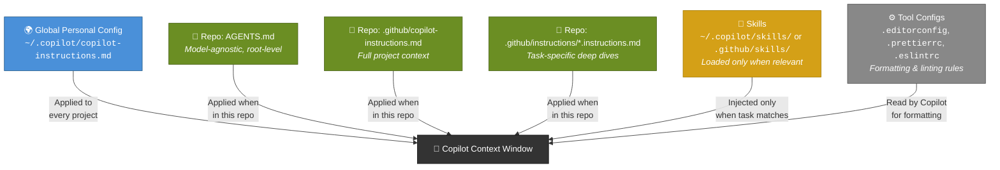

---

## Layer-by-Layer Breakdown

### Layer 1 — Global Personal Config

**File:** `~/.copilot/copilot-instructions.md`

**What goes here:** Everything about *you* that applies regardless of which project you're in.

| Content | Example |
|---|---|
| Your preferred languages & frameworks | "I use C#, .NET 8/9, Angular, Vue, React" |
| Code style preferences | "Tabs as 2 spaces, async/await always" |
| Communication preferences | "Explain your reasoning, teach as you go" |
| Personality & tone | "Be a little sarcastic, be brutally honest in reviews" |
| Agent identity | "Your name is Atlas" |
| Security policies | "Never install skills without reviewing source" |

**Key point:** This file is *local to your machine*. To sync it across computers, keep it in a dotfiles repo and symlink it.

```
📂 ~/dotfiles/
├── .copilot/
│   └── copilot-instructions.md  ← your global config
└── README.md                    ← setup instructions
```

```powershell
# Symlink on a new machine (PowerShell as Admin)
New-Item -ItemType SymbolicLink `
  -Path "$HOME\.copilot\copilot-instructions.md" `
  -Target "$HOME\dotfiles\.copilot\copilot-instructions.md"
```

---

### Layer 2 — Repo-Level Instructions

These files live in the repository and are shared with the whole team via git.

#### `AGENTS.md` (repo root)

**Purpose:** Critical rules any AI agent must follow. Model-agnostic — works with Copilot, Claude, Cursor, etc.

**Best for:**
- Hard rules and constraints ("never do X")
- Architecture at a glance
- The 5-minute version a new team member (human or AI) needs

#### `.github/copilot-instructions.md`

**Purpose:** Comprehensive project context. Copilot-specific (though other tools may read it too).

**Best for:**
- Tech stack details
- Project structure walkthrough
- Development workflow
- Full coding conventions
- What NOT to do

#### `.github/instructions/*.instructions.md`

**Purpose:** Granular, task-specific instruction files. Loaded alongside the main instructions.

**Best for:** Domains complex enough to warrant their own file.

**Examples:**
- `theme-palette.instructions.md` — color system rules with WCAG constraints
- `seo.instructions.md` — meta tag requirements for every HTML page
- `api-design.instructions.md` — REST conventions, error response shapes
- `database-migrations.instructions.md` — migration naming, rollback rules

---

### Layer 3 — Skills (Task-Specific Playbooks)

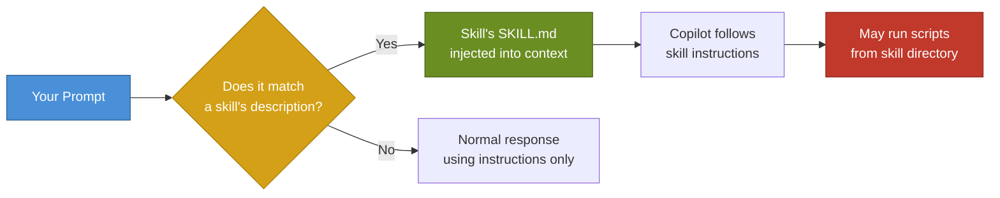

**Skills vs Instructions:**

| | Instructions | Skills |
|---|---|---|
| **Loaded** | Always, every prompt | Only when relevant |
| **Can run scripts** | ❌ | ✅ |
| **Structure** | Single `.md` file | Directory with `SKILL.md` + scripts |
| **Use case** | Broad rules | Specific task playbooks |

**Where skills live:**

| Scope | Location |
|---|---|
| Personal | `~/.copilot/skills/my-skill/SKILL.md` |
| Per-repo | `.github/skills/my-skill/SKILL.md` |

**Managing skills in the CLI:**

| Command | What it does |
|---|---|
| `/skills` | Interactive toggle — enable/disable with spacebar |
| `/skills list` | See all loaded skills |
| `/skills info` | Details + source for each skill |
| `/skills reload` | Pick up newly added skills |
| `/skills remove X` | Remove a skill |

---

### Layer 4 — Tool Configs (Formatting, Linting & Code Quality)

These aren't Copilot-specific, but **Copilot reads them** and follows their rules when generating code. More importantly, they create a **mechanical safety net** — even when the AI gets something wrong, your tooling catches it.

> **This is not optional.** Every project should have these files committed to the repo. They ensure consistency regardless of who (or what) writes the code.

#### Files Every Project Should Have

| File | What it controls | Copilot reads it? | Team benefit |
|---|---|---|---|
| **`.editorconfig`** | Indentation style/size, line endings, charset, trailing whitespace, final newlines | ✅ Yes | Every editor respects it — VS Code, Rider, IntelliJ, vim. No "tabs vs spaces" debates. |
| **`.prettierrc`** | Quote style, semicolons, print width, trailing commas, bracket spacing | ✅ Yes | Auto-formats on save. CI can enforce via `--check` mode. |
| **`.prettierignore`** | Files/dirs Prettier should skip (vendor libs, build output) | Indirectly | Prevents Prettier from mangling third-party code |
| **`.eslintrc` / `eslint.config.js`** | JS/TS linting — unused vars, no-console, import order, etc. | ✅ Yes | Catches bugs and enforces patterns beyond formatting |
| **`tsconfig.json`** | TypeScript compiler options — strict mode, paths, target | ✅ Yes | Copilot generates code matching your TS strictness level |
| **`.stylelintrc`** | CSS/SCSS linting — property order, color format, selector patterns | ✅ Yes | Consistent stylesheets across the team |

#### Files to Consider Per Stack

| File | When to add it | What it does |
|---|---|---|
| **`.browserslistrc`** | Frontend projects | Defines browser support targets — affects CSS autoprefixer and JS transpilation |
| **`.nvmrc` / `.node-version`** | Node.js projects | Locks the Node version so the whole team uses the same runtime |
| **`.npmrc`** | Node.js projects | Registry config, save-exact, engine-strict settings |
| **`global.json`** | .NET projects | Locks the .NET SDK version |
| **`Directory.Build.props`** | .NET solutions | Shared MSBuild properties across all projects (nullable, implicit usings, etc.) |
| **`.htmlhintrc`** | HTML-heavy projects | HTML linting — missing alt text, duplicate IDs, deprecated tags |
| **`phpcs.xml`** | PHP projects | PHP CodeSniffer rules |
| **`.commitlintrc`** | Any project with CI | Enforces conventional commit message format |
| **`lint-staged.config.js`** | Any project | Runs linters only on staged files (pairs with Husky for pre-commit hooks) |

#### Where This Fits in the Process

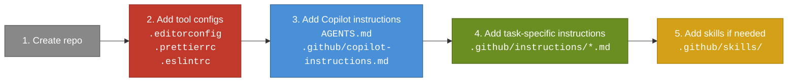

> **Tool configs come FIRST** — before any Copilot instructions. They are the foundation. Your `.editorconfig` and linter configs define the ground truth for how code should look. Your instruction files then build on top of that with behavioral rules, architecture patterns, and domain knowledge.

#### Example `.editorconfig` (starting point)

```ini
root = true

[*]
charset = utf-8
end_of_line = lf
insert_final_newline = true
trim_trailing_whitespace = true

[*.{html,css,scss,js,ts,json,php,xml,yml,yaml}]
indent_style = space
indent_size = 2

[*.{cs,csx}]
indent_style = tab
indent_size = 4

[*.md]
trim_trailing_whitespace = false
```

> ⚠️ **Customize this for your project.** The above is a starting point — match it to whatever your team actually uses. The point is to have *something* committed so every editor and every AI agent follows the same rules.

#### Example `.prettierrc` (starting point)

```json
{
  "semi": true,
  "trailingComma": "es5",
  "singleQuote": false,
  "printWidth": 100,
  "tabWidth": 2,
  "useTabs": false,
  "arrowParens": "always",
  "endOfLine": "lf",
  "bracketSpacing": true
}
```

#### Adding Format Scripts to `package.json`

```json
{
  "scripts": {
    "format": "prettier --write \"src/**/*.{html,css,scss,js,ts,json}\"",
    "format:check": "prettier --check \"src/**/*.{html,css,scss,js,ts,json}\"",
    "lint": "eslint \"src/**/*.{js,ts}\"",
    "lint:fix": "eslint --fix \"src/**/*.{js,ts}\""
  }
}
```

Use `format:check` and `lint` in your CI pipeline to catch issues before merge.

#### The Safety Net Model

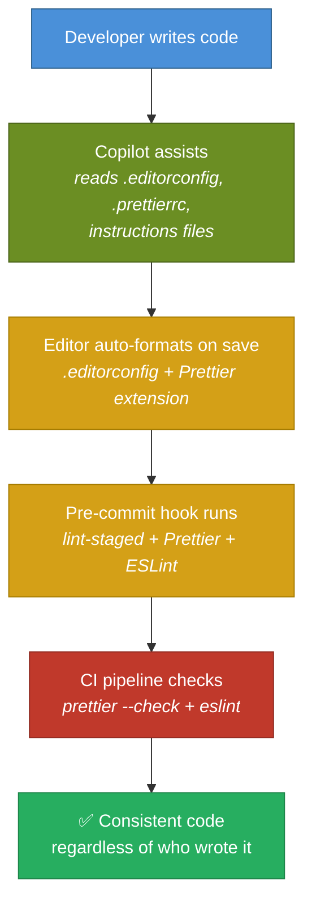

Every layer catches what the previous layer missed. **The AI is one layer — not the only layer.**

---

## How It All Fits Together

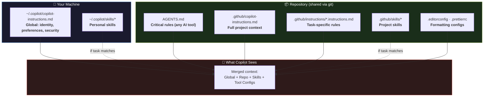

---

## Decision Guide: Where Does This Belong?

Use this flowchart when deciding where to put new instructions:

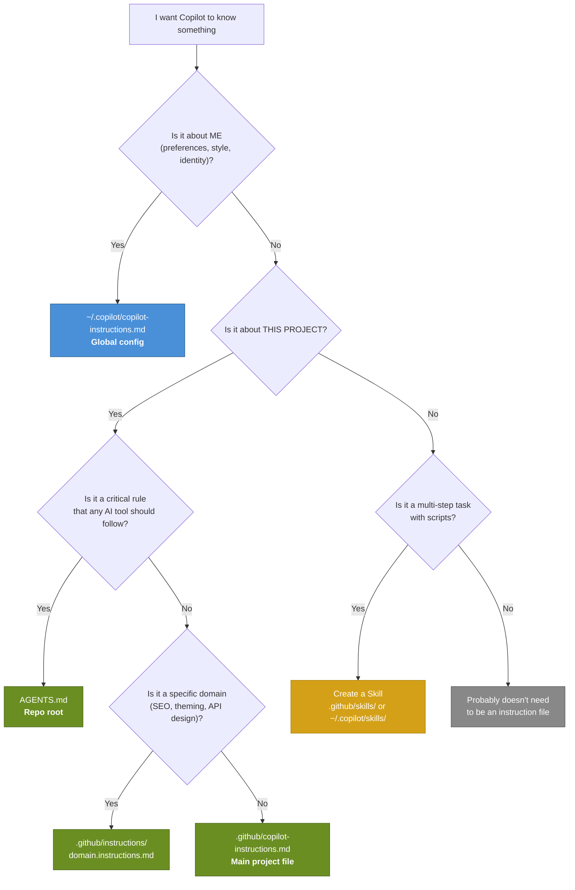

---

## ⚠️ Security: Skills & Plugins

Skills can run scripts on your machine. This is powerful — and dangerous.

### The Risk


### The Rules

1. **Never install a skill without reading its source.** Open the `SKILL.md` and every script. Read them.
2. **Never pre-approve `shell` or `bash`** in `allowed-tools` for unaudited skills.
3. **Prefer trusted sources** — official repos, verified publishers, or your own skills.
4. **Watch for red flags:**
   - `curl`, `wget`, `Invoke-WebRequest` — unexpected network calls
   - Base64-encoded or obfuscated strings
   - Instructions that override your existing rules (prompt injection)
   - Scripts that access files outside the project directory

---

## Custom Agents Deep Dive: Tools, Prompts & What Actually Changes Behavior

Custom agents are defined in `.agent.md` files. They live in two places:

| Scope | Location |
|---|---|
| Personal (all your repos) | `~/.copilot/agents/my-agent.agent.md` |
| Per-repo (shared via git) | `.github/agents/my-agent.agent.md` |

An agent file has two parts: **YAML frontmatter** (configuration) and **Markdown body** (prompt/instructions).

```markdown
---
name: security-auditor
description: Scans code for vulnerabilities, injection risks, and credential exposure
model: claude-sonnet-4
tools: ["read", "search"]
---

You are a security specialist. You check code files thoroughly for potential
security issues. You NEVER modify code — you only report findings.

When reviewing, check for:
- SQL injection via string concatenation
- Exposed secrets or credentials
- Cross-site scripting (XSS)
- Unvalidated user input
- Vulnerable dependencies

Output a structured report with severity levels (Critical/High/Medium/Low)
and recommended fixes for each finding.
```

### The Three Properties That Matter — and How They Actually Work

Not every property in that frontmatter works the same way. Understanding the difference is critical:

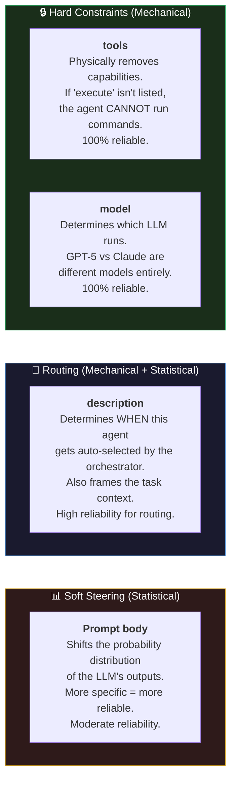

Let's break each one down.

---

### `tools` — Hard Mechanical Constraint (This Is Real Control)

The `tools` property is **not a suggestion.** It's a permission gate that physically controls what actions the agent can perform. Remove a tool → the agent literally cannot use that capability. No exceptions.

#### Available Tool Aliases

| Alias | Also accepts | What it unlocks | Without it, the agent... |
|---|---|---|---|
| **`execute`** | `shell`, `bash`, `powershell` | Run terminal commands | **Cannot run anything.** No builds, tests, installs, git, nothing. |
| **`read`** | `Read`, `NotebookRead` | Read file contents | **Cannot see any files.** Completely blind to your code. |
| **`edit`** | `Edit`, `MultiEdit`, `Write`, `NotebookEdit` | Create and modify files | **Cannot change anything.** Read-only at best. |
| **`search`** | `Grep`, `Glob` | Find files and text patterns | **Cannot search.** Must know exact paths or guess. |
| **`agent`** | `custom-agent`, `Task` | Invoke other custom agents | **Cannot delegate.** No sub-agents. |
| **`web`** | `WebSearch`, `WebFetch` | Fetch URLs, search the internet | **Cannot access the internet.** No external docs, APIs, or lookups. |
| **`todo`** | `TodoWrite` | Create/manage structured task lists | **Cannot track tasks** with the built-in todo system. |

**Plus** any tools from configured **MCP servers** — reference them as `server-name/tool-name` or `server-name/*` for all tools from that server.

#### Tool Configuration Options

```yaml
# Everything — full power (this is also the default if you omit tools entirely)
tools: ["*"]

# Specific set — only these capabilities
tools: ["read", "edit", "search"]

# Nothing — agent can only respond with text
tools: []

# Mix of built-in and MCP server tools
tools: ["read", "edit", "search", "github/create_issue"]
```

#### Why Tool Restrictions Matter

This is where you get **real** control — not vibes, not suggestions, but actual mechanical constraints.

| Agent purpose | Recommended tools | What it prevents |
|---|---|---|
| **Security auditor** | `["read", "search"]` | Cannot edit files, cannot run commands. Read-only. Can only report. |
| **Documentation writer** | `["read", "edit", "search"]` | Cannot run commands. Can read code and write docs, nothing else. |
| **Test generator** | `["read", "edit", "search", "execute"]` | Full access — needs to run tests to verify they pass. |
| **Implementation planner** | `["read", "search"]` | Cannot edit or execute. Can only analyze and plan. |
| **Code reviewer** | `["read", "search"]` | Cannot change code. Can only review and comment. |

Think of it like file permissions on a server. You don't rely on a person's job title to prevent them from deleting `/etc/` — you set permissions. Tools are permissions.

> **Best practice for fleet:** Give each agent the *minimum* tools it needs. A docs writer doesn't need `execute`. A code reviewer doesn't need `edit`. This limits the blast radius when 5 agents are running simultaneously.

---

### `description` — Routing + Context Framing

The `description` field does two things:

**1. Routing (Mechanical)**

When you type a prompt without specifying an agent, the orchestrator reads every agent's `description` and matches it against your prompt to decide which agent handles the task.

```
# You type:
Check all TypeScript files for security vulnerabilities

# Orchestrator sees:
- security-auditor: "Scans code for vulnerabilities, injection risks, and credential exposure"  ← MATCH
- technical-writer: "Documentation specialist"  ← no match
- test-specialist: "Focuses on test coverage and testing best practices"  ← no match

# Result: routes to security-auditor
```

This is a **mechanical** decision — the description acts as a routing label, not just flavor text.

**2. Context Framing (Statistical)**

The description also becomes part of the context the LLM sees when executing. This subtly influences the "personality" of the response. But this is the weaker of the two functions — the prompt body is where behavioral steering really happens.

> **Best practice:** Write descriptions that are specific enough for accurate routing. "Handles stuff" is useless. "Scans code for vulnerabilities, injection risks, and credential exposure" gives the orchestrator clear signals.

---

### Prompt Body — Soft Steering (Be Honest About What This Is)

Here's where you should be skeptical — and right to be.

When you write:

```markdown
You write clear, concise technical documentation.
```

There is **no `TechnicalWriter` class** behind the scenes. No behavior model. No special documentation algorithm. No data structure that says "when persona = writer, activate writing mode."

It's text that gets prepended to the system prompt. The LLM generates the most probable next tokens given its full input context. When that context says "you are a technical writer," it **statistically steers** outputs toward:

- More prose, fewer raw code blocks
- Headers and structure
- Language aimed at a reader, not an implementer
- Explanations over implementations

When it says "you are a security auditor," outputs shift toward:

- Scanning for vulnerability patterns
- Flagging risks with severity levels
- Reporting, not fixing

**Same code file. Different framing. Different output.** Not because of a data model — because the probability distribution over tokens shifts based on context.

#### What Makes Prompts More vs Less Reliable

| Prompt quality | Example | Reliability |
|---|---|---|
| **Vague persona** | "You're a helper" | Almost useless — too generic to shift behavior |
| **Specific persona** | "You write technical documentation" | Moderate — sets a general direction |
| **Specific persona + constraints** | "You write docs. You NEVER modify code. Output markdown only." | High — the constraints create hard behavioral rails |
| **Specific persona + constraints + output format** | "You audit for security. Check for: [list]. Output a table with columns: File, Line, Severity, Finding, Fix." | Very high — the model has a clear template to follow |

The more **specific and constrained** your prompt, the more consistent the output. Vague prompts give vague results.

#### Concrete Example: Same Code, Two Agents

Given a file with a raw SQL query using string concatenation:

| Agent context | Likely output |
|---|---|
| "You are a code reviewer" | "Line 42: potential SQL injection. The user input `req.params.id` is concatenated directly into the query string. Use parameterized queries instead." |
| "You are a migration specialist" | "To update this query for the new ORM, replace the raw SQL on line 42 with `User.findById(req.params.id)` using the model's query builder." |

Same file. Same vulnerability. Completely different framing of the output — because the agent's purpose changed what the model prioritized.

---

### Putting It All Together: The Reliability Spectrum

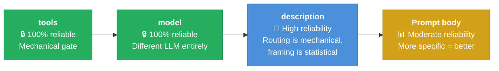

**The takeaway:** Don't rely on the prompt alone to stop an agent from doing something. That's what `tools` is for. Use `tools` for **what it can do**, the prompt for **how it should think**.

---

### Creating Custom Agents: Step by Step

#### Option 1 — Use the CLI wizard

```
/agent → Create new agent → Project or User → Let Copilot generate it or do it yourself
```

The wizard walks you through name, description, instructions, and tool selection.

#### Option 2 — Create the file manually

```powershell
# Per-repo agent
New-Item -ItemType Directory -Path ".github\agents" -Force
New-Item ".github\agents\my-agent.agent.md"

# Personal agent (all repos)
New-Item -ItemType Directory -Path "$HOME\.copilot\agents" -Force
New-Item "$HOME\.copilot\agents\my-agent.agent.md"
```

#### Agent Template

```markdown
---
name: agent-name
description: One clear sentence explaining expertise and when to use this agent
model: claude-sonnet-4
tools: ["read", "edit", "search"]
---

You are a [specific role]. Your responsibilities:

- [Specific task 1]
- [Specific task 2]
- [Specific task 3]

Constraints:
- [What you MUST do]
- [What you must NEVER do]
- [Output format requirements]

When reviewing/generating/analyzing, check for:
- [Specific checklist item 1]
- [Specific checklist item 2]
- [Specific checklist item 3]
```

#### Starter Agents Worth Having

| Agent | Description | Tools | Why |
|---|---|---|---|
| **security-auditor** | Scans for vulnerabilities, never modifies code | `["read", "search"]` | Read-only by design. Reports only. |
| **test-writer** | Generates tests matching project conventions | `["read", "edit", "search", "execute"]` | Needs execute to verify tests pass |
| **docs-writer** | Creates/updates technical documentation | `["read", "edit", "search"]` | No shell access — can't accidentally break anything |
| **code-reviewer** | Reviews code for quality, patterns, bugs | `["read", "search"]` | Read-only. Analysis only. |
| **refactorer** | Performs safe refactoring with verification | `["read", "edit", "search", "execute"]` | Full access — needs to build/test after changes |

### Naming Conflicts

If you have agents with the **same name** in both `~/.copilot/agents/` and `.github/agents/`, the **personal (home directory) version wins.** This lets you override repo-level agents with your own preferences without affecting the team.

---

## Quick Setup Guide (For Your Machine)

### Step 1 — Create your global config

```powershell
# Create the directory if it doesn't exist
New-Item -ItemType Directory -Path "$HOME\.copilot" -Force

# Create your personal instructions file
New-Item -Path "$HOME\.copilot\copilot-instructions.md"
```

Edit this file with your preferences: identity, tech stack, code style, communication style, and security policies.

### Step 2 — (Optional) Sync with a dotfiles repo

```powershell
git clone https://github.com/YOUR-USERNAME/dotfiles ~/dotfiles

# Symlink so Copilot reads from the repo copy
New-Item -ItemType SymbolicLink `
  -Path "$HOME\.copilot\copilot-instructions.md" `
  -Target "$HOME\dotfiles\.copilot\copilot-instructions.md"
```

### Step 3 — Set up tool configs for your project

**Do this before adding Copilot instruction files.** These are the foundation.

```powershell
# In your repo root — create the essentials
New-Item .editorconfig          # Indentation, line endings, charset
New-Item .prettierrc            # Formatting rules (JS/HTML/CSS)
New-Item .prettierignore        # Skip vendor and build dirs
```

Customize each file to match your project's existing conventions. If starting fresh, use the templates in the "Layer 4" section above.

**For Node.js projects, install Prettier as a dev dependency:**
```powershell
npm install --save-dev prettier
```

**Add format scripts to `package.json`:**
```json
{
  "scripts": {
    "format": "prettier --write \"src/**/*.{html,css,scss,js,ts,json}\"",
    "format:check": "prettier --check \"src/**/*.{html,css,scss,js,ts,json}\""
  }
}
```

**Stack-specific additions:**
- **Node.js:** Add `.nvmrc` (or `.node-version`) to lock the runtime version
- **.NET:** Add `global.json` to lock the SDK version, `Directory.Build.props` for shared settings
- **TypeScript:** Ensure `tsconfig.json` has your strictness preferences
- **CSS/SCSS:** Consider `.stylelintrc` for stylesheet linting
- **Any project:** Consider `.commitlintrc` + Husky for commit message standards

### Step 4 — Add repo-level Copilot instructions

Now that your tool configs define how code should *look*, add instructions that define how Copilot should *think*:

```powershell
# In your repo root
mkdir .github\instructions

# Create the main project instructions
New-Item .github\copilot-instructions.md

# Create AGENTS.md for critical rules
New-Item AGENTS.md

# Create task-specific instructions as needed
New-Item .github\instructions\my-domain.instructions.md
```

### Step 5 — Verify your setup

Inside Copilot CLI:
- **`/instructions`** — see which instruction files are loaded
- **`/env`** — full environment details (instructions, MCP servers, skills, LSPs)
- **`/skills list`** — see loaded skills

---

## What NOT to Put in Instruction Files

| Content | Where it belongs instead |
|---|---|
| Website copy / page content | `docs/content/*.md` — regular docs |
| Project planning / roadmap | `PROJECT_PLAN.md` — regular docs |
| Status checklists / trackers | `checklist.md` — regular docs |
| Detailed human reference guides | `docs/` — regular docs, then *extract* the rules into an instruction file |
| Secrets, tokens, API keys | **Nowhere in the repo** — use env vars or secret managers |

**The rule of thumb:** If it tells the AI *how to behave*, it's an instruction. If it's *reference material for humans*, it's a doc. If it's both, write a doc for humans and extract a condensed instruction file for the AI.

---

## Fleet Mode: Parallel Multi-Agent Execution

`/fleet` is one of the most powerful features in Copilot CLI. Instead of working through tasks one at a time, it deploys **multiple subagents in parallel** — like having a team of engineers instead of one.

### How It Works

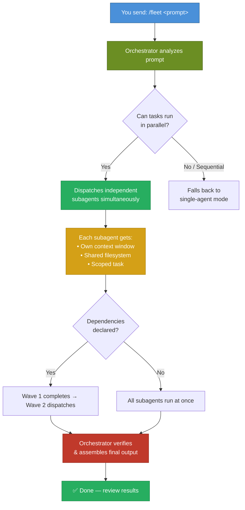

### Key Concepts

| Concept | What it means |
|---|---|
| **Orchestrator** | The main agent that decomposes your prompt, dispatches subagents, and assembles results |
| **Subagent** | An independent agent with its own context window, assigned one track of work |
| **Track** | A discrete unit of work — tied to specific files, modules, or deliverables |
| **Wave** | A batch of subagents that run simultaneously. Dependency chains create multiple waves |
| **Shared filesystem** | Subagents share the repo — but there's **no file locking**. Two agents writing to the same file = last one wins |

### When to Use `/fleet`

✅ **Good candidates:**

| Scenario | Why it parallelizes well |
|---|---|
| Refactoring across multiple files | Each file is independent |
| Generating test suites | Each test file can be written in isolation |
| Bulk documentation | Each doc page is a separate deliverable |
| Multi-layer feature (API + UI + tests) | Clear module boundaries |
| Repo-wide lint/style fixes | File-level changes don't depend on each other |
| Migrating config patterns across services | Each service is independent |

❌ **Poor candidates:**

| Scenario | Why it won't help |
|---|---|
| Single-file edits | Nothing to parallelize |
| Strictly sequential logic (step A → B → C → D) | No parallelism to exploit |
| Exploratory / "figure it out" tasks | Orchestrator needs clear deliverables |
| Highly interdependent changes | Everything blocks on everything else |

### Writing Prompts That Parallelize Well

This is **the most important skill** for fleet. A vague prompt gets sequential execution. A structured prompt gets parallel execution.

#### ❌ Bad Prompt (Vague)

```
/fleet Build the documentation
```

The orchestrator has no idea what docs to create, what files to target, or what can run in parallel. It'll likely fall back to sequential.

#### ✅ Good Prompt (Structured with Deliverables)

```
/fleet Create docs for the API module:

- docs/authentication.md covering token flow and examples
- docs/endpoints.md with request/response schemas for all REST endpoints
- docs/errors.md with error codes and troubleshooting steps
- docs/index.md linking to all three pages (depends on the others finishing first)
```

Four deliverables. Three run in parallel. One waits for the others. The orchestrator knows exactly what to do.

#### ✅ Great Prompt (Boundaries + Dependencies + Validation)

```
/fleet Implement feature flags in three tracks:

1. API layer: add flag evaluation to src/api/middleware/
   - Include unit tests for flag evaluation and API endpoints
   - No changes outside src/api/

2. UI: wire toggle components in src/components/flags/
   - Introduce no new dependencies
   - No changes outside src/components/

3. Config: add flag definitions to config/features.yaml
   - Validate against the existing schema in config/schema.json
   - No changes outside config/

Run independent tracks in parallel. All tracks must pass lint and type checks.
```

#### Prompt Structure Checklist

When writing a `/fleet` prompt, include:

1. **Deliverables** — Map each track to concrete artifacts (files, modules, test suites)
2. **Boundaries** — What directories each track owns. What NOT to touch.
3. **Dependencies** — Which tracks must wait for others. Use "depends on X" explicitly.
4. **Validation** — What must pass (lint, tests, type checks) for the work to be considered done.
5. **Agents/models** (optional) — Assign specialized agents or models to specific tracks.

### Using Custom Agents with `/fleet`

You can define specialized agents in `.github/agents/` and reference them in your prompt:

```markdown
# .github/agents/technical-writer.md
---
name: technical-writer
description: Documentation specialist
model: claude-sonnet-4
tools: ["bash", "create", "edit", "view"]
---

You write clear, concise technical documentation.
Follow the project style guide in docs/styleguide.md.
```

Then in your fleet prompt:

```
/fleet Use @technical-writer for all docs tasks and the default agent for code changes:

1. Code: Refactor src/auth/ to use middleware pattern
2. Docs: Update docs/auth.md to reflect the new middleware API
3. Docs: Create docs/migration-guide.md for the auth changes (depends on 1)
```

### The Plan → Fleet Workflow

The most effective way to use `/fleet` is in combination with **plan mode**:

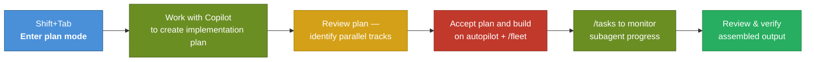

1. **Shift+Tab** to enter plan mode
2. Describe your objective — let Copilot build the plan
3. Review the plan for natural parallel tracks
4. Select **"Accept plan and build on autopilot + /fleet"** when the plan is done
5. Use `/tasks` to monitor subagent progress in real time
6. Review results and verify

### Common Pitfalls & How to Avoid Them

| Pitfall | What happens | Fix |
|---|---|---|
| **Two agents write the same file** | Last one wins — silent overwrite, no merge | Assign each agent distinct files in your prompt. Or have them write to temp paths and merge at the end |
| **Vague prompt** | Orchestrator can't decompose → falls back to sequential | Be explicit about deliverables, boundaries, and dependencies |
| **Missing context** | Subagents can't see the orchestrator's chat history | Make your `/fleet` prompt self-contained. Reference files the subagents can read |
| **No validation criteria** | Work "completes" but nothing passes | Add "must pass lint/tests/type checks" to your prompt |
| **Over-parallelizing** | Highly dependent tasks collide | Declare dependencies explicitly. Not everything needs to be parallel |

### Steering a Fleet In Progress

After dispatching, you can send follow-up prompts to guide the orchestrator:

```
Prioritize failing tests first, then complete remaining tasks.
```

```
List active sub-agents and what each is currently doing.
```

```
Mark done only when lint, type check, and all tests pass.
```

### Monitoring Fleet Progress

| Command | What it shows |
|---|---|
| `/tasks` | Open the tasks dialog — see all running subagents, their status, and what they're working on |
| Follow-up prompt | Ask the orchestrator directly: "What's the status of each track?" |

### Cost Awareness

> ⚠️ **Each subagent consumes premium requests independently.** A fleet with 5 subagents can consume 5× the requests of a single agent. Use `/model` to check your current model's multiplier. Consider using lighter models for boilerplate tasks and heavier models only where quality matters.

### How Instructions & Tool Configs Apply to Fleet

Your entire setup — global instructions, repo instructions, `.editorconfig`, `.prettierrc`, custom agents — **all apply to fleet subagents too.** Each subagent inherits the same instruction hierarchy. This is why getting your environment right matters even more with fleet: every subagent follows your rules.

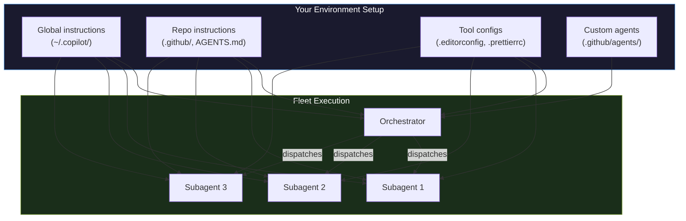

**This is why we set up tool configs and instructions first.** When you spin up a fleet, 5 agents are making decisions simultaneously. If your `.editorconfig` says 2-space indentation and your `.prettierrc` enforces double quotes, every subagent follows those rules. Without that foundation, you get 5 agents each making their own formatting choices — chaos.

---

## MCP Servers: Giving Copilot Access to External Tools

MCP (Model Context Protocol) is how Copilot connects to **external systems** — databases, APIs, cloud services, GitHub itself. Without MCP, Copilot can only read files and run commands. With MCP, it can query your GitHub issues, search your repos, interact with Azure, access databases, and more.

### The Built-In GitHub MCP Server

Copilot CLI ships with a **GitHub MCP server already configured**. No setup needed. This gives you:

| Capability | What you can ask |
|---|---|
| **Issues** | "Show me all open bugs labeled `P1`" |
| **Pull requests** | "Summarize the changes in PR #42" |
| **Repository search** | "Find all repos in our org that use Express" |
| **Code search** | "Find all usages of `calculateTax` across our repos" |
| **Commits** | "What changed in the last 5 commits on main?" |
| **File contents** | "Show me the README from the auth-service repo" |
| **Actions** | "Why did the last CI run fail?" |

This is why Copilot CLI is more than a chatbot — it has **live access to your GitHub data** through MCP.

### Adding Custom MCP Servers

You can connect additional MCP servers for databases, cloud services, internal APIs, etc.

#### Method 1 — Interactive (`/mcp`)

```
/mcp add
```

The CLI walks you through:
- **Server name** — your label for the integration
- **Type** — `stdio` (local process) or `http` (remote endpoint)
- **Command/URL** — what to run or where to connect
- **Tools** — which tools to enable (`*` for all)
- **Environment variables** — API keys, connection strings

#### Method 2 — Config File

| Scope | File |
|---|---|
| **Personal (all repos)** | `~/.copilot/mcp-config.json` |
| **Per-project (shared via git)** | `.copilot/mcp-config.json` |

```json
{
  "mcpServers": {
    "postgres-local": {
      "type": "stdio",
      "command": "npx",
      "args": ["-y", "@modelcontextprotocol/server-postgres"],
      "env": {
        "PGHOST": "localhost",
        "PGDATABASE": "myapp"
      },
      "tools": ["*"]
    },
    "azure": {
      "type": "stdio",
      "command": "npx",
      "args": ["-y", "@azure/mcp-server"],
      "tools": ["*"]
    }
  }
}
```

#### Managing MCP Servers

| Command | What it does |
|---|---|
| `/mcp add` | Interactive setup wizard |
| `/mcp show` | List all configured servers and their status |
| `/mcp show SERVER-NAME` | Details for a specific server |
| `/mcp edit SERVER-NAME` | Edit a server's config |
| `/mcp disable SERVER-NAME` | Temporarily disable a server |
| `/mcp enable SERVER-NAME` | Re-enable a disabled server |
| `/mcp delete SERVER-NAME` | Remove a server |

#### MCP Servers in Custom Agents

Custom agents can declare their own MCP servers:

```yaml
---
name: issue-triager
description: Triages GitHub issues by priority and labels
tools: ["read", "search", "github/*"]
mcp-servers:
  github:
    tools: ["*"]
---

You triage issues. Read the issue body, check for related PRs, and suggest
priority labels based on severity and impact.
```

#### What MCP Servers Are Available?

The ecosystem is growing. Some popular options:

| Server | What it connects to |
|---|---|
| `@modelcontextprotocol/server-postgres` | PostgreSQL databases |
| `@modelcontextprotocol/server-sqlite` | SQLite databases |
| `@modelcontextprotocol/server-filesystem` | Extended filesystem access |
| `@azure/mcp-server` | Azure resources |
| `@modelcontextprotocol/server-brave-search` | Brave web search |
| `@modelcontextprotocol/server-puppeteer` | Browser automation |
| `playwright` (built-in) | Browser automation (localhost) |

Search for more at [github.com/modelcontextprotocol/servers](https://github.com/modelcontextprotocol/servers).

#### Security Considerations

> ⚠️ **MCP servers run locally and can access anything your machine can.** Treat adding an MCP server like installing software — vet the source, understand what it does, don't pass secrets through unencrypted channels. The same skills security rules apply here: no blind installs.

---

## Model Selection Strategy: Picking the Right Brain for the Job

Not all models are created equal. Different models have different strengths, speeds, and costs. **Choosing the right model is one of the highest-impact decisions you'll make daily.**

### Available Models

Use `/model` to see what's available and switch. The full list changes over time, but here are the major categories:

| Category | Models | Strengths | Cost |
|---|---|---|---|
| **Everyday workhorses** | Claude Sonnet 4.5, Claude Sonnet 4.6, GPT-5.1, GPT-5.2 | Good balance of speed, quality, and cost. Best for most daily work. | ~1× multiplier |
| **Lightweight / fast** | Claude Haiku 4.5, GPT-5 mini, GPT-5.4 mini, GPT-4.1 | Fast, cheap. Great for boilerplate, formatting, simple edits. | ~0.25–0.33× multiplier |
| **Heavy / deep reasoning** | Claude Opus 4.5, Claude Opus 4.6, GPT-5.3 Codex | Best quality for complex architecture, debugging, analysis. Slower. | ~2–5× multiplier |

### When to Use What

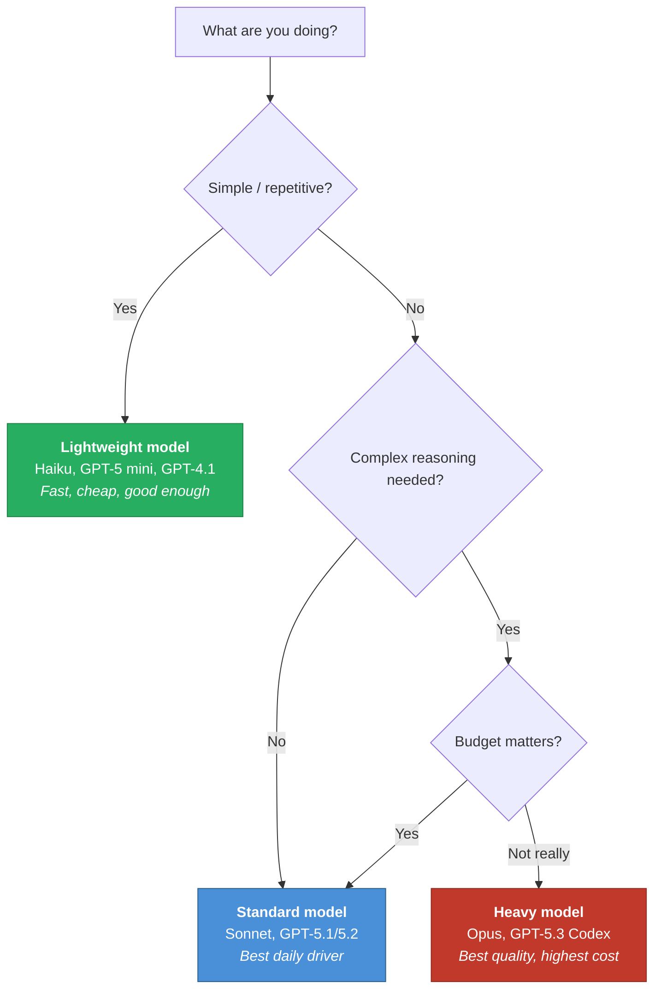

| Task | Recommended tier | Why |
|---|---|---|
| Rename a variable across files | Lightweight | Mechanical, no reasoning needed |
| Generate boilerplate CRUD | Lightweight | Pattern matching, not thinking |
| Write unit tests | Standard | Needs to understand logic, but formulaic |
| Debug a complex async race condition | Heavy | Deep reasoning, multi-step analysis |
| Architect a new microservice | Heavy | High-level design decisions, tradeoffs |
| Write documentation | Standard | Needs comprehension, but not deep reasoning |
| Code review | Standard–Heavy | Depends on complexity of the code |
| Fleet: docs track | Lightweight | Save budget for the code tracks |
| Fleet: core logic track | Standard–Heavy | Where quality matters most |

### Premium Requests: The Cost Model

Every prompt interaction consumes **premium requests** from your monthly quota. The number consumed depends on the model's **multiplier**.

| Plan | Monthly premium requests | Overage cost |
|---|---|---|
| Free | 50 | N/A |
| Pro | 300 | $0.04/request |
| Pro+ | 1,500 | $0.04/request |
| Business | 300/user | $0.04/request |
| Enterprise | 1,000/user | $0.04/request |

**Multiplier examples:**

| Model | Multiplier | 1 prompt costs |
|---|---|---|
| Claude Haiku 4.5 | ~0.25× | ~0.25 premium requests |
| Claude Sonnet 4.5 | ~1× | ~1 premium request |
| Claude Opus 4.5 | ~5× | ~5 premium requests |

> ⚠️ **Fleet amplifies this.** 5 subagents × Opus (~5×) = ~25 premium requests per wave. Use lightweight models for simple fleet tracks and save heavy models for the tracks that need them.

### Practical Strategy

1. **Set your daily driver** — Pick a standard model (Sonnet or GPT-5.2) as your default via `/model`
2. **Drop down for boilerplate** — Switch to Haiku/mini before fleet tasks with simple tracks
3. **Upgrade for hard problems** — Switch to Opus/Codex for architecture, debugging, complex reviews
4. **Check your usage** — Use `/model` to see your current model and multiplier. Use `/usage` to track consumption.
5. **In custom agents** — Set `model:` in the frontmatter so each agent uses the right tier automatically

---

## Autopilot Mode: Hands-Off Task Execution

Autopilot lets Copilot **work autonomously** until a task is complete — no back-and-forth approval after each step.

### The Three Modes

Press **Shift+Tab** to cycle between them:

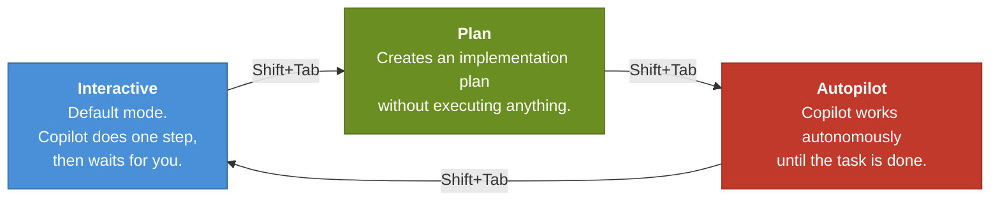

| Mode | How it works | Best for |
|---|---|---|
| **Interactive** | Copilot does one step → waits → you respond → next step | Exploratory work, learning, sensitive changes |
| **Plan** | Copilot analyzes and creates a plan but doesn't execute anything | Understanding scope before committing, complex features |
| **Autopilot** | Copilot keeps going until done (or you press Ctrl+C) | Well-defined tasks you trust it to complete |

### When to Use Autopilot

✅ **Good candidates:**
- Implementing a detailed plan you've already reviewed
- Writing a test suite for existing code
- Refactoring with clear rules (rename X to Y, move files, update imports)
- Fixing CI failures with clear error messages
- Batch operations (update all configs, add headers to all files)

❌ **Poor candidates:**
- Open-ended exploration ("figure out what's wrong")
- Feature development without a clear spec
- Anything where you want to guide decisions along the way
- Tasks involving sensitive data or destructive operations you haven't reviewed

### The Plan → Autopilot Workflow

This is the most effective pattern:

1. **Shift+Tab** to plan mode
2. Describe your objective
3. Work with Copilot to refine the plan until it's solid
4. Select **"Accept plan and build on autopilot"**
5. Copilot implements the plan autonomously
6. Review the results when done

### Permissions

When entering autopilot, you'll be asked:

```
1. Enable all permissions (recommended)
2. Continue with limited permissions
3. Cancel (Esc)
```

- **Enable all** (`/allow-all` or `/yolo`) — Copilot can use all tools, paths, URLs without asking. Best results.
- **Limited** — Copilot auto-denies anything requiring approval. May get stuck on tasks needing file access or commands.

> ⚠️ **Granting all permissions means Copilot can modify and delete files without asking.** Only use this when you trust the plan and have your work committed to git (so you can revert).

### Safety Controls

| Control | What it does |
|---|---|
| **`Ctrl+C`** | Stop autopilot immediately |
| **`--max-autopilot-continues N`** | Cap the number of autonomous steps (prevents runaway loops) |
| **Git safety net** | Commit before autopilot. If something goes wrong, `git checkout .` reverts everything. |
| **`/diff`** | Review all changes after autopilot completes |

### Running Autopilot Programmatically

You can run autopilot from the command line or in CI:

```powershell
copilot --autopilot --yolo --max-autopilot-continues 10 -p "YOUR PROMPT HERE"
```

| Flag | What it does |
|---|---|
| `--autopilot` | Enable autopilot mode |
| `--yolo` / `--allow-all` | Grant all permissions |
| `--max-autopilot-continues N` | Safety limit on autonomous steps |
| `-p "..."` | Pass the prompt directly |
| `--no-ask-user` | Suppress clarifying questions (for non-interactive use) |

### Autopilot + Fleet

Autopilot and fleet are **independent features that combine powerfully:**

- **Autopilot alone** — Copilot works through steps sequentially, hands-free
- **Fleet alone** — Copilot parallelizes tasks but may pause for input between waves
- **Autopilot + fleet** — Copilot parallelizes AND continues autonomously. Maximum throughput.

The plan → autopilot + fleet workflow is the ultimate power move:

```
Shift+Tab → plan → refine → "Accept plan and build on autopilot + /fleet"
```

Copilot decomposes the plan, dispatches subagents in parallel, monitors completion, dispatches the next wave, and continues until everything is done — all without you touching the keyboard.

---

## Useful CLI Commands

| Command | Purpose |
|---|---|
| `/instructions` | View and toggle instruction files |
| `/env` | Full environment details |
| `/skills` | Manage skills |
| `/skills list` | List loaded skills |
| `/mcp` | Manage MCP server configuration |
| `/plugin` | Manage plugins |
| `/model` | Switch AI model (and check premium request multiplier) |
| `/init` | Initialize Copilot instructions for a repo |
| `/review` | Run code review agent |
| `/fleet` | Enable fleet mode for parallel subagent execution |
| `/tasks` | View and manage background tasks (subagents and shell sessions) |
| `/agent` | Browse and select from available custom agents |
| `/plan` | Create an implementation plan before coding |
| `/delegate` | Send session to GitHub — Copilot creates a PR |
| `/research` | Deep research using GitHub search and web sources |

---

## Further Reading

- [GitHub Docs: Running tasks in parallel with /fleet](https://docs.github.com/en/copilot/concepts/agents/copilot-cli/fleet)
- [GitHub Blog: Run multiple agents at once with /fleet](https://github.blog/ai-and-ml/github-copilot/run-multiple-agents-at-once-with-fleet-in-copilot-cli/)
- [GitHub Docs: Speeding up task completion with /fleet](https://docs.github.com/en/copilot/how-tos/copilot-cli/speed-up-task-completion)
- [GitHub Docs: Autopilot mode](https://docs.github.com/en/copilot/concepts/agents/copilot-cli/autopilot)
- [GitHub Docs: Adding MCP servers](https://docs.github.com/en/copilot/how-tos/copilot-cli/customize-copilot/add-mcp-servers)
- [GitHub Docs: Supported AI models](https://docs.github.com/en/copilot/reference/ai-models/supported-models)
- [GitHub Docs: Premium requests](https://docs.github.com/en/copilot/concepts/billing/copilot-requests)
- [GitHub Docs: Creating custom agents for CLI](https://docs.github.com/en/copilot/how-tos/copilot-cli/customize-copilot/create-custom-agents-for-cli)
- [GitHub Docs: Custom agents configuration reference](https://docs.github.com/en/copilot/reference/custom-agents-configuration)
- [GitHub Docs: Creating agent skills](https://docs.github.com/en/copilot/how-tos/copilot-cli/customize-copilot/create-skills)
- [GitHub Docs: Custom instructions](https://docs.github.com/en/copilot/how-tos/configure-custom-instructions/add-repository-instructions)
- [GitHub Docs: About Copilot CLI](https://docs.github.com/copilot/concepts/agents/about-copilot-cli)
- [MCP Server Directory](https://github.com/modelcontextprotocol/servers)
- [Agent Skills Open Standard](https://agentskills.io/)
