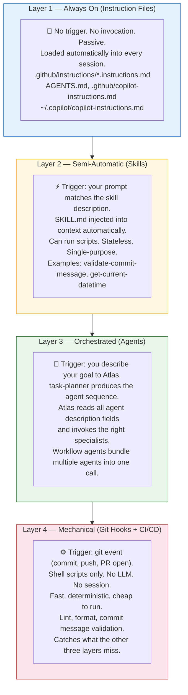
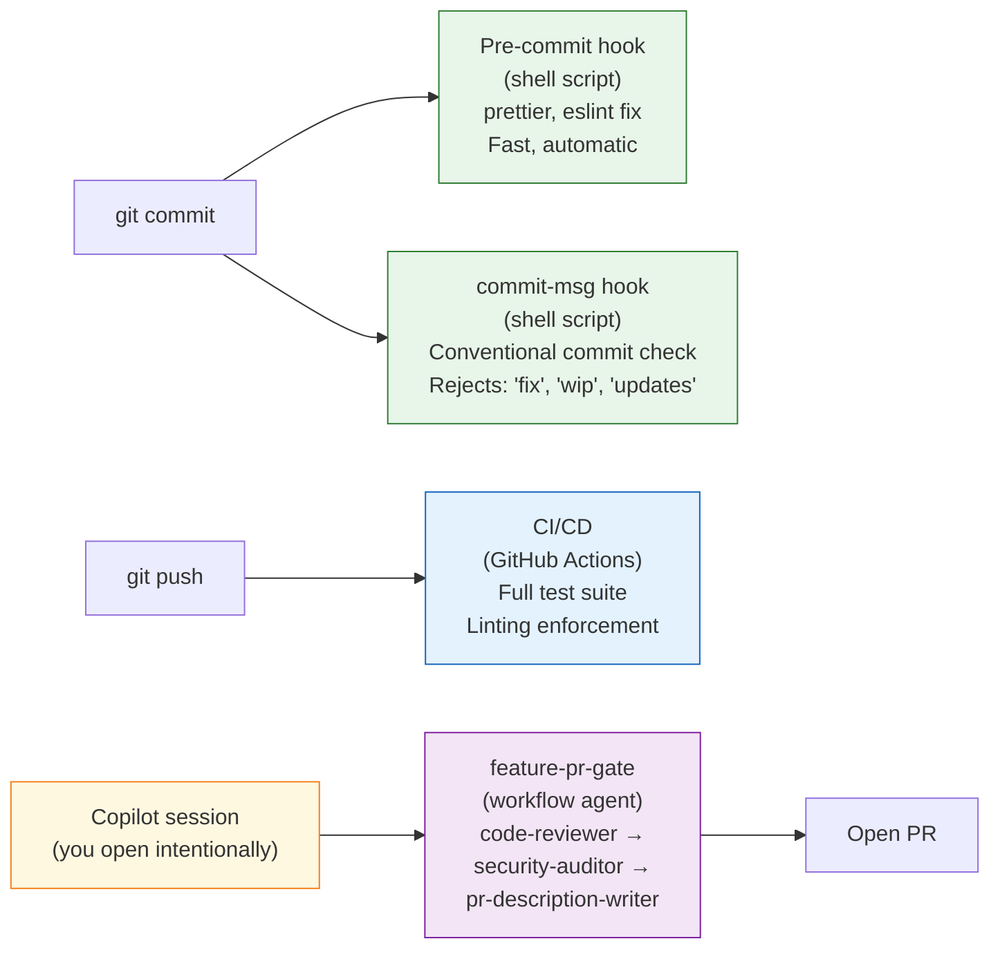
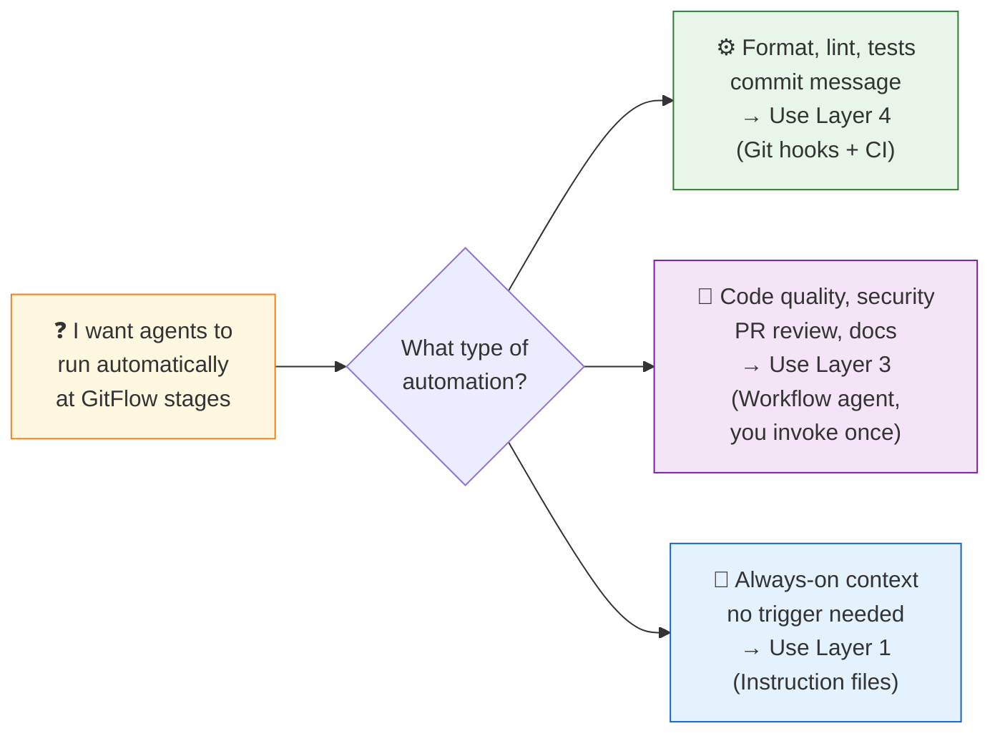

# The Four Automation Layers — Exercise

> **Audience:** Developers who have completed exercises 01 and 02 and have a working Copilot environment.
> **Goal:** Understand the four-layer automation model that maps every AI tool to its correct trigger — and implement the mechanical layer (git hooks) in your own repo.

---

## The Central Question

> "Why don't my agents fire automatically when I commit or push?"

This is the question every developer hits after building a solid agent ecosystem. They've created task-planner, code-reviewer, security-auditor — and then they discover: **nothing fires unless they explicitly invoke it.**

This feels like a misconfiguration. It isn't. It's a mental model problem — and this exercise fixes it.

---

## The Four Layers

Every AI automation tool belongs to one of four layers. Each layer has a different trigger, a different tool, and a different job. **No single layer does everything.**



---

## Why Agents Can't Be Layer 4

Agents are **interactive specialists** — they run inside a Copilot session. They require a session context to operate. They cannot fire themselves at a git event.

This is a feature, not a limitation.

If agents fired automatically at every commit:
- You'd have no control over when they run
- There'd be no way to steer or redirect mid-execution
- Expensive model calls would trigger on every save or test run
- You'd lose the review-approve loop that prevents bad output from shipping

The design is correct. Layer 3 (agents) belongs in a session you open intentionally. Layer 4 (hooks) is the fast, automatic, cheap safety net.

> **🔀 Tool Portability — Layer 1 (Instruction Files)**
>
> Instruction files are the most portable layer — the concept works across every AI tool:
>
> | Tool | Always-loaded global file | Always-loaded repo file |
> |---|---|---|
> | **GitHub Copilot** | `~/.copilot/copilot-instructions.md` | `AGENTS.md` + `.github/copilot-instructions.md` |
> | **Claude** | `~/CLAUDE.md` | `CLAUDE.md` at project root |
> | **ChatGPT** | Custom Instructions | Project Instructions |
> | **Cursor** | `~/.cursorrules` | `.cursorrules` at project root |
>
> Layers 2–4 (skills, agents, hooks) are GitHub Copilot CLI-specific in their implementation. The *principle* of "semi-automatic, orchestrated, and mechanical" layers applies to any AI workflow.

---

## The GitFlow Integration — Correctly Mapped



**The correct mental model:**
- Hooks enforce the mechanical rules (format, lint, commit message)
- Agents judge the quality and safety (code review, security, PR quality)
- You open a session before you push and invoke the workflow agent once
- CI is the safety net if you forgot the session

---

## Layer-by-Layer Reference

### Layer 1: Instruction Files (Always On)

| File | When it loads | What it does |
|---|---|---|
| `~/.copilot/copilot-instructions.md` | Every session, every project | Your personal preferences, stack, style |
| `AGENTS.md` | Every session in this repo | Critical rules every agent must follow |
| `.github/copilot-instructions.md` | Every session in this repo | Project context, conventions, patterns |
| `.github/instructions/*.instructions.md` | When the path matches | Feature-area or domain-specific rules |

**Key point:** These load automatically. You don't invoke them. You don't mention them in prompts. They're always there.

### Layer 2: Skills (Semi-Automatic)

Skills fire when your prompt naturally matches the skill's `description` field. The `SKILL.md` is injected into context. If the skill has a script, it can run it.

```
/skills list      — see all loaded skills
/skills reload    — reload after changes
```

Example skill description that would trigger automatically:
> "Use this skill when the user asks to validate a commit message format, check if a commit follows conventional commits, or asks about commit message rules."

### Layer 3: Agents (Orchestrated)

Agents run inside your session. You invoke them by:
- Describing your goal to Atlas (Atlas auto-routes based on description fields)
- Invoking task-planner to get a sequenced plan
- Calling a workflow agent that chains multiple specialists

```
/agent            — browse and invoke an agent directly
```

### Layer 4: Git Hooks + CI/CD (Mechanical)

Runs at git events. No session required. Shell scripts only.

| Hook | When | Job |
|---|---|---|
| `pre-commit` | Before every commit | Format + lint staged files |
| `commit-msg` | After commit message is typed | Validate conventional commit format |
| `pre-push` | Before push | Optional: run tests |
| CI/CD | After push | Full test suite, build verification |

---

## Exercise Steps

### Step 1 — Draw Your Four-Layer Map

Before writing any code, map your current project to the four layers.

For each layer, answer:
- Layer 1: What instruction files exist? What's missing?
- Layer 2: What skills do you have? What should you have?
- Layer 3: What agents do you have? Which ones belong in a workflow?
- Layer 4: What's currently enforced by hooks/CI? What should be?

> **Tip:** Most developers find Layer 4 is mostly empty. That's the gap this exercise fills.

---

### Step 2 — Add a Pre-Commit Hook (Format + Lint)

Install Husky and lint-staged:

```powershell
npm install --save-dev husky lint-staged
npx husky init
```

This creates `.husky/pre-commit`. Replace its contents with:

```sh
npx lint-staged
```

Add lint-staged config to `package.json`:

```json
{
  "lint-staged": {
    "*.{ts,tsx,js,jsx}": ["prettier --write", "eslint --fix"],
    "*.{css,scss,md,json}": ["prettier --write"]
  }
}
```

**Test it:**
```powershell
git add -A
git commit -m "test: verify pre-commit hook"
```

You should see prettier and eslint run on staged files. If they fail, the commit is rejected.

---

### Step 3 — Add a Commit-Message Hook (Conventional Commits)

Create `.husky/commit-msg`:

```sh
#!/bin/sh
commit_msg=$(cat "$1")
pattern="^(feat|fix|docs|style|refactor|test|chore|perf|ci|build|revert)(\(.+\))?: .{1,100}$"

if ! echo "$commit_msg" | grep -qE "$pattern"; then
  echo ""
  echo "❌ Commit message rejected — does not follow Conventional Commits format."
  echo ""
  echo "Expected: type(scope): description"
  echo "Examples:"
  echo "  feat(auth): add OAuth login"
  echo "  fix: correct null check in UserService"
  echo "  chore: bump dependencies"
  echo ""
  echo "Your message: $commit_msg"
  exit 1
fi
```

Make it executable:
```powershell
git update-index --chmod=+x .husky/commit-msg
```

**Test it:**
```powershell
git commit -m "fix stuff"   # should be rejected
git commit -m "fix: correct null check in UserService"  # should pass
```

---

### Step 4 — Walk Through `/skills list`

In your Copilot session:
```
/skills list
```

Pick two skills from the list. For each:
1. Find the `SKILL.md` file for that skill
2. Read the `description` field
3. Answer: what prompt would trigger this skill automatically?
4. Answer: what's the difference between this skill triggering vs. invoking an agent?

> **Key insight:** Skills fire when your natural language prompt matches the description. Agents require explicit intent ("run the code reviewer" or a workflow agent invocation). Layer 2 is more automatic than Layer 3 — but less powerful.

---

### Step 5 — Write Two Description Fields

Write a description field for each of these hypothetical tools. The goal is to understand how the description field controls trigger behavior differently for skills vs agents.

**Scenario A: Validate a git commit message against conventional commit format**

Write a **skill** description field that would cause this skill to fire automatically when a developer asks about their commit message format.

**Scenario B: Review a pull request for code quality, security issues, and generate a PR description**

Write an **agent** description field that would cause Atlas to invoke this agent when a developer says they're ready to open a PR.

**Answer these questions:**
1. Why does Scenario A fit a skill better than an agent?
2. Why does Scenario B fit an agent better than a skill?
3. What's the key difference in how each description is written?

> **Expected answer:** Skills describe a single, stateless action triggered by natural language match. Agents describe judgment-requiring, multi-step work with a personality and hard rules. The description field in a skill fires the injection; the description field in an agent fires the routing decision.

---

## Key Takeaways



- **Agents are not daemons.** They run in sessions you open intentionally.
- **Hooks are not agents.** They run shell scripts at git events.
- **The four layers complement each other.** None replaces the others.
- **The workflow agent is the answer** to "I want agents at GitFlow stages" — one invocation, full pipeline, you control when.

---

*Previous: [02-copilot-environment-walkthrough.md](02-copilot-environment-walkthrough.md)*
*Next: [04-agent-ecosystem.md](04-agent-ecosystem.md)*
