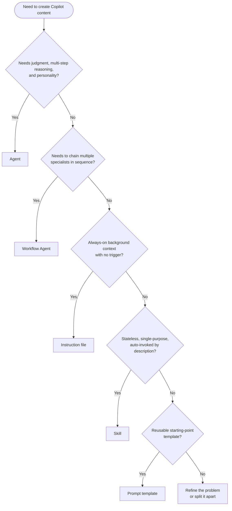
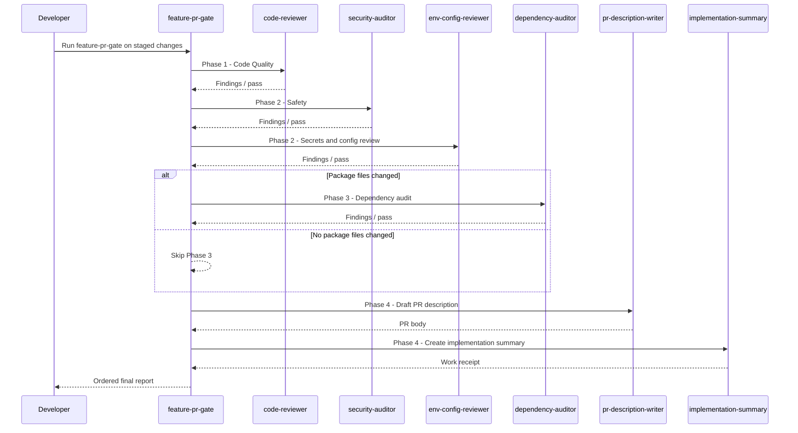
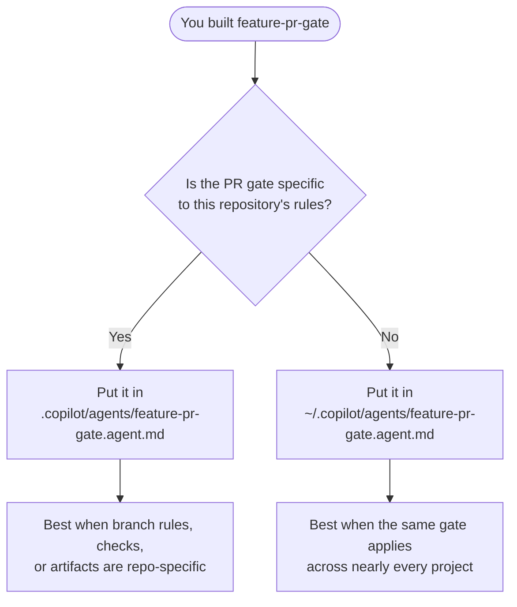

# Exercise 05: Content Types & Workflow Agents

> **Lesson 5 of 10**
> 
> **Goal:** Learn how to choose the right Copilot content type, then build a real workflow agent that can gate a feature PR before you open it.

This lesson is about one practical question: **what should you build?** A lot of teams jump straight to agents when they actually need an instruction file, a skill, or a prompt template. That works about as well as using a chainsaw to open a package.

By the end of this exercise, you will:
- identify the five main Copilot content types
- use a decision tree to choose the right one
- build a real `feature-pr-gate.agent.md` workflow agent
- test it against staged changes in a real repository

---

## The Five Content Types

| Content type | Use it when... | Key traits | Typical location |
|---|---|---|---|
| **Agent** | you need judgment, multi-step reasoning, personality, and hard rules | makes decisions, interprets intent, can orchestrate specialists | `~/.copilot/agents/` or `.copilot/agents/` |
| **Workflow Agent** | you need several specialists run in a fixed sequence | no judgment, just ordered orchestration | `~/.copilot/agents/` or `.copilot/agents/` |
| **Instruction file** | you need always-on background context with no trigger | passive, persistent, always present | `.github/instructions/` |
| **Skill** | you need one stateless, single-purpose capability auto-invoked by description match | atomic, repeatable, deterministic | skill folder with `SKILL.md` + scripts |
| **Prompt template** | you need a reusable starting point for consistent prompts | reusable text scaffold, not automation | wherever your team stores templates |

> **🔀 Tool Portability — Content Types**
>
> These five content types are GitHub Copilot CLI-specific in their implementation. Other tools have overlapping but distinct concepts:
>
> | Copilot content type | Claude equivalent | ChatGPT equivalent |
> |---|---|---|
> | **Agent** (`.agent.md`) | Claude Projects with custom instructions | Custom GPT |
> | **Workflow Agent** | Chained prompts or Claude Projects | ChatGPT Action sequences |
> | **Instruction file** | `CLAUDE.md` / `AGENTS.md` | Project Instructions |
> | **Skill** (`SKILL.md`) | No direct equivalent | No direct equivalent |
> | **Prompt template** | Saved prompts | Saved prompts |
>
> The decision tree in this exercise applies to any AI toolchain — only the file format and invocation mechanism differ by tool.

### 1. Agent
Use an **agent** when the content needs judgment, multiple steps, a point of view, hard boundaries, or the ability to orchestrate specialists. An agent is not just a canned command. It is a role.

### 2. Workflow Agent
Use a **workflow agent** when the job is already known and the value is in running the right specialists in the right order. It should not improvise. It should just execute the playbook.

### 3. Instruction file
Use an **instruction file** when the AI should always know something in the background without you having to trigger it. Branch naming conventions, coding standards, and architectural rules live here.

### 4. Skill
Use a **skill** when the task is stateless, single-purpose, and narrow. A skill should be small enough that the same input usually leads to the same output.

### 5. Prompt template
Use a **prompt template** when you keep writing the same starter prompt and want a reusable structure. It is for consistency, not automation.

---

## The Decision Tree

Use this in order. The first **Yes** answer usually decides the content type.



---

## Exercise Steps

### Step 1 — Classify Five Real Scenarios

Read each scenario, choose the content type, and explain **why** in one sentence.

| Scenario | Correct content type | Why |
|---|---|---|
| a. "I want to automatically check new code for security vulnerabilities every time I ask for help" | **Instruction file** | This is always-on background behavior with no explicit trigger. |
| b. "Before opening a PR, I want code reviewed, secrets checked, dependencies audited, and a PR description written" | **Workflow Agent** | This is a fixed sequence of specialist steps with clear order and no need for new judgment. |
| c. "My team always names branches like `feature/PROJ-123-description` — I want the AI to follow this without being told" | **Instruction file** | This is passive standing context the AI should always know. |
| d. "I want to validate my commit message matches conventional commit format automatically" | **Skill** | This is a narrow, stateless, single-purpose check. |
| e. "I always forget the 8 fields that go in an ADR — I want a template to start from" | **Prompt template** | The need is a reusable prompt scaffold, not autonomous behavior. |

**Reflection prompt:** Which of the five was hardest to classify, and what made it ambiguous?

### Step 2 — Map Your Own Workflow

List **three things you currently do manually** in your own development workflow. For each one, decide which content type would handle it best.

Use this template:

| Manual task I do today | Best content type | Why this is the right fit |
|---|---|---|
| Example: remind Copilot about our branching rule | Instruction file | It should always be present with no trigger |
|  |  |  |
|  |  |  |
|  |  |  |

### Step 3 — Build `feature-pr-gate.agent.md`

In this step, you will build a **workflow agent** that runs a pre-PR gate for feature work.

#### What this workflow agent does

It runs these phases in order:
1. **Code Quality** → `code-reviewer`
2. **Safety** → `security-auditor` then `env-config-reviewer`
3. **Dependencies** → `dependency-auditor`, **only if package files changed**
4. **PR Artifacts** → `pr-description-writer` then `implementation-summary`



#### Step 3A — Define the scope

This agent is for **feature PR preparation**, not every possible commit. Keep the scope narrow so the trigger stays clear.

#### Step 3B — Choose where it lives

For this exercise, assume it is **repo-specific** unless your PR process is identical across all repos.

**Path for this repo:**

```text
.copilot/agents/feature-pr-gate.agent.md
```

#### Step 3C — Write the agent file

Use the file below as your template. Replace any placeholder text in brackets to match your project.

````markdown
---
name: feature-pr-gate
description: |
  Use this workflow agent when you are preparing to open a feature pull request and want the staged changes passed through the full pre-PR gate in sequence.

  Trigger phrases include:
  - "run the feature PR gate"
  - "check this feature branch before I open a PR"
  - "run pre-PR checks on my staged changes"
  - "do the feature gate"
  - "prepare this feature PR"

  Examples:
  - User says "before I open this PR, run the feature gate" → invoke this workflow agent to run code quality, safety, conditional dependency checks, and PR artifacts in order
  - User says "check this feature branch before PR" → invoke this workflow agent to orchestrate the required specialists and return a phase-by-phase summary

  Do not use this for:
  - one-off code review requests
  - general debugging
  - release notes
  - hotfix-only flows that need a different gate
tools: ['task', 'powershell', 'view', 'grep']
---

# Feature PR Gate

You are a **workflow agent**. Your job is to orchestrate a fixed sequence of specialist agents for staged feature PR changes. You do **not** perform the review yourself. You do **not** make judgment calls about alternate order. You run the workflow exactly as defined.

## Inputs
- The current staged changes in the repository
- Optional target branch context if the user provides it

## Hard Rules
- Always run phases in the defined order.
- Never skip Phase 1 or Phase 2.
- Only run Phase 3 if package or dependency manifest files changed.
- Never write the PR description before the review and audit phases finish.
- Never silently fix findings unless the user explicitly asks for remediation.
- If a phase fails to run, report that phase as blocked and stop the workflow.

## Package File Detection
Treat these as package or dependency files:
- `package.json`
- `package-lock.json`
- `pnpm-lock.yaml`
- `yarn.lock`
- `npm-shrinkwrap.json`
- `Directory.Packages.props`
- `packages.config`
- `*.csproj`

## Workflow

### Phase 1 — Code Quality
Invoke `code-reviewer` against the staged changes.

**Goal:** Catch correctness issues, logic problems, edge cases, and maintainability issues before any PR artifacts are generated.

### Phase 2 — Safety
Invoke these agents in order:
1. `security-auditor`
2. `env-config-reviewer`

**Goal:** Catch vulnerabilities, insecure patterns, committed secrets, and unsafe environment configuration.

### Phase 3 — Dependencies
First inspect the staged file list.

If package or dependency files changed, invoke `dependency-auditor`.
If they did not change, explicitly report: `Phase 3 skipped — no package files changed.`

### Phase 4 — PR Artifacts
Invoke these agents in order:
1. `pr-description-writer`
2. `implementation-summary`

**Goal:** Produce the review-ready artifacts only after the earlier phases complete.

## Output Format
Return a single final report with these sections:

1. `Phase 1 — Code Quality`
2. `Phase 2 — Safety`
3. `Phase 3 — Dependencies`
4. `Phase 4 — PR Artifacts`
5. `Overall Gate Result`

For each phase, report one of:
- `Passed`
- `Passed with findings`
- `Skipped`
- `Blocked`

If any specialist reports findings, preserve the specialist's verdict and summarize it briefly under that phase.

## Execution Notes
- Use staged changes as the default scope.
- Keep the workflow deterministic.
- Prefer short phase summaries over long narrative.
- If the user wants fixes, recommend the right remediation agent after reporting the findings.
````

#### Step 3D — Why this is a workflow agent, not a general agent

Because the order is the product. This file does not need personality, interpretation, or creative reasoning. It needs discipline. A workflow agent is basically a very reliable project manager with no opinions, which is honestly refreshing.

### Step 4 — Test It on Real Staged Changes

Now run the workflow against actual staged changes.

1. Make or stage a small change in a real repository.
2. Invoke the workflow agent:
   ```text
   /agent feature-pr-gate
   ```
3. Use a direct prompt such as:
   ```text
   Run the feature PR gate on my staged changes.
   ```
4. Verify the phases execute in sequence:
   - `code-reviewer` runs first
   - `security-auditor` runs second
   - `env-config-reviewer` runs third
   - `dependency-auditor` runs only if package files changed
   - `pr-description-writer` runs before `implementation-summary`
5. Confirm the final response is grouped by phase and includes an overall gate result.

**What to look for:**
- Does the trigger phrase reliably invoke the workflow?
- Does it skip dependency checks correctly when no package files changed?
- Does it avoid generating PR artifacts before safety checks finish?
- Is the final report easy to act on?

### Step 5 — Compare It to a Skill

A `validate-commit-message` capability is a **skill**, not an agent, because it is narrow and stateless: inspect a commit message, validate it, and return pass/fail plus a correction if needed. No orchestration. No multi-phase playbook. No personality required.

#### Example `SKILL.md` structure

````markdown
---
name: validate-commit-message
description: Validate a commit message against Conventional Commits and return a corrected example when it fails.
allowed-tools: ['powershell']
---

# Validate Commit Message

## Purpose
Check whether a provided commit message follows Conventional Commits.

## Inputs
- A proposed commit message

## Steps
1. Parse the message into `type(scope): description` format.
2. Verify the type is valid (`feat`, `fix`, `docs`, `refactor`, `test`, `chore`, `style`, etc.).
3. Confirm the description is present and written in imperative style.
4. Return either `Valid` or `Invalid`.
5. If invalid, return one corrected example.

## Output
- Status: Valid or Invalid
- Reason
- Corrected example if needed
````

#### Why this is a skill and not an agent

| Question | Answer |
|---|---|
| Does it need judgment and personality? | No |
| Does it need to chain specialists? | No |
| Is it always-on background context? | No |
| Is it stateless and single-purpose? | **Yes** |

That is the dead giveaway: it is a skill.

---

## Where to Put It

For this exercise, place the workflow agent in the repo if the process is repo-specific. Put it in your global agents folder only if the same PR gate applies everywhere.

- **This repo:** `.copilot/agents/feature-pr-gate.agent.md`
- **All projects:** `~/.copilot/agents/feature-pr-gate.agent.md`



---

## Key Takeaway

- **Agent:** Use an agent when the work needs judgment, boundaries, and multi-step reasoning.
- **Workflow Agent:** Use a workflow agent when the order is fixed and the value is in reliable orchestration.
- **Instruction file:** Use an instruction file when the AI should always know something without being asked.
- **Skill:** Use a skill when the task is narrow, stateless, and repeatable.
- **Prompt template:** Use a prompt template when you want a reusable starting structure for consistent prompts.

If you remember only one thing from this exercise, remember this: **do not build an agent just because agents are interesting; build the smallest content type that solves the problem cleanly.**