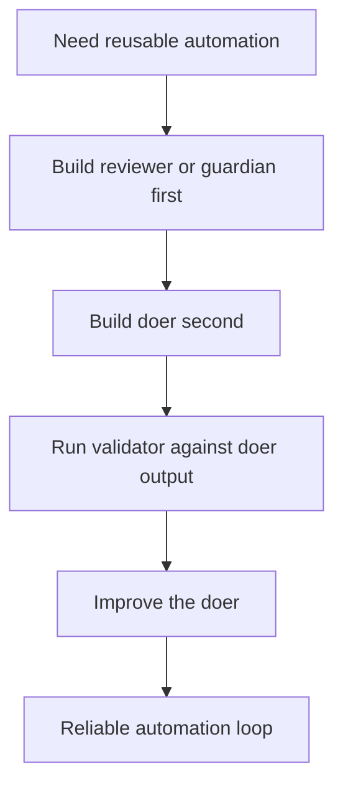
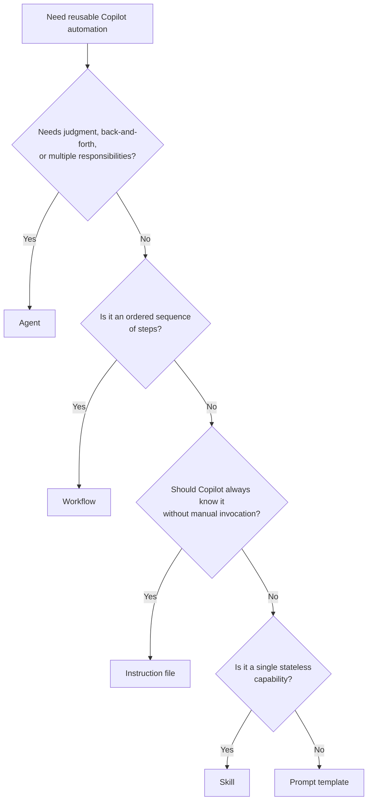
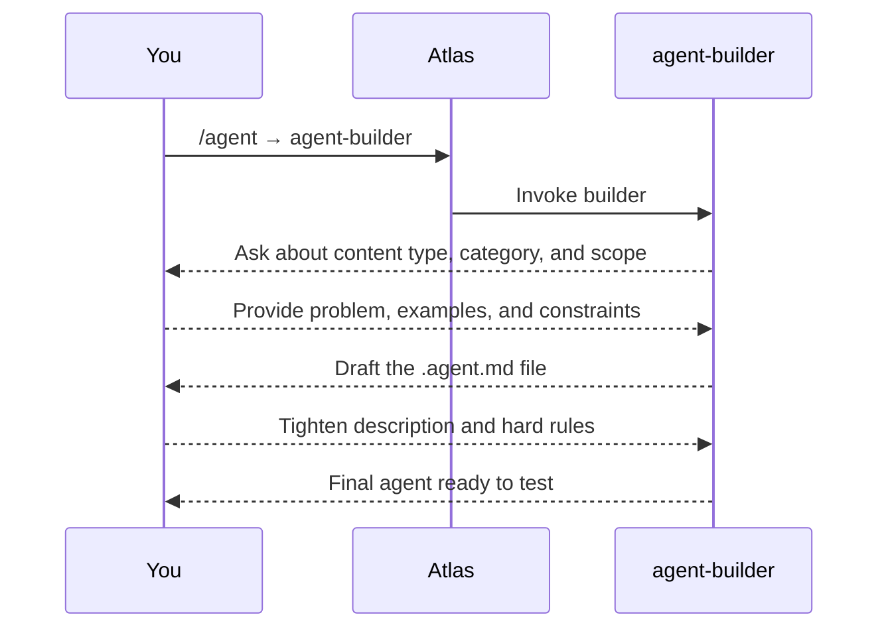
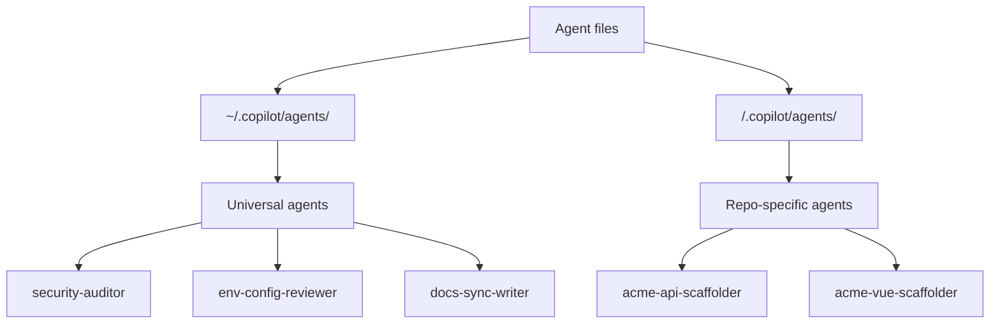
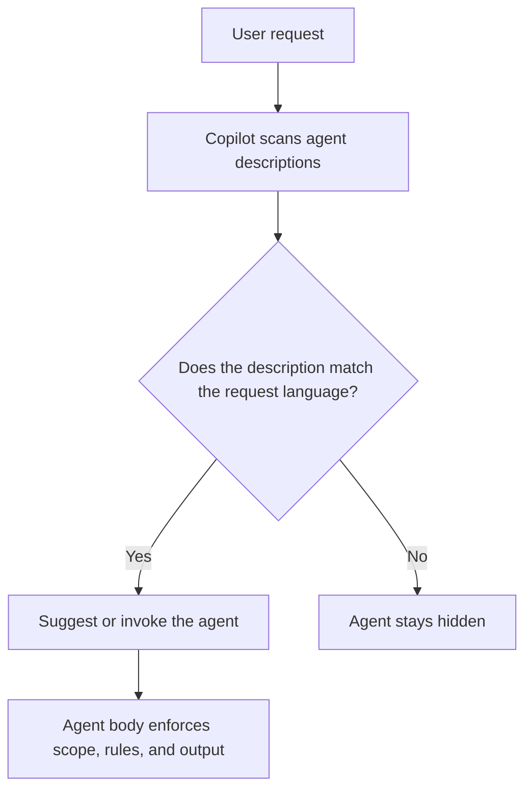
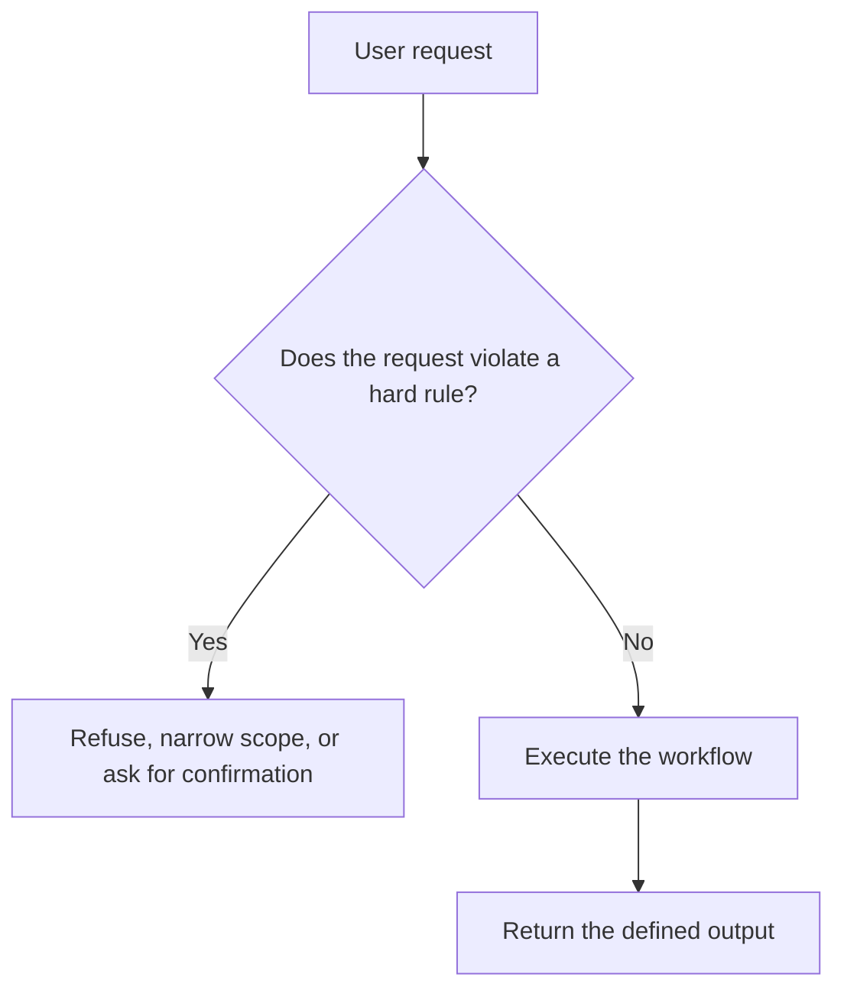
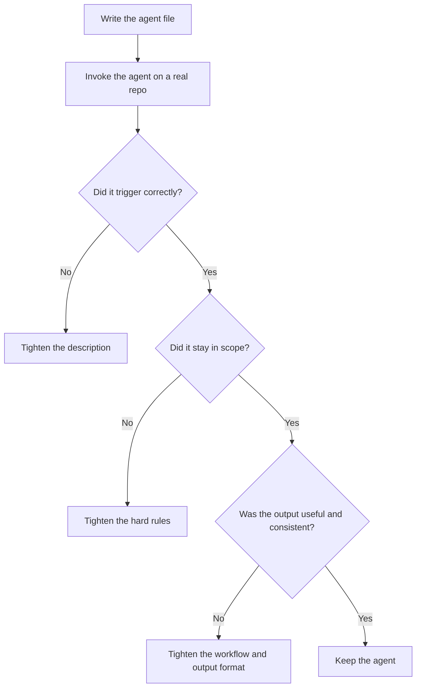

# Building Agents

> **Prerequisite:** Complete `01-setup-exercise.md` and read `04-agent-ecosystem.md` first. You need a working Copilot environment and the ecosystem mental model before you start authoring agents.
>
> **Goal:** Build a real agent from scratch, understand exactly how an agent file is structured, and learn the rules that make agents reliable instead of glorified prompt confetti.

---

## Why This Matters

A custom agent is not just a saved prompt with a fancy filename. A good agent has:

- a **clear job**
- a **description that makes it discoverable**
- **hard rules** that keep it trustworthy
- an **output format** people can act on

If you skip those pieces, the agent may still _run_ — it just will not run consistently. And inconsistent automation is how teams end up trusting nothing.

---

## Before You Build Anything

Answer these two questions first:

### 1. What problem are you solving?

A good agent owns one clear responsibility.

- Too broad: "review my project"
- Better: "check environment and config files for committed secrets before I push"
- Better: "review changed C# files for async misuse and missing cancellation tokens"

### 2. Does this already exist?

Check your existing catalog before you create a duplicate.

```powershell
# Universal agents in your dotfiles repo
Get-ChildItem "$HOME\.copilot\agents" -Filter "*.agent.md" | Select-Object Name

# Repo-specific agents for the current project
Get-ChildItem ".\.copilot\agents" -Filter "*.agent.md" | Select-Object Name
```

If your team keeps a catalog, index, or README of shared agents, check that too. A simple `~/.copilot/agents/README.md` is enough.

---

## Validators Before Doers

Before you build scaffolders, generators, or other doers, build the agents that can judge their output.

Why? Because a doer without a validator is just an unreviewed factory. It will happily mass-produce mistakes at machine speed, which is a very modern way to create boring problems.

Build in this order:

1. **Feedback agents** first — `code-reviewer`, `test-coverage-analyzer`, `accessibility-auditor`
2. **Guardian agents** next — `security-auditor`, `env-config-reviewer`, `api-contract-reviewer`
3. **Doers** after that — scaffolders, generators, refactoring agents



If you build the scaffolder first and the reviewer later, your first output ships unchecked. That is not a pipeline. That is optimism.

---

## Step 1 — Decide What You Are Actually Building

Not every reusable thing should be an agent.



Use this quick rule of thumb:

| If it needs... | Build... |
|---|---|
| Judgment, scope, refusal rules, structured output | **Agent** |
| A fixed sequence of stages | **Workflow** |
| Always-on context | **Instruction file** |
| One tiny atomic action | **Skill** |
| Reusable wording only | **Prompt** |

Most review, audit, and orchestration tools belong in **agents**.

---

## Step 2 — Use `agent-builder` as Your Guide

Start here:

```
/agent → agent-builder
```

`agent-builder` is useful because it forces the questions most people skip:

- Is this actually an agent?
- What category does it belong to?
- Is the name clear?
- Does the description trigger correctly?
- Are the hard rules explicit?
- Is the output format testable?



If you are building from scratch, let the builder lead. It exists to stop you from skipping the thinking.

---

## Step 3 — Choose the Right Category

Every agent should have a home in the ecosystem.

| Category | Use it when the agent... |
|---|---|
| **Planning** | Breaks a goal into a sequence of actions or routes work |
| **Learner** | Reads the existing codebase before other agents act |
| **Doer** | Writes, scaffolds, generates, or refactors |
| **Feedback** | Reviews quality, correctness, coverage, or usability |
| **Guardian** | Enforces a safety gate |
| **Tool Operator** | Talks to GitHub, CI/CD, package managers, or other systems |
| **Presenter** | Produces human-readable summaries or documentation |

If an idea fits two categories, that is usually your sign to split it.

---

## Step 4 — Name It Correctly

Use names that tell the truth about scope.

| Scope | Convention | Example |
|---|---|---|
| Universal agent in your dotfiles repo | `<verb>-<noun>` | `security-auditor` |
| Repo-specific agent | `<project>-<purpose>` | `acme-api-scaffolder` |

Rules:

- Use **kebab-case** only
- Keep it **specific**
- Avoid names that hide scope like `api-scaffolder`
- If it is repo-specific, include the repo or product name

### Where agents live



Put universal behavior in `~/.copilot/agents/`. Put repo knowledge in the repo.

---

## Step 5 — Anatomy of an Agent File

Every good agent file has two parts:

1. **Frontmatter** — metadata Copilot uses to discover the agent
2. **Body** — the agent's actual behavior, rules, workflow, and output contract

### Minimal anatomy

```md
---
name: branch-policy-reviewer
description: Use this agent when you want to check whether the current Git branch name follows your team's naming convention before opening a pull request. Trigger phrases include 'check my branch name', 'is this branch PR-ready?', and 'does this follow our naming convention?'
tools: git, powershell
---

## Purpose
Check the current branch name and explain whether it matches the team's allowed patterns.

## Hard Rules
- Never rename, create, delete, or push branches.
- Never inspect repositories outside the current repo root.
- Never report a pass/fail result without reading the current branch name.

## Workflow
1. Read the current branch name.
2. Compare it to the configured patterns.
3. Report pass/fail and explain the mismatch if it fails.

## Output Format
- ✅ Pass — `<branch>` matches `feature/JIRA-1234-short-description`
- ❌ Fail — `<branch>` does not match any allowed pattern
- Suggested fix: `feature/JIRA-1234-short-description`
```

### What the frontmatter does

| Field | Why it matters |
|---|---|
| `name` | How you invoke the agent |
| `description` | How Copilot decides when to suggest or auto-invoke it |
| `tools` | What the agent is allowed to use |

Everything else — scope, behavior, refusal rules, output format, and examples — belongs in the body.

---

## The Description Field — This Controls Auto-Invocation

This is the most important line in the file.

Copilot does not auto-suggest agents because the name looks cool. It uses the **description** to decide whether the agent matches what the user is asking for.



### Write descriptions for matching, not for documentation

A good description should do three things:

1. Start with **"Use this agent when..."**
2. Include **trigger phrases** in plain user language
3. Make the agent's purpose obvious in one sentence

### Good vs bad descriptions

❌ **Bad**

```yaml
description: "Reviews code, checks security, audits dependencies, writes PR descriptions, and summarizes implementation"
```

Why it fails:

- Too broad
- Competes with half your catalog
- Gives Copilot no clear matching signal
- Hides five different jobs in one line

✅ **Good**

```yaml
description: "Use this agent when you're about to open a PR and want all quality gates run in sequence: code review, security audit, dependency check, and PR description. Trigger phrases include 'run my PR checks', 'review this before I open the PR', and 'do the full pre-PR pass'."
```

Why it works:

- Triggered by real user language
- Narrow enough to match reliably
- Clear about the job without dumping the full implementation

### What not to put in the description

Do **not** use the description as a full spec. Keep these in the body instead:

- detailed scope boundaries
- long step-by-step workflows
- hard rules
- output format examples
- implementation notes

The description decides **when** the agent appears. The body decides **how** the agent behaves.

---

## Hard Rules — What Makes an Agent Reliable

Hard rules are the non-negotiable behaviors the agent must follow even if the user asks for something reckless, vague, or flat-out wrong.

That is what separates a reliable agent from an "it depends" agent.



### Examples of strong hard rules

- Never modify files outside the repo root
- Always ask before making git commits
- Never generate code that disables authentication
- Never invent findings for files that were not inspected
- Never claim a test passed unless it was actually run

### What hard rules are not

Hard rules are **not** style preferences.

- "Prefer bullet points" → preference
- "Use markdown headings" → formatting preference
- "Never commit without explicit approval" → hard rule
- "Never write secrets into source code" → hard rule

If breaking the rule would create risk, false confidence, or damage, it belongs in the hard rules section.

---

## Hands-On Exercise — Build One Agent from Scratch

For this exercise, build a small **validator** first.

### Recommended first build: `branch-policy-reviewer`

Why this is a good first agent:

- it has one job
- it is easy to test
- it teaches description writing clearly
- it forces you to write hard rules
- it reinforces the validators-before-doers principle

### Your target behavior

Build a universal agent that:

- lives in `~/.copilot/agents/`
- checks the current branch name against your naming convention
- reports pass/fail with a suggested fix
- never renames or pushes the branch

### Use this prompt with `agent-builder`

> I want to build a universal feedback agent called `branch-policy-reviewer`. It should live in `~/.copilot/agents/`. Its job is to check whether the current Git branch name follows our naming convention before I open a PR. Trigger phrases include: "check my branch name", "is this branch PR-ready?", and "does this follow our branch rules?" It must never rename, push, or modify branches. Help me write the full `.agent.md` file with strong frontmatter, hard rules, workflow steps, and output format.

### If you already have that agent

Swap in another validator with the same shape, such as:

- `env-config-reviewer`
- `commit-message-reviewer`
- `release-readiness-reviewer`

The point is not the exact agent. The point is learning how to write one that is narrow, reliable, and testable.

---

## Step 6 — Test the Agent on Real Work

Do not stop when the file looks good. Test it.



Run it against a real repository and check:

- Does it trigger when expected?
- Does it stay inside its job?
- Do the hard rules actually hold?
- Is the output structured enough to act on quickly?

If any answer is no, tighten the file and test again.

---

## Submission Checklist

Before you consider the exercise done, confirm all of this:

- [ ] The agent solves **one** clear problem
- [ ] The `description` uses real trigger language
- [ ] The body contains explicit hard rules
- [ ] The output format is defined
- [ ] The agent was tested on a real example
- [ ] The agent lives in the correct folder for its scope

---

## What You Should Understand Now

By the end of this exercise, you should be able to explain:

- the anatomy of an agent file
- why the `description` field controls discovery and auto-invocation
- why hard rules make agents trustworthy
- why validators should exist before doers

If you can explain those four things clearly, you are ready to build better agents than most people who stop at "it worked once." Which, admittedly, is a low bar — but now it is not your bar.

---

## References

- `04-agent-ecosystem.md` — the full agent taxonomy and pipeline
- `01-setup-exercise.md` — where Atlas and your global Copilot setup live
- `~/.copilot/agents/README.md` — a simple shared catalog of universal agents
- `~/.copilot/agents/code-reviewer.agent.md` — a strong universal reference for structure and quality
