# The Business Agent Ecosystem — How It All Fits Together

> **Audience:** Product Owners, Business Analysts, UX Researchers, and anyone involved in the discovery-to-spec pipeline
> **Goal:** Understand how the business agent ecosystem is structured, where each type of agent lives, and how they work together to produce reliable, well-validated requirements across every initiative.

---

## The Same Problem, A Different Domain

If you've read [03-agent-ecosystem-guide.md](03-agent-ecosystem-guide.md), the logic here is identical — just applied to a different lifecycle.

A single general-purpose AI assistant is mediocre at everything and great at nothing. The moment you give it a clear role, a defined scope, and hard rules — it becomes dramatically more reliable. The business ecosystem applies that exact same principle to the discovery-to-spec pipeline.

The dev pipeline runs: **discover → plan → build → validate → ship**
The business pipeline runs: **research → define → validate → communicate**

Same structure. Different domain. The same 8-category taxonomy maps directly.

Think of it less like "one AI" and more like **a product team where every role is filled by a specialist**:

- You don't ask your UX Researcher to write the business case.
- You don't ask the Product Owner to catch GDPR violations in a spec.
- You don't ask the BA to synthesize six months of support tickets before grooming.

Agents work the same way.

---

## The Orchestrator — Themis

Just as every developer has a personal **Atlas**, every Product Owner has a personal **Themis**.

Atlas is named after the Titan who holds up the world. Themis is the Titan of divine law, order, and governance — she organized the first divine assemblies and held everyone accountable to proper process. That is exactly the role: keep requirements in order, keep scope governed, and keep the pipeline from descending into chaos.

Themis is configured in your personal `copilot-instructions.md` and coordinates all other business agents. It is not a specialist — it is the coordinator.

---

## The Ecosystem at a Glance

```mermaid
flowchart TD
    PO([👤 Product Owner / BA])
    PO --> THEMIS

    subgraph THEMIS["🤖 Orchestrator — Themis (personal product agent)"]
        TNode["Titan of order & governance\nKnows your domain, roadmap, team preferences\nCoordinates all specialist agents"]
    end

    THEMIS --> PLAN

    subgraph PLAN["🧠 Planning"]
        P1["discovery-planner — sequences research & spec agents for an initiative"]
        P2["sprint-planner — organizes approved stories into sprints"]
    end

    PLAN --> LEARN

    subgraph LEARN["📚 Learners (RAG) — Read before you spec"]
        L1["customer-feedback-reader — support tickets, NPS, user interviews"]
        L2["product-analytics-reader — adoption, funnel, retention data"]
        L3["customer-success-reader — CS notes, renewal signals, churn data"]
        L4["competitor-research-reader — market positioning, feature gaps"]
        L5["domain-knowledge-reader — field expert interviews → knowledge doc"]
    end

    LEARN --> DO

    subgraph DO["⚙️ Doers"]
        D1["user-story-writer — well-formed stories from discovered requirements"]
        D2["acceptance-criteria-generator — AC with edge cases & error states"]
        D3["feature-spec-writer — full feature specification documents"]
        D4["business-case-writer — ROI, cost-to-build, payback period"]
        D5["solution-bridge-writer — technical feasibility brief for engineering"]
    end

    DO --> FEEDBACK

    subgraph FEEDBACK["🔍 Feedback"]
        F1["invest-auditor — story quality against INVEST criteria"]
        F2["requirements-completeness-checker — happy path + edge + error + a11y"]
        F3["ux-flow-auditor — user journeys vs. research findings"]
        F4["acceptance-criteria-auditor — specific, testable, unambiguous"]
    end

    DO --> GUARD

    subgraph GUARD["🛡️ Guardians"]
        G1["scope-creep-detector — flags anything outside approved initiative scope"]
        G2["feasibility-checker — technical & resource feasibility before sprint commit"]
        G3["requirements-conflict-detector — contradictions across stories & ACs"]
        G4["compliance-reviewer — GDPR, HIPAA, ADA, SOC 2 implications pre-build"]
    end

    FEEDBACK --> TOOLS
    GUARD --> TOOLS

    subgraph TOOLS["🔧 Tool Operators"]
        T1["jira-issue-creator — creates formatted stories from approved specs"]
        T2["roadmap-updater — keeps roadmap in sync with sprint outcomes"]
        T3["stakeholder-notifier — structured progress updates at milestones"]
    end

    TOOLS --> PRESENT

    subgraph PRESENT["📋 Presenters"]
        O1["stakeholder-update-writer — business-readable release comms"]
        O2["sprint-review-writer — sprint ceremony content"]
        O3["executive-summary-writer — C-suite initiative summaries"]
        O4["roadmap-writer — formatted roadmap documents for sharing"]
    end

    PRESENT --> Done([✅ Shipped & Communicated])

    style THEMIS fill:#1a1a2e,stroke:#4a4aff,color:#ffffff
    style PLAN fill:#e8f4f8,stroke:#4a9eca
    style LEARN fill:#fff8e1,stroke:#f9a825
    style DO fill:#e8f5e9,stroke:#43a047
    style FEEDBACK fill:#f3e5f5,stroke:#8e24aa
    style GUARD fill:#fce4ec,stroke:#e91e63
    style TOOLS fill:#e0f2f1,stroke:#00897b
    style PRESENT fill:#ede7f6,stroke:#5e35b1
```



---

## The Eight Categories

### 🤖 Orchestrator — Themis

**One per Product Owner.** Themis is your primary product agent — configured in your personal `dotfiles` via `copilot-instructions.md`. It is not a specialist. It is the coordinator.

Themis knows:
- Your product domain and current roadmap
- Your team's definition of "done"
- Your stakeholder communication preferences
- How to invoke other agents and interpret their output

Every Themis is slightly different, which is intentional. It reflects your individual product context while sharing a common foundation.

> **See:** `01-setup-exercise.md` for how to configure your personal orchestrator. The pattern is the same whether you're Atlas or Themis — the `copilot-instructions.md` is the single most important file.

---

### 🧠 Planning Agents

**Role:** Receive an initiative or goal and produce a plan — which research and spec agents to run, in which order, with what inputs.

Without planning agents, you have to manually decide "what do I ask Themis next?" every step of the way. Planning agents automate that routing decision.

| Agent | What it does |
|---|---|
| `discovery-planner` | Takes an initiative, goal, or incoming request and outputs a sequenced agent invocation plan for the full research-to-spec pipeline |
| `sprint-planner` | Organizes a backlog of approved stories into sprints based on priority, team capacity, and dependencies |

**When to invoke:** At the start of any non-trivial initiative. Give it the goal; it produces the plan; you approve it; it runs.

---

### 📚 Learners (RAG Agents) — "Read Before You Spec"

**Role:** Synthesize existing customer data, analytics, and domain knowledge *before* any spec work begins.

This is the most commonly skipped category — and the most expensive to skip. The most common product failure mode is writing specs that don't reflect what customers actually experience. Learners prevent this by grounding every Doer in real signal before a single story is written.

| Agent | What it reads |
|---|---|
| `customer-feedback-reader` | Support tickets, NPS comments, and user interview transcripts — synthesized into a signal summary |
| `product-analytics-reader` | Feature adoption, funnel drop-off, retention curves, NPS segmentation — "what does the data say users are actually doing?" |
| `customer-success-reader` | CS notes, renewal conversations, expansion blockers, and churn postmortems — signals from existing paying customers (distinct from UX Research, which studies *potential* users) |
| `competitor-research-reader` | Competitor feature analysis, market positioning docs, and gap identification |
| `domain-knowledge-reader` | Interviews field experts via structured questions and synthesizes a domain knowledge document for Doers to reference |

**When to invoke:** Before any Doer runs on a new initiative. The output of these agents is the context that Doers require.

> **The principle that transfers directly from the dev ecosystem:** In dev, `context-reader` reads the codebase before any code is generated. Here, `customer-feedback-reader` reads the customer data before any spec is written. Same discipline. Same reason.

---

### ⚙️ Doers

**Role:** Execute. Write stories, generate acceptance criteria, produce specs, build business cases.

Doers produce their best output when Learners have already run. A spec written without customer data is a guess. A spec written after the Learner layer has synthesized six months of signals is grounded.

| Agent | What it produces |
|---|---|
| `user-story-writer` | Well-formed user stories following your team's agreed template |
| `acceptance-criteria-generator` | Complete AC covering happy path, edge cases, error states, empty states, and accessibility considerations |
| `feature-spec-writer` | Full feature specification documents — problem statement, solution, scope, out-of-scope, open questions |
| `business-case-writer` | ROI estimate, cost-to-build vs. cost-of-not-building, pricing impact, payback period — answers "why does this financially make sense?" |
| `solution-bridge-writer` | Translates product requirements into a plain-language technical feasibility brief for engineering — not code, not architecture diagrams, but a clear statement of constraints, risks, and which assumptions in the spec engineering needs to validate before sprint commitment |

> **`solution-bridge-writer` is the most important agent most teams don't have.** It fills the gap between product and engineering. It prevents "no one told us that was a constraint" mid-sprint. It is not a technical architect — it is a translator.

**When to invoke:** After Learners have synthesized the research. Before anything goes into Feedback.

---

### 🔍 Feedback Agents

**Role:** Validate quality. Review stories, verify completeness, check user journeys against research.

Feedback agents are the pre-grooming quality gate. They run after Doers produce output and before Guardians check risk. A bad story caught here costs nothing. The same story caught in sprint planning costs a sprint. Caught in QA, it costs a release.

| Agent | What it checks |
|---|---|
| `invest-auditor` | Story quality against the INVEST criteria — Independent, Negotiable, Valuable, Estimable, Small, Testable. The business equivalent of `code-reviewer`. |
| `requirements-completeness-checker` | Does this story define: happy path + all edge cases + error states + empty states + accessibility considerations? Most stories don't. |
| `ux-flow-auditor` | Do the proposed user journeys match what UX research says users actually expect and do? |
| `acceptance-criteria-auditor` | Are the ACs specific, testable, and free of ambiguous language? *"The system should respond quickly"* is not an AC. |

**When to invoke:** After Doers finish, before any story is committed to a sprint board.

---

### 🛡️ Guardians — Chronically Underbuilt on the Product Side

**Role:** Enforce safety gates. These agents protect the team from scope creep, compliance exposure, resource overcommitment, and contradictory requirements.

Guardians are distinct from Feedback because they're not about story quality — they're about risk. A perfectly written story that introduces a GDPR violation, contradicts another approved story, or commits engineering to something infeasible is still a production incident waiting to happen.

| Agent | What it guards |
|---|---|
| `scope-creep-detector` | Compares new requirements against the approved initiative scope; flags anything that was not agreed to — even if it "seems small" |
| `feasibility-checker` | Validates technical and resource feasibility before a story is committed to a sprint — the business equivalent of `migration-auditor` |
| `requirements-conflict-detector` | Finds contradictions between requirements, stories, or acceptance criteria across the entire backlog |
| `compliance-reviewer` | GDPR, HIPAA, ADA, SOC 2 implications of a feature *before* it's built — the business equivalent of `security-auditor` |

> **The framing that matters:** Scope creep caught at spec time costs nothing. Scope creep caught mid-sprint costs a sprint. Scope creep caught in QA costs a release. The Guardian layer is where you enforce the gate.

**When to invoke:** After Feedback, before any story is created in Jira or committed to a roadmap. Non-negotiable for new initiatives.

---

### 🔧 Tool Operators

**Role:** Interface with external systems — Jira, roadmap tools, communication channels.

Tool Operators don't validate or generate specs. They handle the mechanical steps that connect approved specs to the outside world.

| Agent | What it does |
|---|---|
| `jira-issue-creator` | Creates properly formatted Jira stories from approved specs — with correct labels, component assignments, and AC formatted per team convention |
| `roadmap-updater` | Keeps the product roadmap in sync with sprint outcomes, reprioritization decisions, and new initiative additions |
| `stakeholder-notifier` | Sends structured progress updates to stakeholders at defined milestones — using output from Presenter agents |

**When to invoke:** After Guardians clear a story (`jira-issue-creator`). After sprint close (`roadmap-updater`). At defined communication milestones (`stakeholder-notifier`).

---

### 📋 Presenters

**Role:** Produce human-readable output for stakeholders, executives, and the business.

Presenters are the last stage in the pipeline. They take the work that was done and make it consumable by people who were not in the room.

| Agent | What it produces |
|---|---|
| `stakeholder-update-writer` | Business-readable release comms — reads the same git diff the dev ecosystem's `release-notes-writer` already produced and translates it into plain business language |
| `sprint-review-writer` | Sprint review ceremony content — what shipped, what didn't, what it means for the roadmap |
| `executive-summary-writer` | C-suite summaries of initiatives, outcomes, and roadmap changes — no jargon, clear business impact |
| `roadmap-writer` | Formatted roadmap documents ready for sharing externally or with leadership |

**When to invoke:** `sprint-review-writer` and `stakeholder-update-writer` after every sprint close. `executive-summary-writer` and `roadmap-writer` at quarterly or initiative milestones.

---

## The Bridge to the Development Ecosystem

The two ecosystems connect at two handoff points. Getting these right is where the most friction between product and engineering lives.

```mermaid
flowchart LR
    subgraph BIZ["📦 Business Ecosystem"]
        direction TB
        Learners["Learners\n(customer data, analytics)"]
        Doers["Doers\n(stories, specs)"]
        Bridge["solution-bridge-writer\nfeasibility-checked spec + technical brief"]
        Learners --> Doers --> Bridge
    end

    subgraph DEV["💻 Development Ecosystem"]
        direction TB
        TaskPlanner["task-planner\ndecomposes spec into agent plan"]
        Build["Doers + Feedback + Guardians\n(build, review, validate)"]
        ReleaseNotes["release-notes-writer\ntechnical release notes"]
        TaskPlanner --> Build --> ReleaseNotes
    end

    subgraph COMMS["📢 Shared Output"]
        GitDiff["Git Diff / Release Commits"]
        StakeholderUpdate["stakeholder-update-writer\nplain business language"]
    end

    Bridge -->|"Plain-language technical brief\nconstraints + assumptions"| TaskPlanner
    ReleaseNotes --> GitDiff
    GitDiff --> StakeholderUpdate

    style BIZ fill:#fff8e1,stroke:#f9a825
    style DEV fill:#e8f5e9,stroke:#43a047
    style COMMS fill:#e8f4f8,stroke:#4a9eca
```



**Handoff 1 — Business → Dev:**
`solution-bridge-writer` produces a technical feasibility brief. `task-planner` on the dev side uses it to scope engineering work accurately. Product hands off a conflict-free, feasibility-checked spec. Engineering is never surprised.

**Handoff 2 — Dev → Business:**
Both ecosystems read the same git diff. `release-notes-writer` translates it for engineers. `stakeholder-update-writer` translates it for the business. One source of truth. Two audiences. Two agents.

---

## The Pipeline in Practice

```mermaid
sequenceDiagram
    participant PO as Product Owner
    participant T as Themis
    participant L as Learners
    participant D as Doers
    participant F as Feedback
    participant G as Guardians
    participant TO as Tool Operators
    participant P as Presenters

    PO->>T: Describe initiative or incoming request
    T->>L: discovery-planner sequences Learners
    L-->>T: Customer signals, analytics, domain knowledge synthesized
    T->>D: Doers run with Learner context
    D-->>T: Draft stories, AC, spec, and feasibility brief produced
    T->>F: invest-auditor + requirements-completeness-checker run
    F-->>T: Story quality issues flagged and resolved inline
    T->>G: scope-creep-detector + compliance-reviewer run
    G-->>T: Scope and risk gates cleared
    T->>TO: jira-issue-creator creates stories; roadmap-updater syncs
    T->>P: stakeholder-update-writer + sprint-review-writer produce comms
    P-->>PO: Business-readable output ready for review and distribution
```

Every step is specialized. Every step produces output the next step can use. Themis coordinates the sequence so no one is guessing "what do I run next?"

---

## Where Agents Live

The same placement rules from the dev ecosystem apply here.

```
~/.copilot/agents/                    ← Universal business agents (dotfiles → all machines)
  customer-feedback-reader
  invest-auditor
  scope-creep-detector
  solution-bridge-writer
  stakeholder-update-writer
  discovery-planner
  ...

<product-repo>/.copilot/agents/       ← Product-specific agents (prefixed with product name)
  <product>-feature-spec-writer       ← Knows this product's domain and spec format
  <product>-roadmap-writer            ← Knows this product's roadmap structure
  <product>-compliance-reviewer       ← Knows this product's specific regulatory context
```

**The rule:**
- **Universal agents** (useful on any product) → `dotfiles` repo
- **Product-specific agents** (depend on knowing this product's domain, format, or regulations) → that product's repo, prefixed with the product name

---

## Recommended Build Order

Build in order of ROI, not completeness. You don't need everything on day one.

| Priority | Agent | Why first |
|---|---|---|
| 1 | `scope-creep-detector` | Pays for itself the first time it catches a "small addition" before engineering sees it |
| 2 | `customer-feedback-reader` | Most specs are written without reading customer data — this forces the discipline |
| 3 | `invest-auditor` | Bad stories are the #1 source of mid-sprint chaos; catch them at grooming, not planning |
| 4 | `solution-bridge-writer` | Eliminates the most expensive product-engineering friction point |
| 5 | `stakeholder-update-writer` | Highest-visibility output; immediately useful at every release |
| 6 | `requirements-completeness-checker` | Catches the missing edge cases that become sprint surprises |
| 7 | `compliance-reviewer` | Critical if your product touches PII, health data, or financial data |
| 8 | `acceptance-criteria-auditor` | Polishes the output of `acceptance-criteria-generator` |

---

## Next Steps

- **Build your Themis:** `01-setup-exercise.md` — same process as Atlas, different domain context
- **Build your first business agent:** `05-building-agents-exercise.md` — the authoring pattern is identical
- **Dev ecosystem counterpart:** `03-agent-ecosystem-guide.md` — understand how the two ecosystems connect
