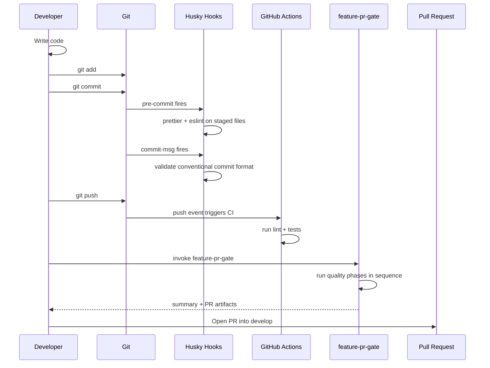
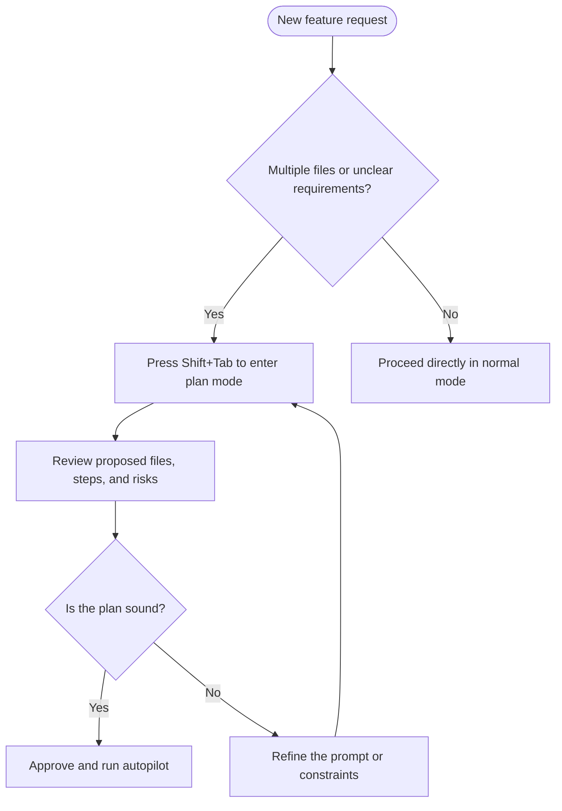

# Exercise 07: Workflow Agents & GitFlow Integration

> **Lesson 7 of 10**
>
> **Goal:** Wire your local hooks, CI pipeline, and Copilot workflow agents into one coherent GitFlow. By the end of this exercise, you'll have Husky enforcing local rules, GitHub Actions enforcing post-push checks, and a `feature-pr-gate` workflow agent handling the contextual pre-PR review layer.

---

## Why This Exercise Matters

GitFlow works best when each stage has the **right kind of automation** attached to it.

- **Hooks** handle fast, deterministic checks at commit time
- **CI** handles repository-wide verification after push
- **Workflow agents** handle the contextual review work that requires judgment

That is the whole point: don't ask a shell script to reason, and don't ask an LLM to behave like a deterministic hook. Different tools. Different jobs. Same pipeline.

---

## The Complete GitFlow Map

```mermaid
flowchart LR
    Code[Write code on feature branch]
    Add[git add]
    Commit[git commit]
    PreCommit[pre-commit hook\nprettier + eslint on staged files]
    CommitMsg[commit-msg hook\nconventional commit validation]
    Push[git push origin feature/*]
    CI[GitHub Actions CI\nlint + tests]
    Gate[feature-pr-gate agent\nquality + safety + PR artifacts]
    PR[Open PR into develop]
    Develop[Merge into develop]
    Release[Create release/* branch]
    ReleaseCI[Release validation\nversioning + final checks]
    Main[Merge release into main]
    Tag[Tag and deploy]

    Code --> Add --> Commit
    Commit --> PreCommit
    Commit --> CommitMsg
    PreCommit --> Push
    CommitMsg --> Push
    Push --> CI
    CI --> Gate
    Gate --> PR
    PR --> Develop
    Develop --> Release
    Release --> ReleaseCI
    ReleaseCI --> Main
    Main --> Tag
```



| GitFlow Event | Tool | Layer | Trigger | What Happens |
|---|---|---|---|---|
| `git commit` | Husky `pre-commit` + Husky `commit-msg` | Mechanical | Local git event | Staged files are formatted/linted, then the commit message is validated before the commit is accepted |
| Push to branch | GitHub Actions CI | Mechanical | Remote `push` event | The branch runs repository-level lint and tests so a bad push is caught before review |
| PR open | `feature-pr-gate` workflow agent + PR UI | Orchestrated | You intentionally invoke the workflow before opening or immediately after drafting the PR | Copilot runs the quality/safety sequence, then helps generate PR artifacts with full context |
| PR merge to `develop` | GitHub branch protections + CI status checks | Mechanical | Merge action | Only reviewed, passing work lands in the shared integration branch |
| Release branch | Release workflow / CI pipeline | Mechanical | `release/*` branch creation and pushes | Release-specific validation runs on stabilization work before production promotion |
| Merge to `main` | Protected branch rules + release/deploy workflow | Mechanical | Merge action | Production-ready code is merged, tagged, and prepared for deployment |

---

## Exercise Steps

### Step 1 — Set up Husky in your repo

Run these commands from the root of your repository:

```bash
npm install --save-dev husky
npx husky init
```

What this gives you:
- `husky` installs the git hook manager
- `npx husky init` creates the `.husky/` folder and wires Git to use it

---

### Step 2 — Create the pre-commit hook

Install `lint-staged` so only staged files are processed:

```bash
npm install --save-dev lint-staged
```

Now replace `.husky/pre-commit` with this complete file:

```sh
#!/usr/bin/env sh
. "$(dirname -- "$0")/_/husky.sh"

npx lint-staged
```

What happens here:
- Husky intercepts `git commit`
- `lint-staged` finds the staged files only
- Prettier and ESLint run before the commit is allowed to complete

---

### Step 3 — Create the commit-msg hook

Create the file `.husky/commit-msg` with this complete content:

```sh
#!/usr/bin/env sh
. "$(dirname -- "$0")/_/husky.sh"

commit_msg="$(cat "$1")"
pattern='^(feat|fix|docs|style|refactor|test|chore|perf|ci|build|revert)(\([a-z0-9._/-]+\))?: .+$'

if ! printf '%s' "$commit_msg" | grep -Eq "$pattern"; then
  echo ""
  echo "❌ Commit message rejected. Use Conventional Commits."
  echo ""
  echo "Expected format: type(scope): description"
  echo "Examples:"
  echo "  feat(auth): add github login"
  echo "  fix: handle null branch name"
  echo "  chore(ci): cache npm dependencies"
  echo ""
  echo "Your message: $commit_msg"
  exit 1
fi
```

Then make sure Git tracks it as executable:

```bash
git update-index --chmod=+x .husky/commit-msg
```

This is your first line of defense against commit history turning into `wip`, `stuff`, and other masterpieces of human communication.

---

### Step 4 — Add `lint-staged` config to `package.json`

Add this exact JSON block to your `package.json`:

```json
"lint-staged": {
  "*.{js,jsx,ts,tsx}": [
    "prettier --write",
    "eslint --fix"
  ],
  "*.{json,md,yml,yaml,css,scss,html}": [
    "prettier --write"
  ]
}
```

A minimal example showing where it normally sits:

```json
{
  "scripts": {
    "lint": "eslint .",
    "test": "npm test"
  },
  "lint-staged": {
    "*.{js,jsx,ts,tsx}": [
      "prettier --write",
      "eslint --fix"
    ],
    "*.{json,md,yml,yaml,css,scss,html}": [
      "prettier --write"
    ]
  }
}
```

---

### Step 5 — Build a GitHub Actions workflow for post-push enforcement

Create `.github/workflows/ci.yml` with this complete content:

```yaml
name: CI

on:
  push:
    branches:
      - "**"

jobs:
  verify:
    runs-on: ubuntu-latest

    steps:
      - name: Checkout repository
        uses: actions/checkout@v4

      - name: Set up Node.js
        uses: actions/setup-node@v4
        with:
          node-version: 20
          cache: npm

      - name: Install dependencies
        run: npm ci

      - name: Run lint
        run: npm run lint

      - name: Run tests
        run: npm test
```

This is the post-push safety net:
- local hooks protect your machine
- CI protects the shared branch
- if someone bypasses a hook, CI still catches the problem

---

### Step 6 — Build `feature-pr-gate.agent.md`

If you already completed the workflow-agent exercise earlier in the curriculum, compare your existing file to this version. If you have not, create `.copilot/agents/feature-pr-gate.agent.md` with this full content:

```markdown
---
name: feature-pr-gate
description: "Use this agent when a feature branch is ready for PR review and you want the full pre-PR quality gate to run in sequence. Trigger phrases include: 'run the PR gate', 'prep this branch for PR', 'I am ready to open a PR', 'run pre-PR checks', and 'review this branch before I submit'. Examples: User says 'run the PR gate for this feature branch' → invoke this workflow to execute code review, safety review, dependency review when needed, and PR artifact generation. User says 'prep this for PR' → invoke this workflow before the PR is opened. User says 'I am ready to open a pull request' → invoke this workflow and return a phase-by-phase summary."
tools: ['read', 'search', 'edit']
---

# feature-pr-gate

You are the workflow gate that runs before a feature branch becomes a pull request.

Your job is to coordinate the correct specialist agents in the correct order. You do not replace them. You run them, collect their output, and present one final go/no-go summary.

## Rules

- Always inspect the changed files first.
- Never skip a phase unless the conditional rule for that phase says it is optional.
- If a phase finds blocking issues, continue gathering the remaining findings unless doing so would be unsafe.
- Keep the final output organized by phase.
- End with a clear recommendation: `Ready for PR` or `Not ready for PR`.

## Phase 0 — Changed File Discovery

1. Inspect the current branch diff.
2. Build a changed-file list.
3. Use that list as the scope for all later phases.

## Phase 1 — Code Quality

Invoke `code-reviewer` against the changed files.

Goal:
- Catch correctness issues
- Catch missing edge cases
- Catch poor patterns before review time is wasted

## Phase 2 — Safety

Invoke these agents against the same changed files:
- `security-auditor`
- `env-config-reviewer`

Goal:
- Catch security flaws
- Catch hardcoded secrets or unsafe configuration

## Phase 3 — Dependencies (conditional)

If the changed files include any of the following, invoke `dependency-auditor`:
- `package.json`
- `package-lock.json`
- `pnpm-lock.yaml`
- `yarn.lock`
- `*.csproj`
- `Directory.Packages.props`

If none of those files changed, explicitly report `Dependency phase skipped — no dependency manifest changes detected`.

## Phase 4 — PR Artifacts

Invoke:
- `pr-description-writer`
- `implementation-summary`

Goal:
- Produce the PR body
- Produce the human-readable work receipt

## Final Output Format

Return the results in this structure:

### feature-pr-gate summary
- Branch: `<branch-name>`
- Files changed: `<count>`
- Final status: `Ready for PR` or `Not ready for PR`

### Phase 1 — Code Quality
- Result
- Findings

### Phase 2 — Safety
- Result
- Findings

### Phase 3 — Dependencies
- Result
- Findings

### Phase 4 — PR Artifacts
- PR description: created / not created
- Implementation summary: created / not created

### Recommendation
- One short paragraph telling the developer what to fix next, or confirming the branch is ready.
```

How this connects to GitFlow:
- you run it **after your push succeeds**
- it evaluates the branch in context
- it prepares the branch for the **PR stage**
- it does not replace hooks or CI; it sits above them as the judgment layer

---

### Step 7 — Walk through the full feature lifecycle



Recommended rehearsal commands:

```bash
git add .
git commit -m "feat(workflow): wire gitflow automation"
git push origin feature/workflow-gitflow
```

Then in Copilot CLI:

```text
Run the PR gate for this branch.
```

---

## Plan Mode for Features

Use plan mode when the feature is not a one-file edit.

Typical triggers:
- multiple files will change
- requirements are incomplete
- the safest implementation path is not obvious
- you want to inspect the file list before Copilot starts editing



The workflow is simple:
1. **Shift+Tab** to request a plan
2. Review the proposed approach before anything changes
3. **Approve** when the sequence and scope look right
4. Use **autopilot** to execute the approved plan

Approve the plan when:
- the scope is correct
- the file list looks complete
- the order of operations makes sense
- the risks were actually noticed

Iterate on the plan when:
- the wrong files are included
- the order is unsafe
- a missing prerequisite was skipped
- the plan is trying to do six unrelated things because it got excited

---

## Fleet for Parallel Work

Use `/fleet` when tasks are independent enough to run safely in parallel.

Use sequential plan mode when tasks depend on each other.

```mermaid
flowchart TD
    Work([New work item]) --> Split{Can the work be split into independent tasks?}
    Split -->|Yes| Fleet[/fleet]
    Split -->|No| Sequential[Use plan mode + sequential execution]
    Fleet --> Wave1[Wave 1: run independent tasks in parallel]
    Wave1 --> Wait[Wait for results and reconcile changes]
    Wait --> Wave2[Wave 2: run the next independent set]
    Wave2 --> Finish[Merge results and verify]
    Sequential --> Finish
```

Rules for using fleet well:
- **Fleet:** use it when tasks do not depend on the output of earlier tasks
- **Plan mode:** use it when task B must wait for task A
- **Wave structure:** batch only the tasks that can safely run together, then wait before launching the next wave
- **Scope isolation:** each agent gets one responsibility only

Good fleet examples:
- create tests for three unrelated modules
- update docs while another agent reviews CI
- audit accessibility and dependency health in parallel

Bad fleet examples:
- scaffold a feature before the architecture decision is done
- generate tests before the implementation exists
- run a refactor and a consumer API review against moving code at the same time

---

## Key Takeaway

> **Hooks enforce. Agents judge. You decide. These are not competing tools — they are complementary layers.**

The distinction matters:
- **Hooks are mechanical.** They always fire. They do not reason. They do not negotiate. They are deterministic gatekeepers.
- **Agents are contextual.** They evaluate what changed, explain risk, suggest next actions, and bring judgment to the branch.
- **You decide.** You approve plans, invoke workflow agents, and choose when the branch is actually ready for review.

That is the mature workflow:
- automatic enforcement where judgment is unnecessary
- AI reasoning where context matters
- human approval where responsibility belongs
