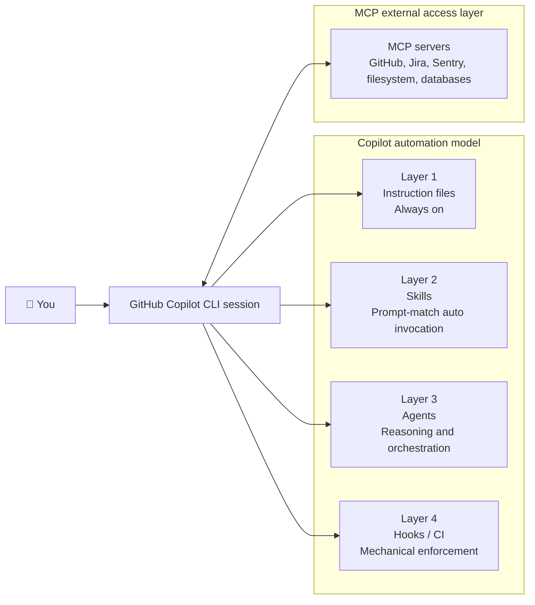
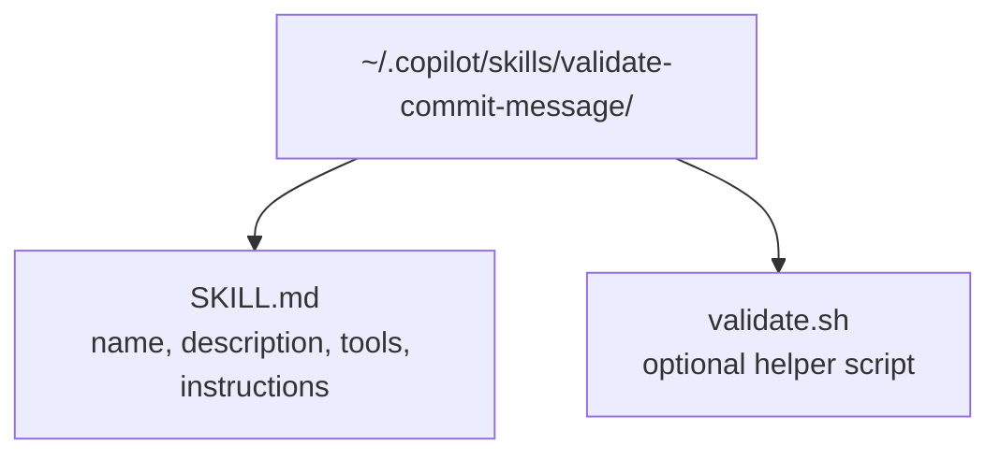
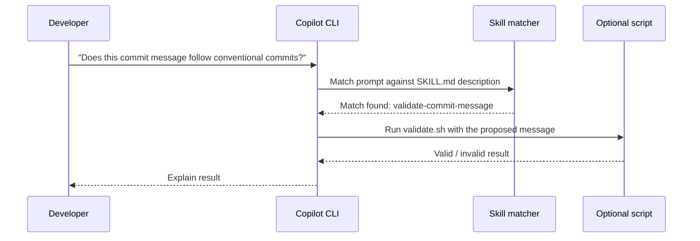
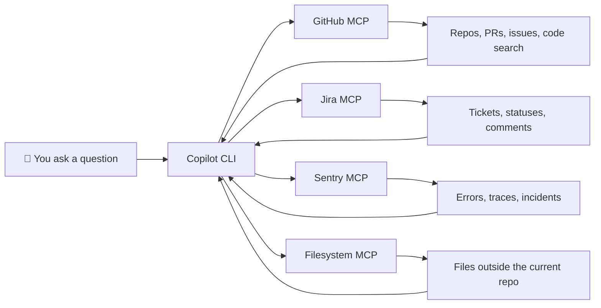
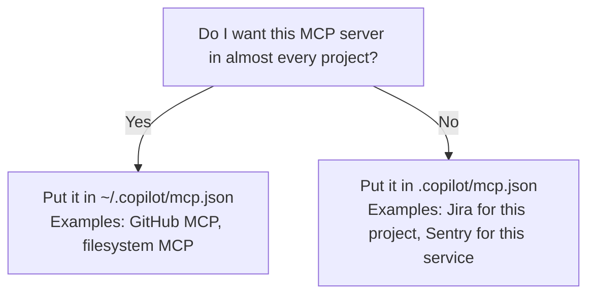
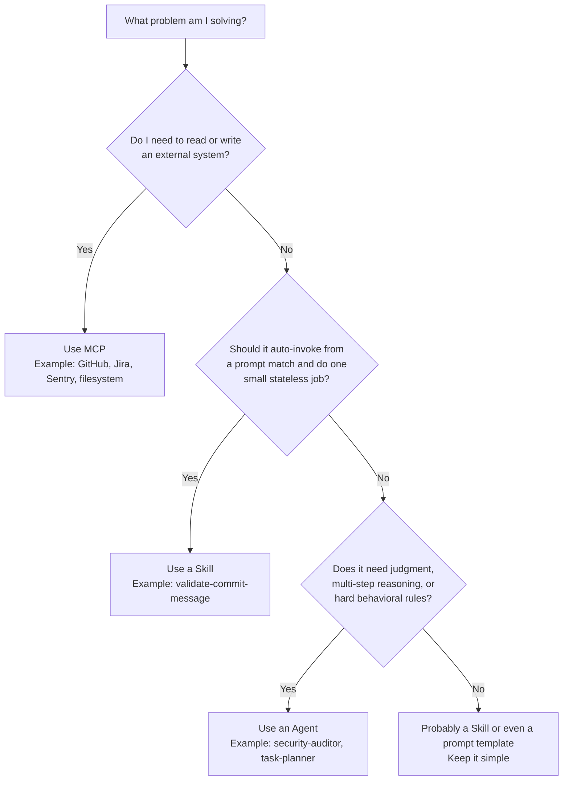

# Exercise 08: Skills & MCP Servers

> **Lesson:** 8 of 10
> **Audience:** Developers who have completed Exercise 03 and want to extend Copilot safely and intentionally.
> **Goal:** Build a real skill, understand how MCP servers extend Copilot's reach, and know when to use a skill, an MCP server, or an agent.

---

## Why This Lesson Matters

By this point you already know that not every AI capability belongs in an agent. Some problems need **automatic single-purpose behavior**. Some need **access to systems outside the repo**. This lesson covers both:

- **Skills** add semi-automatic behavior inside Copilot
- **MCP servers** add external system access to Copilot's context

Security is not optional here. A bad skill can run code on your machine. A bad MCP server can expose data you never meant to share. "Looks useful" is not a review process.

---

## Where Skills & MCP Fit

From the four-layer model in Exercise 03:

- **Layer 2: Skills** — semi-automatic, fire when your prompt matches the skill's `description`
- **MCP** — the external access layer, connecting outside systems to Copilot's context window and toolset



**Mental model:** skills change what Copilot can do *inside the session*. MCP changes what Copilot can *reach outside the session*.

---

## Skills

A skill is a **small, stateless, single-purpose capability**. It is not a personality. It is not a workflow. It is not a miniature employee with opinions. It just does one job when the prompt matches.

### Anatomy of a Skill

A skill consists of:

- `SKILL.md`
- Optional helper scripts



Minimal structure:

```text
~/.copilot/
└── skills/
    └── validate-commit-message/
        ├── SKILL.md
        └── validate.sh
```

### The `description` Field Is the Trigger

This works on the same principle as agents:

- The **description field is what Copilot matches against your natural-language prompt**
- If the description is vague, the skill won't trigger reliably
- If the description overlaps with too many other tools, you'll get noisy behavior

Write the description like a trigger surface:

- what the skill does
- what kinds of prompts should invoke it
- a few concrete example phrases



### Security: Treat Skills Like Code, Because They Are

A skill can run shell scripts. That means a skill from the internet has the same machine access **you** have.

Before enabling any external skill:

1. Read **every line** of `SKILL.md`
2. Read **every line** of every script it calls
3. Look for file writes, network calls, credential access, and hidden side effects
4. Check whether it requests tools you would not casually hand to a stranger

If you have not reviewed the source, do **not** enable it. Otherwise you're just installing terminal access with extra branding.

---

## Exercise: Build `validate-commit-message`

### Step 1 — Create the Skill Folder

Create:

```text
~/.copilot/skills/validate-commit-message/
```

### Step 2 — Create `SKILL.md`

File: `~/.copilot/skills/validate-commit-message/SKILL.md`

```md
---
name: validate-commit-message
description: Use this skill when the user asks to validate a git commit message, check whether a commit follows Conventional Commits, explain why a commit message was rejected, or asks about commit message format rules. Example triggers: "does this commit message pass", "check this against conventional commits", "validate my commit message format".
tools: echo, shell
---

# Validate Commit Message

This skill checks whether a proposed git commit message follows the Conventional Commits format.

Use it for a single candidate message at a time. When invoked, run the local `validate.sh` script and pass the proposed commit message as an argument.

Expected format:

- `feat: add search page`
- `fix(auth): handle expired token`
- `docs: update README`

Reject messages that do not match the format and explain why.
```

### Step 3 — Create `validate.sh`

File: `~/.copilot/skills/validate-commit-message/validate.sh`

```sh
#!/usr/bin/env bash
set -euo pipefail

message="${1:-}"
pattern='^(feat|fix|docs|style|refactor|test|chore|perf|ci|build|revert)(\([a-z0-9._/-]+\))?: .{1,100}$'

if [ -z "$message" ]; then
  echo "❌ No commit message provided."
  echo 'Usage: ./validate.sh "feat(scope): description"'
  exit 1
fi

if printf '%s' "$message" | grep -Eq "$pattern"; then
  echo "✅ Valid conventional commit: $message"
  exit 0
fi

echo "❌ Invalid conventional commit: $message"
echo "Expected format: type(scope): description"
echo "Allowed types: feat, fix, docs, style, refactor, test, chore, perf, ci, build, revert"
echo "Examples:"
echo "  feat(auth): add OAuth login"
echo "  fix: handle null user profile"
echo "  docs: update onboarding guide"
exit 1
```

### Step 4 — Reload Skills

In Copilot CLI:

```text
/skills reload
```

### Step 5 — Trigger It Naturally

Do **not** invoke it like a bash script in normal use. Test the trigger behavior with natural language:

> Does this commit message follow conventional commits: `feat(auth): add OAuth login`

Or:

> Validate this commit message for me: `fix stuff`

If your description is written well, Copilot should match the prompt to the skill automatically.

---

## MCP Servers

### What MCP Is

**MCP** stands for **Model Context Protocol**.

It is the protocol that lets Copilot connect to external systems and pull those systems into the working context of a session. That means the model is no longer limited to the current repo and your prompt. It can also use approved external tools and data sources.



### What's Already Built In: GitHub MCP

Most learners will already have the **GitHub MCP server** available. This is the default bridge between Copilot and GitHub data.

Run:

```text
/mcp show
```

Review the configured servers and the tools they expose.

With the built-in GitHub MCP, you can typically ask Copilot to do things like:

- search code across GitHub repositories
- read file contents from a repo, branch, tag, or PR ref
- inspect repository structure without cloning another repo locally
- look up issues and pull requests
- search users, repos, and related GitHub metadata
- read Copilot Spaces and use them as additional context

Examples of the kinds of requests this enables:

- "Search our org for every `SKILL.md` file that mentions shell access."
- "Read `README.md` from the `main` branch of this repo and summarize setup steps."
- "Show me PR #123 and summarize the review comments."
- "Find issues labeled `bug` assigned to me."

The exact tool list depends on your current configuration, which is why `/mcp show` matters more than guessing.

---

## Exercise: Review Existing MCP Configuration

Run:

```text
/mcp show
```

Then answer:

1. Which servers are already configured?
2. Which one is global and useful everywhere?
3. Which tools would help you today without adding anything new?
4. What external data could each configured server send into the model context?

That last question is the important one.

---

## Exercise: Add One MCP Server

Run:

```text
/mcp add
```

Add **one** server that matches your workflow. Good starter options:

| MCP server | Use it when you need to... | Typical scope |
|---|---|---|
| **Filesystem MCP** | read local files outside the current repo | Per-user |
| **Jira MCP** | read and update Jira issues, comments, and statuses | Usually per-project |
| **Sentry MCP** | inspect production errors and traces while debugging | Usually per-project |

### Per-user vs Per-project MCP Config

Use this rule:

- **Per-user** (`~/.copilot/mcp.json`) for tools you want in nearly every session
- **Per-project** (`.copilot/mcp.json`) for integrations that only make sense in one codebase or one client environment



### Security Review for Any MCP Server

Before adding a server, ask:

- What systems can it reach?
- What permissions does it use?
- What operations can it perform: read, write, delete, comment, deploy?
- Does it expose secrets, tickets, logs, customer data, or production metadata?
- **What data does this server send to the LLM?**

If you cannot answer that last question, do not add the server yet.

---

## Decision Matrix: MCP vs Skill vs Agent

| Use this | When you need... | Best fit for | Not ideal for |
|---|---|---|---|
| **MCP** | access to an external system | GitHub, Jira, Sentry, databases, files outside the repo | judgment-heavy orchestration by itself |
| **Skill** | auto-invoked, stateless, single-purpose behavior | validation, formatting checks, tiny utilities, script-backed helpers | multi-step reasoning, persistent persona, broad decision making |
| **Agent** | judgment, multi-step reasoning, hard rules, scoped personality | reviews, planning, refactors, audits, orchestrated workflows | direct external access without tools or integrations |

And the decision tree:



---

## Key Takeaway

**MCP extends what Copilot can see.**
**Skills extend what Copilot can do automatically.**
**Agents extend what Copilot can think through.**

Different tools. Different purposes. Use the wrong one and you'll either over-engineer a tiny problem or under-power a serious one — both classic time-saving strategies, obviously.

If you finish this exercise having built one skill and reviewed one MCP server with a real security lens, you've learned the part most people skip.
