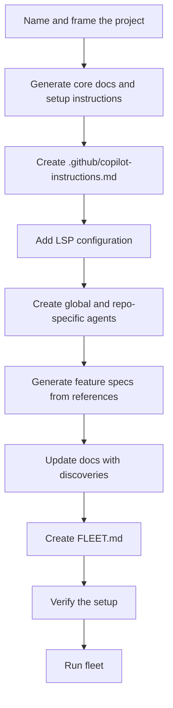
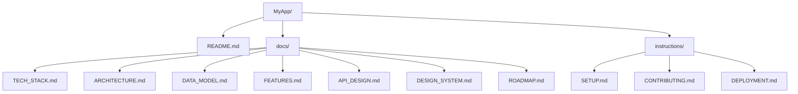
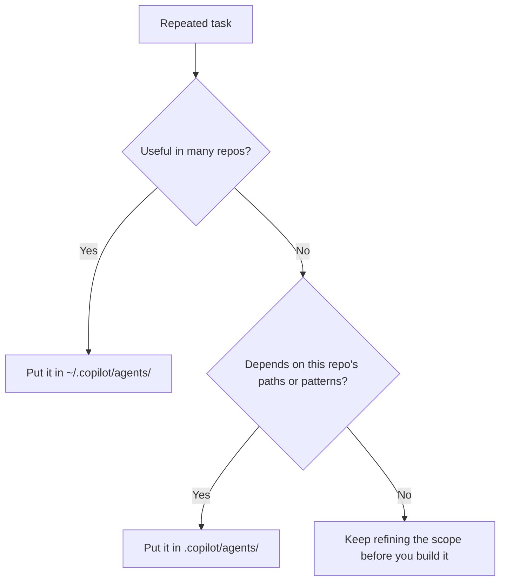
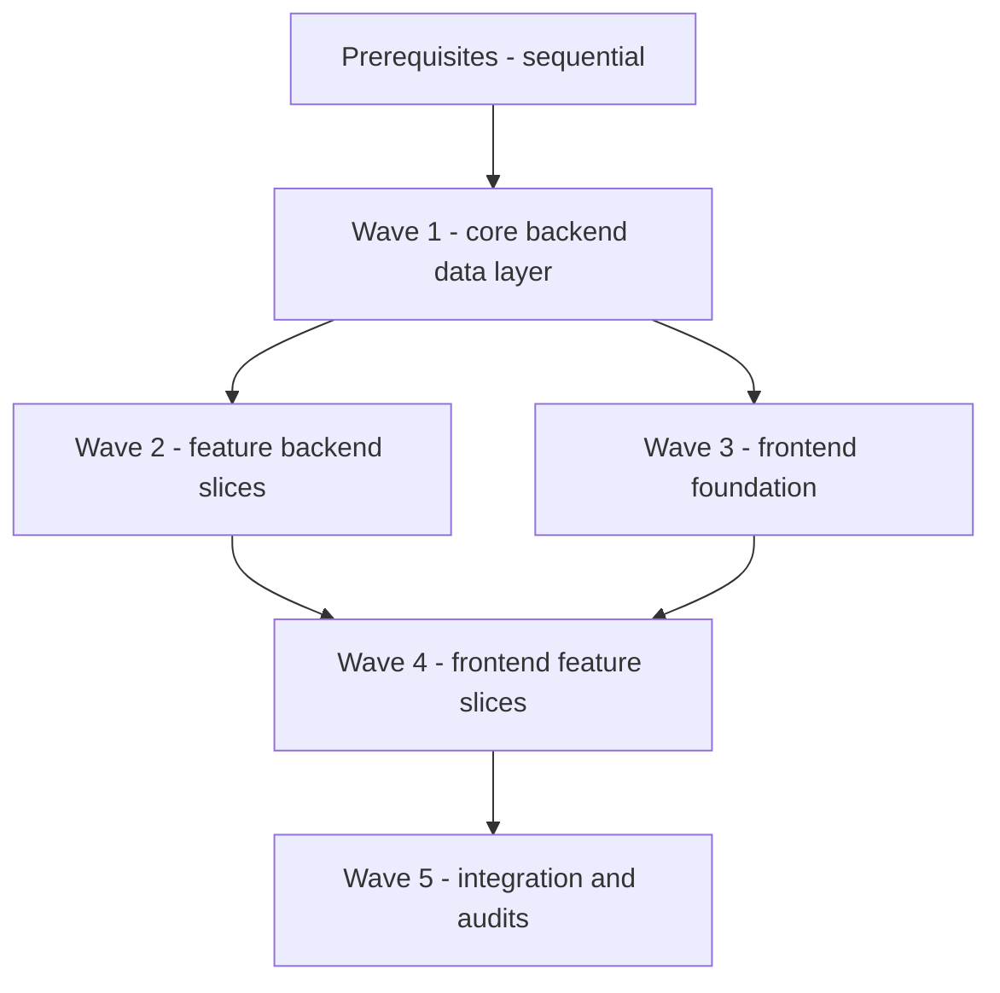

# AI-First Project Kickoff — Project Setup

> **Prerequisite:** Complete `01-setup-exercise.md` first — you need a working Copilot environment with global instructions and at least one custom agent before starting here.
>
> **Goal:** Walk through the full process of kicking off a *brand new project* using Copilot as a design partner — from naming and documentation, through feature specs derived from competitor research, to a fleet-ready parallel build plan.
>
> **Next step after this:** Revisit `04-agent-ecosystem.md` and `05-building-agents-exercise.md` if you want to expand the project-specific agent layer after the initial setup is done.

This is the process you can use to bootstrap **MyApp**, a placeholder cross-platform app. Swap the name for your real product and keep the workflow.

---

## The Big Picture

Before writing a single line of code, we want Copilot to understand the project as deeply as a senior team member would. That means:

1. Generating living documentation (what the project *is*)
2. Generating operational instructions (how to *work on* the project)
3. Creating project-level Copilot instructions (loaded automatically into every session)
4. Defining custom agents for repeated tasks on this project
5. Generating feature specs from real-world references
6. Creating a fleet build plan to execute everything in parallel

Each step feeds the next. By the end, you can hand the entire context to a fleet of agents and have them build in parallel without getting in each other's way.



---

## Step 1 — Name and Frame Your Project

Before generating docs, you need a clear mental model of:
- What problem does this solve?
- Who is the primary user?
- What does it do *specifically* before being generic?
- Who is the competition?

**Starter prompt:**

> I want to build [one sentence description]. The primary use case is [specific niche]. Longer term it should generalize to [broader scope]. The main competitor is [competitor]. Help me brainstorm names that are modern, brandable, and hint at [core concept].

**What to look for in a name:**
- Short (1–2 syllables ideally)
- Memorable and spellable
- Not already a product in your space
- Evokes the right feeling, even subtly

> 💡 In this exercise we use **MyApp** as the placeholder. In a real project, push for a second or third naming round before you lock anything in. Your first batch is usually fine. Fine is not the bar.

---

## Step 2 — Generate Project Documentation

Create the folder structure first, then generate docs and instructions in one pass.

```powershell
mkdir MyApp
cd MyApp
mkdir docs
mkdir instructions
```

**Starter prompt:**

> I'm starting a new project called [Name]. Here's what it does: [2–3 sentences]. Tech stack: [your stack]. Generate the following documentation files:
>
> - `README.md` — project overview linking to all docs
> - `docs/TECH_STACK.md` — full stack with rationale for each choice
> - `docs/ARCHITECTURE.md` — system overview, folder structure, multi-tenancy if applicable
> - `docs/DATA_MODEL.md` — all entities with fields and relationships
> - `docs/FEATURES.md` — feature breakdown by phase (MVP, Phase 2, Phase 3)
> - `docs/API_DESIGN.md` — REST API endpoint reference with conventions
> - `docs/DESIGN_SYSTEM.md` — typography, spacing, component rules, accessibility expectations
> - `docs/ROADMAP.md` — phased delivery plan
> - `instructions/SETUP.md` — prerequisites and local dev setup
> - `instructions/CONTRIBUTING.md` — Gitflow, commit conventions, PR standards
> - `instructions/DEPLOYMENT.md` — deployment steps per environment and platform

**The docs vs. instructions split:**
| Folder | Contains | Used by |
|---|---|---|
| `docs/` | What the project *is* — design decisions, entities, APIs, design system rules | Developers reading to understand the system |
| `instructions/` | How to *work on* it — setup, workflow, deployment | Developers following a process |

**Suggested baseline structure:**



> ⚠️ Generate all files in one prompt where possible. Copilot can create 10+ files simultaneously. Doing them one at a time wastes time and loses cross-file consistency.

---

## Step 3 — Add Project-Level Copilot Instructions

These live in `.github/copilot-instructions.md` and are **automatically loaded into every Copilot session** when you're in this project folder. Every agent, every fleet worker, every autopilot run gets this context.

> **🔀 Tool Portability — Project-Level Instructions**
>
> The file that carries project context varies by tool, but the content is nearly identical:
>
> | Tool | File to create | Auto-loaded? |
> |---|---|---|
> | **GitHub Copilot** | `.github/copilot-instructions.md` | ✅ Yes, every session |
> | **Claude** | `CLAUDE.md` at project root | ✅ Yes, every conversation |
> | **Cursor** | `.cursorrules` at project root | ✅ Yes, every session |
> | **All tools** | `AGENTS.md` at project root | ✅ Yes, model-agnostic hard rules |
>
> Generate the Copilot-specific file first. Then copy the key architecture rules into `AGENTS.md` for portability. Every tool on the team benefits.

```powershell
mkdir .github
New-Item .github\copilot-instructions.md
```

**Starter prompt:**

> Read all files in `docs/` and `instructions/`. Generate a `.github/copilot-instructions.md` that covers:
>
> - What this project is (1 paragraph)
> - Frontend and backend tech summary
> - Frontend folder structure with explanations
> - Backend folder structure with explanations
> - Frontend conventions (naming, state, API calls, styling)
> - Backend conventions (file-per-endpoint, async rules, namespaces, validation)
> - Data rules (ID format, timestamps, tenant or org scoping if applicable)
> - Key non-negotiable rules (no hardcoded secrets, WCAG 2.1 AA, test coverage)

**What makes a good project instructions file:**
- Concrete, not vague — `ULIDs, not GUIDs or ints` not `use good ID types`
- Covers the things that *break silently* if ignored (like missing tenant scoping in queries)
- Short enough to be read in 2 minutes, dense enough to be genuinely useful

---

## Step 4 — Configure LSP for Your Stack

LSP servers let Copilot navigate your code intelligently — go to definition, find references, understand types.

```powershell
New-Item .github\lsp.json
```

**Starter prompt:**

> Generate a `.github/lsp.json` for a project using [TypeScript / Vue (Volar) / C# (OmniSharp)]. Include install commands for any LSP servers that need to be installed globally.

**Install the servers (run once per machine):**

```powershell
npm install -g typescript-language-server
npm install -g @vue/language-server
# OmniSharp: installed via VS Code C# extension or downloaded from github.com/OmniSharp/omnisharp-roslyn
```

---

## Step 5 — Create Project-Specific Agents

Think about the *repeated tasks* unique to this project. General agents live in your global config — project agents cover patterns specific to this codebase.

```powershell
# Global (available in all projects)
New-Item "$HOME\.copilot\agents\my-agent.agent.md"

# Project-scoped (only in this repo)
mkdir .copilot\agents
New-Item ".copilot\agents\my-agent.agent.md"
```

**Agent file format:**

```markdown
---
name: agent-name
description: "One sentence description. Trigger phrases: 'do X', 'scaffold Y'."
tools: [read_file, write_file, search_files, run_terminal_command]
---

# agent-name instructions

[Full system prompt for this agent — be specific about what it does,
what patterns it follows, and what it should never do.]
```

**Starter prompt:**

> I have a [Vue 3 / .NET Minimal API] project that uses [vertical slice architecture / specific patterns]. Create a custom agent called [name] that can [task]. It should follow the conventions in `.github/copilot-instructions.md`. When scaffolding files, it should output to [path pattern]. It should never [constraint].

**Should this agent be global or repo-specific?**



**Example agents for MyApp:**

| Agent | Purpose |
|---|---|
| `myapp-web-slice-scaffolder` | Scaffolds a frontend feature slice (component + state + service + types) |
| `myapp-api-slice-scaffolder` | Scaffolds a backend vertical slice (request + response + handler) |
| `design-system-validator` | Validates design system usage, spacing, typography, and consistency |
| `accessibility-auditor` | Audits UI components against WCAG 2.1 AA |

> 💡 Add universal agents to your dotfiles repo so they're available across all machines. Keep repo-specific agents in `.copilot/agents/` so the team gets the same project-specific behavior.

---

## Step 6 — Generate Feature Specs from Competitor Research

This is the step that makes fleet *actually work*. Feature specs are instruction files that agents read to understand exactly what to build.

**The pattern:**
1. Gather screenshots or docs from a competitor or reference product
2. Show them to Copilot and ask it to identify distinct feature areas
3. Generate one `*.instructions.md` file per feature area

```powershell
mkdir .github\instructions\features
```

**Starter prompt (viewing screenshots):**

> I have [N] screenshots of [competitor/reference app] in [path]. View all of them. Group them into distinct feature areas. For each feature area, identify:
> - What UI patterns are used
> - What data is displayed
> - What actions are available
> - What the expected behavior is on mobile vs desktop
>
> Then generate a `.github/instructions/features/[feature-name].instructions.md` for each feature area. Use the frontmatter format with `applyTo` scoped to the relevant source paths.

**Feature spec file format:**

```markdown
---
applyTo: "client/src/features/catalog/**"
---

# Feature: Catalog

## Overview
[What this feature does in 2–3 sentences]

## UI Patterns
[List the specific UI components, layouts, and interactions]

## Data Requirements
[What entities and fields are needed — reference DATA_MODEL.md]

## API Endpoints
[What endpoints this feature calls — reference API_DESIGN.md]

## Behavior
[Edge cases, empty states, loading states, error states]

## Mobile Behavior
[Any differences on mobile/tablet vs desktop]
```

**Why this approach:**
- `.github/instructions/**/*.instructions.md` files are **auto-loaded into every Copilot agent's context** — no manual injection needed
- The `applyTo` frontmatter tells agents which part of the codebase each spec applies to
- When you run `/fleet`, every parallel agent already has the right spec in context

---

## Step 7 — Update Core Docs with New Discoveries

During screenshot analysis and feature spec writing, you'll discover things that weren't in your original docs. Update them before running fleet.

**Common gaps found:**
- Entities that weren't in `DATA_MODEL.md` (for example: saved views, asset groups, approval states)
- API endpoints that weren't in `API_DESIGN.md` (for example: dashboard summary or reporting endpoints)
- A design system rule that needs to be documented everywhere (for example: Bootstrap 5, Tailwind, or a custom component library)

**Starter prompt:**

> I've added feature spec files in `.github/instructions/features/`. Cross-reference them against `docs/DATA_MODEL.md`, `docs/API_DESIGN.md`, and `docs/DESIGN_SYSTEM.md`. Identify any entities, endpoints, or design rules referenced in the specs that are missing from the docs, and add them.

**When you add a technology (like a UI framework):**

Update all of these in one pass:
- `docs/TECH_STACK.md` — add the technology row with rationale
- `docs/DESIGN_SYSTEM.md` — add the component, spacing, and accessibility rules
- `.github/copilot-instructions.md` — add to the tech summary line and add specific conventions
- `FLEET.md` (coming next) — update prerequisites and agent prompts

---

## Step 8 — Create the Fleet Build Plan

The fleet plan (`FLEET.md`) defines which tasks can run in parallel, what order they must run in, and what each agent needs to know.

```powershell
New-Item FLEET.md
```

**Starter prompt:**

> Based on the feature specs in `.github/instructions/features/`, the data model in `docs/DATA_MODEL.md`, the API design in `docs/API_DESIGN.md`, and the design rules in `docs/DESIGN_SYSTEM.md`, generate a `FLEET.md` that:
>
> 1. Lists the sequential prerequisites that must be done before fleet runs
> 2. Organizes remaining work into parallel waves (backend data layer → backend features → frontend foundation → frontend feature slices → integration/polish)
> 3. For each task: specifies the agent, the instruction file it reads, the output path, and any dependencies
> 4. Provides a boilerplate fleet agent prompt template
> 5. Includes a dependency map showing which waves can overlap

**Wave structure that works well:**



**Key insight:** Frontend agents don't need the API *running* — they need the API *documented*. As long as `docs/API_DESIGN.md` is accurate, frontend and backend can build in parallel.

---

## Step 8b — Use Plan Mode for Prerequisites

Before running fleet, the prerequisite tasks (scaffolding the project, setting up auth, shared types, etc.) need to happen sequentially. This is exactly what **plan mode** is designed for.

**When plan mode fits into this workflow:**

| Situation | Use plan mode? |
|---|---|
| Running fleet wave prerequisites | ✅ Yes — map out each scaffold step before it runs |
| Executing a single fleet wave | ✅ Yes — plan it, then hand to autopilot |
| Exploratory work (naming, framing, docs) | ❌ No — conversation is faster |
| Generating feature specs from screenshots | ❌ No — discovery doesn't need a plan |
| Updating docs after new discoveries | ❌ Optional — usually a quick targeted edit |

**Starter prompt (in plan mode, before prerequisites):**

> I need to scaffold the MyApp project: Vue 3 + Vite + Capacitor in `client/`, .NET 10 Minimal API in `api/`, Pulumi infrastructure in `infrastructure/`. Walk me through a plan — show me every file and folder you'll create. I'll approve before you build anything.

**Why plan mode matters for fleet:** Once you're in fleet territory, multiple agents are working simultaneously. If the foundation scaffolding has a mistake — wrong folder structure, wrong base config — every downstream agent builds on top of that mistake. Plan mode on the prerequisites is the cheapest way to catch structural errors before they multiply.

**Safety rule:** Always commit before handing off to autopilot or fleet:

```powershell
git add -A && git commit -m "chore: fleet-ready setup"
```

If autopilot goes sideways, `git checkout .` gets you back instantly.

---

## Step 9 — Verify the Setup

Before running fleet, confirm everything is wired up:

```
/instructions    — should show .github/copilot-instructions.md + all feature spec files
/agent           — should show all custom agents
/env             — full environment details
```

**Sanity check prompts:**

> Read `.github/copilot-instructions.md` and all files in `.github/instructions/features/`. Summarize what you know about this project and identify any gaps or inconsistencies across the docs.

> Look at `FLEET.md`. Are there any tasks that claim to be independent but actually share files or resources? Flag any conflicts.

---

## Step 10 — Run Fleet

```
/fleet
```

Provide each agent the standard prompt from `FLEET.md`. Monitor with `/tasks`.

**Pro tips:**
- Commit everything before running fleet (`git add -A && git commit -m "chore: fleet-ready setup"`)
- Run prerequisites manually or with a single autopilot agent first
- Wave 1 is the most critical — get the data layer right before anything else builds on it
- Run the design-system-validator and accessibility-auditor agents *after* each wave, not just at the end

---

## What We Built During This Session

For reference, here's a baseline file tree that comes out of this process for **MyApp**:

```
MyApp/
├── README.md
├── FLEET.md
├── docs/
│   ├── TECH_STACK.md
│   ├── ARCHITECTURE.md
│   ├── DATA_MODEL.md
│   ├── FEATURES.md
│   ├── API_DESIGN.md
│   ├── DESIGN_SYSTEM.md
│   └── ROADMAP.md
├── instructions/
│   ├── SETUP.md
│   ├── CONTRIBUTING.md
│   └── DEPLOYMENT.md
└── .github/
    ├── copilot-instructions.md        ← auto-loaded by every session
    ├── lsp.json                       ← LSP server config
    └── instructions/
        └── features/
            ├── navigation-shell.instructions.md
            ├── dashboard.instructions.md
            ├── catalog.instructions.md
            ├── detail-view.instructions.md
            ├── work-orders.instructions.md
            ├── scheduling.instructions.md
            ├── reporting.instructions.md
            └── auth-onboarding.instructions.md
```

That baseline is **22 files before one line of app code — that's the investment**. Your repo-specific agents in `.copilot/agents/` may add even more, and that's fine. The setup work pays back every time an agent builds exactly what you intended without a correction loop.

---

## Quick Reference

| Step | Output | Where |
|---|---|---|
| 1 | Project name + concept | (mental model) |
| 2 | Docs + instructions | `docs/`, `instructions/` |
| 3 | Project Copilot instructions | `.github/copilot-instructions.md` |
| 4 | LSP config | `.github/lsp.json` |
| 5 | Custom agents | `~/.copilot/agents/*.agent.md`, `.copilot/agents/*.agent.md` |
| 6 | Feature specs | `.github/instructions/features/` |
| 7 | Updated core docs | `docs/DATA_MODEL.md`, `docs/API_DESIGN.md`, `docs/DESIGN_SYSTEM.md` |
| 8 | Fleet build plan | `FLEET.md` |
| 9 | Verification | `/instructions`, `/agent` |
| 10 | Build | `/fleet` |

---

*Previous step: [08-skills-and-mcp.md](08-skills-and-mcp.md)*
*Related reading: [04-agent-ecosystem.md](04-agent-ecosystem.md), [05-building-agents-exercise.md](05-building-agents-exercise.md)*
