# The AI Agent Ecosystem — How It All Fits Together

> **Audience:** Development team
> **Goal:** Understand how the Copilot agent ecosystem is structured, where each type of agent lives, and how they work together to produce reliable, consistent, high-quality output across every project.

---

## Why a Taxonomy Matters

A single general-purpose AI assistant is good at a lot of things and great at nothing in particular. The moment you give it a clear role, a defined scope, and hard rules — it becomes dramatically more reliable.

The agent ecosystem solves this by breaking work into **specialized roles**, each handled by an agent that only does one thing well. The result is a pipeline where every stage has a dedicated expert, and Atlas (your personal orchestrator) coordinates them.

Think of it less like "one AI" and more like **a development team where every role is filled by a specialist**:

- You don't ask your QA engineer to write the feature spec.
- You don't ask the technical writer to review the database queries.
- You don't ask the security auditor to scaffold the boilerplate.

Agents work the same way.

---

## The Ecosystem at a Glance

```mermaid
flowchart TD
    Dev([👤 You])
    Dev --> ATLAS

    subgraph ATLAS["🤖 Orchestrator — Atlas (your personal agent)"]
        AtlasNode["Configured in ~/.copilot/copilot-instructions.md\nKnows your stack, conventions, preferences"]
    end

    ATLAS --> PLAN

    subgraph PLAN["🧠 Planning"]
        P1["task-planner — breaks goals into agent sequences"]
        P2["agent-builder — guides you through building new agents"]
    end

    PLAN --> LEARN

    subgraph LEARN["📚 Learners (RAG)"]
        L1["context-reader — surfaces existing code patterns"]
        L2["architecture-reader — maps the repo structure"]
        L3["repo-auditor — checks repo compliance"]
    end

    LEARN --> DO

    subgraph DO["⚙️ Doers"]
        D1["project-scaffolder — creates new repos"]
        D2["<repo>-api-scaffolder — scaffolds feature slices"]
        D3["<repo>-vue-scaffolder — scaffolds frontend components"]
        D4["slice-test-generator — generates unit tests"]
    end

    DO --> REVIEW

    subgraph REVIEW["🔍 Feedback"]
        R1["code-reviewer"]
        R2["accessibility-auditor"]
        R3["design-system-validator"]
        R4["bdd-scenario-runner"]
        R5["playwright-test-writer"]
        R6["performance-reviewer"]
        R7["product-ux-auditor"]
        R8["database-auditor"]
        R9["test-coverage-analyzer"]
    end

    DO --> GUARD

    subgraph GUARD["🛡️ Guardians"]
        G1["security-auditor"]
        G2["env-config-reviewer"]
        G3["dependency-auditor"]
        G4["api-contract-reviewer"]
        G5["migration-auditor"]
    end

    REVIEW --> SHIP
    GUARD --> SHIP

    subgraph SHIP["🔧 Tool Operators"]
        T1["pr-description-writer"]
        T2["docs-sync-writer"]
        T3["github-issue-creator"]
        T4["deploy-trigger"]
    end

    SHIP --> OUT

    subgraph OUT["📋 Presenters"]
        O1["technical-writer"]
        O2["implementation-summary"]
        O3["release-notes-writer"]
        O4["changelog-writer"]
    end

    OUT --> Done([✅ Shipped])

    style ATLAS fill:#1a1a2e,stroke:#4a4aff,color:#ffffff
    style PLAN fill:#e8f4f8,stroke:#4a9eca
    style LEARN fill:#fff8e1,stroke:#f9a825
    style DO fill:#e8f5e9,stroke:#43a047
    style REVIEW fill:#f3e5f5,stroke:#8e24aa
    style GUARD fill:#fce4ec,stroke:#e91e63
    style SHIP fill:#e0f2f1,stroke:#00897b
    style OUT fill:#ede7f6,stroke:#5e35b1
```



---

## The Eight Categories

### 🤖 Orchestrator — Atlas

**One per developer.** Atlas is your primary agent — configured in your personal `dotfiles` via `copilot-instructions.md`. It is not a specialist. It is the coordinator.

Atlas knows:
- Your tech stack and frameworks
- Your coding conventions and preferences
- Your communication style
- How to invoke other agents and interpret their output

Every developer's Atlas is slightly different, which is intentional. It reflects your individual working style while sharing a common foundation. At PFS, all team members extend their Atlas with shared PFS instructions from `PFS.Utility.Common.Agents`.

> **See:** `setup-exercise.md` for how to configure Atlas. Your `copilot-instructions.md` is the single most important file in your tooling setup.

---

### 🧠 Planning Agents

**Role:** Receive a goal and produce a plan — which agents to run, in which order, with what inputs.

Without planning agents, you have to manually decide "what do I ask Atlas next?" every step of the way. Planning agents automate that routing decision.

| Agent | What it does |
|-------|-------------|
| `task-planner` | Takes a ticket or feature description and outputs a sequenced agent invocation plan |
| `agent-builder` | Guides you through creating a new agent (backlog picker or build-from-scratch) |

**When to invoke:** At the start of any non-trivial feature. Give it the ticket description; it produces the plan; you approve it; it runs.

---

### 📚 Learners (RAG Agents)

**Role:** Read the existing codebase and surface relevant patterns *before* any Doer generates code. This is the "read before you write" category.

The most common AI failure mode is generating code that doesn't match the patterns already established in the codebase — wrong naming, wrong structure, wrong abstractions. Learners prevent this by giving Doers a concrete reference point.

| Agent | What it does |
|-------|-------------|
| `context-reader` | Reads the domain being modified; surfaces naming conventions, reference files, patterns in use |
| `architecture-reader` | Maps the repo's layer boundaries, key abstractions, and cross-cutting concerns |
| `repo-auditor` | Checks a repo against the compliance checklist — what's missing, what needs updating |

**When to invoke:** Before any Doer runs on an unfamiliar area of the codebase, or when onboarding to a new repo.

---

### ⚙️ Doers

**Role:** Execute. Scaffold, generate, write, refactor.

Doers are the agents most people think of first, but they produce their best output when Learners have already run. A Doer with context is dramatically more accurate than a Doer working blind.

| Agent | What it does | Where it lives |
|-------|-------------|----------------|
| `project-scaffolder` | Creates a new repo with full Copilot context, CI, and standards | dotfiles (universal) |
| `<repo>-api-scaffolder` | Scaffolds a new API feature slice following this repo's exact patterns | each repo |
| `<repo>-vue-scaffolder` | Scaffolds a Vue frontend slice following this repo's conventions | each repo |
| `slice-test-generator` | Generates a complete test class for a new slice | shared |

> **Note:** Repo-specific Doers (scaffolders) live in that repo's `.copilot/agents/` directory and are prefixed with the project name: `machina-api-scaffolder`, not `api-scaffolder`. The prefix tells Atlas and the team exactly which project this agent is scoped to.

**When to invoke:** After Learners have confirmed the patterns to follow.

---

### 🔍 Feedback Agents

**Role:** Validate quality. Review code, verify tests, check accessibility, audit UX.

Feedback agents are the pre-merge quality gate. They run after Doers produce output and before Guardians check safety. They find problems that are expensive to fix after merge.

| Agent | What it checks |
|-------|---------------|
| `code-reviewer` | Code quality, PFS standards, naming, async patterns, edge cases |
| `accessibility-auditor` | WCAG 2.1 AA compliance — keyboard nav, ARIA, color contrast |
| `design-system-validator` | Correct use of design tokens, component patterns, typography |
| `bdd-scenario-runner` | BDD test scenarios written and passing for new behavior |
| `playwright-test-writer` | E2E tests covering new user-facing flows |
| `performance-reviewer` | N+1 queries, blocking calls, unbounded operations |
| `product-ux-auditor` | User experience quality — flows, labels, error states |
| `database-auditor` | Cosmos DB query safety, partition key usage, EF Core patterns |
| `test-coverage-analyzer` | Unit test gaps for modified files |

**When to invoke:** After Doers finish, before submitting a PR.

---

### 🛡️ Guardians

**Role:** Enforce safety gates. These agents protect production from preventable disasters.

Guardians are distinct from Feedback because they're not about code quality — they're about risk. A perfectly written feature that introduces a secret in source, breaks the API contract, or ships a vulnerable dependency is still a production incident.

| Agent | What it guards |
|-------|---------------|
| `security-auditor` | OWASP Top 10, XSS, injection, auth gaps, insecure patterns |
| `env-config-reviewer` | Hardcoded secrets, credentials, environment-specific config in code |
| `dependency-auditor` | Known CVEs in npm/NuGet dependencies |
| `api-contract-reviewer` | Breaking changes to public API endpoints and response shapes |
| `migration-auditor` | Database migration safety — idempotency, rollback plans, data integrity |

**When to invoke:** After Feedback, before every PR. Non-negotiable on `feat!:` and `fix:` commits.

---

### 🔧 Tool Operators

**Role:** Interface with external systems — GitHub, CI/CD pipelines, package registries.

Tool Operators don't review or generate code. They handle the mechanical steps that connect your local work to the outside world.

| Agent | What it does |
|-------|-------------|
| `pr-description-writer` | Generates a complete PR description from the git diff |
| `docs-sync-writer` | Keeps developer documentation (README, API docs) in sync with code |
| `github-issue-creator` | Creates a formatted GitHub issue from a review finding |
| `deploy-trigger` | Triggers the appropriate deployment pipeline and monitors for completion |

**When to invoke:** At PR submission (`pr-description-writer`, `docs-sync-writer`) and post-release (`deploy-trigger`, `github-issue-creator`).

---

### 📋 Presenters

**Role:** Produce human-readable output for stakeholders, reviewers, and the team.

Presenters are the last stage in the pipeline. They take the work that was done and make it consumable — by product owners, by reviewers approving a PR, by stakeholders reading a release note.

| Agent | What it produces |
|-------|----------------|
| `technical-writer` | User guides, onboarding docs, how-to guides, process documentation |
| `implementation-summary` | "AI work receipt" — what was created, modified, fixed, and what still needs attention |
| `release-notes-writer` | Plain-English release notes from commit history for stakeholders |
| `changelog-writer` | `CHANGELOG.md` update following Keep a Changelog format |

**When to invoke:** `implementation-summary` before every PR. `release-notes-writer` and `changelog-writer` at release time. `technical-writer` whenever a feature ships that end users or the business team needs to understand.

---

## Where Agents Live

This is the most common source of confusion. Not all agents go in the same place.

```
~/.copilot/
└── copilot-instructions.md    ← Atlas configuration (personal, synced via dotfiles)
└── agents/
    ├── security-auditor       ← Universal agents (dotfiles repo → all projects)
    ├── accessibility-auditor
    ├── pr-description-writer
    └── ...

<your-repo>/
└── .copilot/
    └── agents/
        ├── machina-api-scaffolder    ← Repo-specific agents (this repo only)
        └── machina-vue-scaffolder    ← Must be prefixed with project name

PFS.Utility.Common.Agents/   ← Shared PFS agents (synced to ~/.copilot/agents/ via setup.ps1)
├── pfs-code-reviewer
├── pfs-repo-auditor
├── pfs-agent-builder
└── pfs-technical-writer
```

**The rule:**
- **Universal agents** (work on any project) → `dotfiles` repo
- **PFS-specific shared agents** → `PFS.Utility.Common.Agents`
- **Repo-specific agents** (only make sense for one project) → that repo's `.copilot/agents/`

---

## The Pipeline in Practice

Here's what a complete feature cycle looks like with the full agent ecosystem:

```
1. You describe the feature to Atlas
2. task-planner decomposes it → produces a sequenced plan
3. context-reader reads the relevant domain → surfaces the patterns to follow
4. <repo>-api-scaffolder generates the endpoint following those patterns
5. slice-test-generator generates the test class
6. code-reviewer audits the output → fixes found inline
7. accessibility-auditor runs (UI change) → fixes found inline
8. security-auditor and env-config-reviewer run → any issues flagged
9. pr-description-writer drafts the PR description
10. implementation-summary produces the "AI work receipt"
11. You review and approve → submit PR
```

Every step is specialized. Every step produces output the next step can use. Atlas coordinates the sequence so you're never wondering "what do I run next?"

---

## Next Steps

- **Build your Atlas:** `setup-exercise.md`
- **Set up a new project with the full ecosystem:** `project-setup-exercise.md`
- **Build your first agent:** `building-agents-exercise.md`
- **Full environment walkthrough:** `copilot-environment-walkthrough.md`
